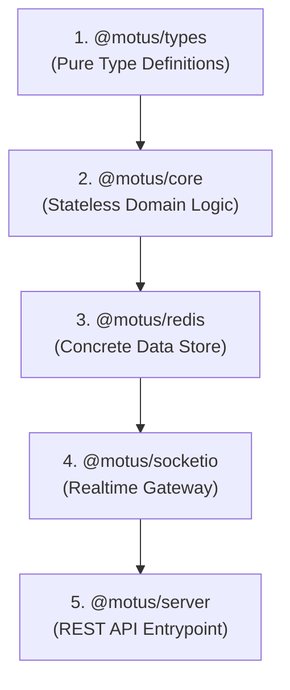

# 57 - Implementation Roadmap

This document outlines the package development roadmap and milestone delivery phases for the Motus project, providing a sequential path for OSS contributors.

---

## Package Implementation Order

We recommend implementing packages in a bottom-up sequence:

### Justification
1.  **`@motus/types`:** Contains pure TypeScript interfaces. Must be implemented first to establish contracts across other modules.
2.  **`@motus/core`:** Houses state machines, matching filters, and domain models. Relies only on `@motus/types`. Implementing this next allows comprehensive unit testing of business logic without database dependencies.
3.  **`@motus/redis`:** Implements the persistence interfaces defined in `@motus/core`. Requires a stable core to bind repositories and Lua scripts.
4.  **`@motus/socketio`:** Operates the real-time gateway using the concrete Redis adapter and repositories.
5.  **`@motus/server`:** The HTTP bootstrap wrapper. Composes and injects dependencies from all other packages, making it the final piece of the monorepo.

---

## Milestone Delivery Phases

To improve OSS planning and contributor onboarding, we divide the roadmap into 7 milestone phases:

### Milestone 1: Driver Presence & Core Foundations
*   **Objectives:** Establish TypeScript compile parameters, core domain definitions, the Driver Presence state machine, and the Redis presence repository.
*   **Scope:** `@motus/types`, `@motus/core/src/domain/state` (Presence), `@motus/redis` (Presence and Location hashes).
*   **Dependencies:** None.

### Milestone 2: Spatial Discovery & Matching
*   **Objectives:** Implement geospatial indices, coordinate filters, and candidate ranking.
*   **Scope:** `@motus/redis` (Geo index), `@motus/core/src/services/matching` (Discovery, Filters, OSRM/Valhalla client adapter).
*   **Dependencies:** Milestone 1.

### Milestone 3: Wave Fanout & Locks
*   **Objectives:** Implement wave coordinators, lock acquisition routines, timeout managers, and the Lua script for atomic offer acceptances.
*   **Scope:** `@motus/core/src/workers` (Fanout, Timeout), `@motus/redis` (Lua catalogs, lock repositories).
*   **Dependencies:** Milestone 2.

### Milestone 4: Session Lifecycle & Control
*   **Objectives:** Implement session state transitions, cancellation rules, and driver reassignment logic.
*   **Scope:** `@motus/core/src/domain/state` (Session), `@motus/core/src/workers` (Session Manager, Driver Lost monitor).
*   **Dependencies:** Milestone 3.

### Milestone 5: Real-time Live Tracking
*   **Objectives:** Implement the WebSocket gateway, JWT handshakes, room subdivisions, and Redis Pub/Sub broadcasting.
*   **Scope:** `@motus/socketio`, `@motus/redis` (Pub/Sub channel subscription synchronization).
*   **Dependencies:** Milestone 4.

### Milestone 6: Telemetry & Post-Session Reports
*   **Objectives:** Implement the 25m/10s delta coordinate sampler, Redis Stream writers, Google Polyline compression, and metrics calculation.
*   **Scope:** `@motus/core/src/services/telemetry` (Sampler, Compression), `@motus/core/src/services/reports` (Metrics Aggregator).
*   **Dependencies:** Milestone 5.

### Milestone 7: REST API Server & Observability
*   **Objectives:** Set up the Fastify HTTP engine, Swagger schemas, health check endpoints, Prometheus metrics, and OpenTelemetry instrumentation.
*   **Scope:** `@motus/server`, `@motus/core` (Bootstrap and Shutdown hooks).
*   **Dependencies:** Milestone 6.
