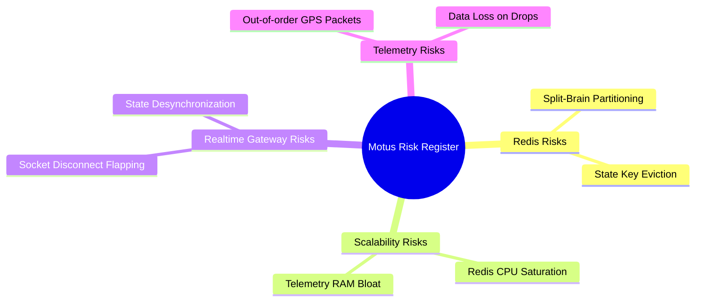

# 58 - Risk Analysis & Register

This document identifies technical, scalability, persistence, and real-time risks for the Motus architecture, along with mitigation strategies.

---

## Operational Risk Register

---

## Detailed Risk Profiles & Mitigations

### 1. Redis Cluster Split-Brain Partitioning
*   **Risk Description:** In a Redis Cluster deployment, network partitions can isolate master nodes. Client requests might write duplicate state updates to both partitions, causing double bookings or driver assignment conflicts.
*   **Likelihood:** Low | **Impact:** High
*   **Mitigation Strategy:**
    *   Configure `min-replicas-to-write 1` and `min-replicas-max-lag 10`. This ensures write requests are rejected if at least one replica does not acknowledge the master node, preventing write splitting.
    *   Implement client-side health checking of Redis cluster topologies to fail-fast on node isolations.

### 2. Database Key Eviction (State Loss)
*   **Risk Description:** If Redis memory becomes saturated, the default eviction policy might prune active session profiles, locks, or driver status caches.
*   **Likelihood:** Low | **Impact:** High
*   **Mitigation Strategy:**
    *   Enforce a strict `noeviction` policy in Redis configurations. If memory limits are hit, Redis returns out-of-memory (OOM) errors to writes rather than silently deleting active keys.
    *   Set up alerts at 70% and 80% RAM utilization to trigger horizontal cluster node expansion.

### 3. Rapid WebSocket Reconnection (Connection Flapping)
*   **Risk Description:** Drivers moving through weak signal zones may drop and reconnect repeatedly within seconds. This can cause rapid state switching between `STALE` and `ONLINE`, overloading database threads.
*   **Likelihood:** High | **Impact:** Medium
*   **Mitigation Strategy:**
    *   Implement connection dampening in `@motus/socketio` (e.g. delay transition of driver presence to `STALE` by 120 seconds after socket disconnection).
    *   Validate coordinate packets using monotonically increasing client-side timestamps. Discard any packets that arrive out-of-order or late.

### 4. Telemetry Stream Memory Bloat
*   **Risk Description:** Under high session volumes, appending coordinate heartbeats to Redis Streams can consume excessive RAM, threatening node stability.
*   **Likelihood:** Medium | **Impact:** Medium
*   **Mitigation Strategy:**
    *   Implement the 25m/10s delta sampling filter in `@motus/core`.
    *   Configure a strict 24-hour TTL on telemetry stream keys.
    *   Prune telemetry stream keys instantly upon compilation of final post-session reports.

### 5. Routing Engine API Outages
*   **Risk Description:** The ETA matching strategy relies on external routing APIs (OSRM/Valhalla/Google Maps). If these services fail, matching operations can hang.
*   **Likelihood:** Medium | **Impact:** High
*   **Mitigation Strategy:**
    *   Enforce a strict 100ms client timeout limit on routing calls.
    *   Implement automatic fallback to Haversine distance calculations if the timeout expires or a failure is detected.
