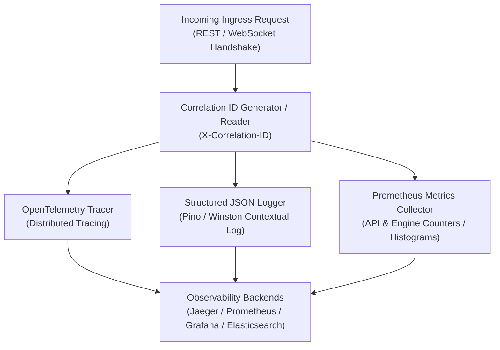
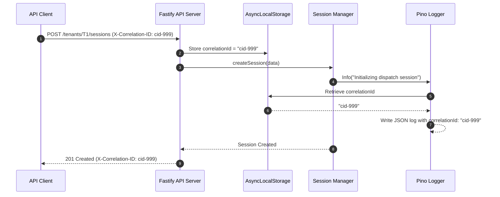

# 59 - Observability Architecture

This document describes the unified Observability Architecture for Motus under scale, covering logging, metrics, distributed tracing, correlation IDs, and audit trails.

---

## Observability Architecture Components

---

## Technical Specifications

### 1. Structured Logging Standards
All packages write logs in a single-line JSON format using a logger (e.g. `pino`) to ensure compatibility with log collectors (e.g. Fluentd, Logstash, Vector).
*   **Log Severity Levels:** `fatal`, `error`, `warn`, `info`, `debug`, `trace`.
*   **Required Fields:**
    *   `level` (string): Level description.
    *   `timestamp` (number): Epoch milliseconds.
    *   `correlationId` (string): Unique request trace identifier.
    *   `tenantId` (string, optional): Active tenant partition.
    *   `sessionId` (string, optional): Active session identifier.
    *   `driverId` (string, optional): Active driver identifier.
    *   `message` (string): Context message.

### 2. Correlation ID Propagation
To trace events across REST, WebSocket, and Redis Stream boundaries:
1.  **Ingress HTTP:** Fastify parses incoming `X-Correlation-ID` headers. If missing, it generates a UUID and binds it to request context.
2.  **WebSocket Handshake:** Sockets inherit the correlation ID from handshake headers or metadata queries.
3.  **Local Context:** The server utilizes Node's `AsyncLocalStorage` to store the active correlation ID context per execution context, ensuring that all log entries automatically include the ID without manual passing.
4.  **Outbox Streams:** The correlation ID is added to the CloudEvent envelope metadata before saving to Redis, tracing the event through external message brokers.

### 3. OpenTelemetry Distributed Tracing
*   **Tracing Collector:** Connects to OpenTelemetry (OTel) instrumentation libraries.
*   **Spans:** Tracks spans for:
    *   `HTTP REST Controllers` (Fastify routing).
    *   `Socket Event Handlers` (WS messages).
    *   `Redis Operations` (Lua executions, repository queries).
    *   `Matching Engine Runs` (Filter and OSRM ETA queries).
*   **Span Context:** Injects the span context into outbound network calls and events to allow Jaeger/Zipkin to render end-to-end execution paths.

### 4. Prometheus Metrics Catalog
*   **Registry:** Maintains a global metrics registry in `@motus/server`.
*   **Key Metrics:**
    *   `motus_api_requests_total`: Counter tracking total HTTP endpoints requests.
    *   `motus_api_request_duration_seconds`: Histogram tracking HTTP response latencies.
    *   `motus_driver_status`: Gauge tracking counts of drivers per status (`ONLINE`, `PAUSED`, `BUSY`, `STALE`).
    *   `motus_session_state`: Gauge tracking active session counts per state.
    *   `motus_matching_routing_failures`: Counter tracking OSRM/Valhalla timeout events.

### 5. Audit Trails
*   **Mechanism:** Transactional outbox streams in Redis serve as an immutable log of state transitions.
*   **Persistence:** The outbox worker publishes events to long-term storage platforms (e.g., Elasticsearch, Kafka topics) to provide audit trails for billing, disputes, and incident post-mortems.

---

## Sequence Diagram (Correlation ID Propagation)

---

## Failure Scenarios

*   **Context Leakage:** When using `AsyncLocalStorage`, third-party libraries that break the async call stack can lose the active correlation ID context. To handle this, the log manager falls back to generating a local correlation ID if the store returns undefined.
*   **Telemetry Logging Loop:** If the logger writes logs to the console and the log parser writes logs back to Redis, an operational loop can overload CPU. Ensure log outputs write strictly to standard console output (`stdout`), decoupling ingestion from the core application thread.
