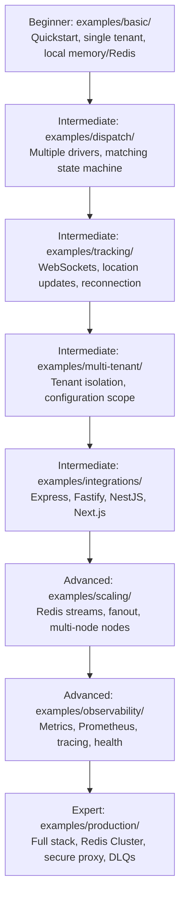
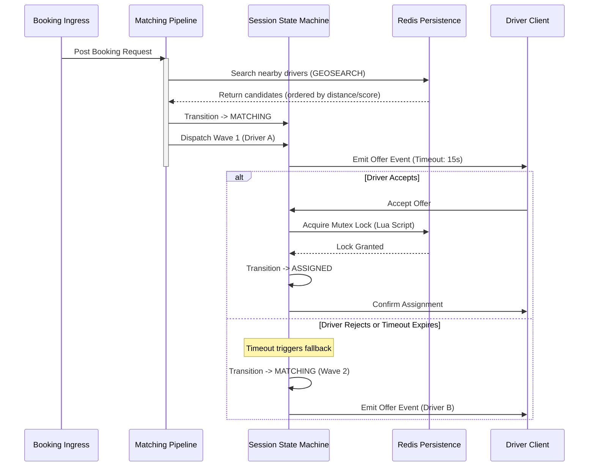

# 60 - Examples & Reference Applications Strategy

This document details the Examples and Reference Applications strategy for Motus, the open-source real-time dispatch and tracking engine. It outlines the philosophy, learning progression, repository layouts, example-specific architectures, documentation plans, and integration paths.

---

## SECTION 1 — EXAMPLES STRATEGY

### Example Philosophy
Examples in Motus are treated as first-class, runnable documentation. They are not merely snippets, but functional, self-contained mini-projects that demonstrate clean architectures, modern development standards, and robust operations. The philosophy is governed by three pillars:
1. **Production-First**: Code written in examples must reflect real-world production practices (e.g., proper error handling, schema validations, lifecycle management, and connection draining).
2. **Zero-Configuration Startup**: Every example must bootstrap locally using single-command environments (e.g., `docker-compose` or `npm run dev`) with zero prior configuration.
3. **Typing Integrity**: All examples must utilize standard TypeScript configurations, leveraging the workspace package definitions strictly.

### Learning Progression
The examples directory uses a progressive learning journey that guides a developer from absolute beginner to enterprise architect:



1. **Beginner (Onboarding)**:
   * **Target**: 0–15 minutes.
   * **Goal**: Spin up a minimal Motus server, register a driver, simulate a request, and see matching/assignment work.
   * **Core Example**: `examples/basic/`.
2. **Intermediate (Integration & Features)**:
   * **Target**: 1–2 hours.
   * **Goal**: Embed Motus into standard web frameworks, handle live location telemetry, isolate multiple business tenants, and design custom workflows.
   * **Core Examples**: `examples/dispatch/`, `examples/tracking/`, `examples/multi-tenant/`, `examples/integrations/`.
3. **Advanced (Scaling & Reliability)**:
   * **Target**: 4–8 hours.
   * **Goal**: Build highly available topologies, ingest massive telemetry fanout streams, configure health metrics, and design dashboards.
   * **Core Examples**: `examples/scaling/`, `examples/observability/`.
4. **Expert (Production Blueprint)**:
   * **Target**: Multi-day integration.
   * **Goal**: Deploy a production-ready template that can be copied directly into enterprise infrastructure with automated deployment assets, security proxies, and telemetry persistence.
   * **Core Example**: `examples/production/`.

### Example Ownership Model
To avoid example decay, a strict ownership matrix is enforced:
* **Framework Core Team**: Owns `examples/basic/`, `examples/scaling/`, and `examples/production/` as they directly map to package release stability tests.
* **Developer Relations & Technical Writers**: Own `examples/integrations/`, `examples/tracking/`, and `examples/observability/` for tutorials and developer onboarding.
* **Community Contributors**: High freedom of contribution allowed for custom frontend frameworks and edge integrations under `examples/integrations/` subject to maintainer review.

### Version Compatibility Strategy
All examples utilize `pnpm` workspaces mapping directly to the monorepo packages (`@motus/core`, `@motus/redis`, `@motus/socketio`, `@motus/types`, and `@motus/server`).
* **Dev/Main Branch**: Pinned to workspace version targets via the `"workspace:*"` specifier. This ensures that any change to core packages immediately updates and validates the examples.
* **Release Branch**: Build workflows automate renaming `"workspace:*"` dependencies to concrete published npm package versions (e.g., `"^1.2.0"`) within released boilerplate templates, verifying examples build against published npm targets before deployment tags are finalized.

### Maintenance Strategy
* **Automated CI Checks**: Every pull request runs linting, type-checks (`tsc --noEmit`), and local integration smoke tests inside `examples/`.
* **Lockfile Enforcement**: A single monorepo root-level lockfile (`pnpm-lock.yaml`) is maintained. Dependencies cannot be added to individual examples without passing lockfile audits to block vulnerable packages.
* **Dependency Updates**: Renovate or Dependabot targets `examples/` alongside `packages/`, ensuring all shared packages use current safe libraries.

---

## SECTION 2 — REPOSITORY STRUCTURE

The following tree defines the exact organization of the `examples/` directory:

```
examples/
├── basic/                  # Beginner: Minimal server, mock driver simulation
│   ├── package.json
│   ├── tsconfig.json
│   ├── src/
│   │   ├── index.ts        # Orchestrator and entry point
│   │   └── client.ts       # Mock driver client simulator
│   └── README.md
├── dispatch/               # Intermediate: Advanced matching and assignment lifecycle
│   ├── package.json
│   ├── tsconfig.json
│   ├── src/
│   │   ├── server.ts       # Server with custom matching pipeline hooks
│   │   └── simulator.ts    # Reassignment, timeout, and cancellation simulator
│   └── README.md
├── tracking/               # Intermediate: Live location updates and telemetry
│   ├── package.json
│   ├── tsconfig.json
│   ├── public/             # Simple HTML UI for map-based tracking visualization
│   └── src/
│       ├── gateway.ts      # WebSocket location consumer
│       └── client.ts       # Driver telemetry generator
├── multi-tenant/           # Intermediate: Multiple tenants with strict separation
│   ├── package.json
│   ├── tsconfig.json
│   ├── src/
│   │   ├── seed.ts         # Multi-tenant bootstrap settings
│   │   └── server.ts       # Scoped router isolation validator
│   └── README.md
├── scaling/                # Advanced: Distributed horizontal nodes
│   ├── package.json
│   ├── tsconfig.json
│   ├── docker-compose.yml  # Multi-node compose with HAProxy load balancer
│   ├── haproxy.cfg         # Sticky websocket balancing settings
│   └── src/
│       └── node.ts         # Horizontal cluster server bootstrap
├── observability/          # Advanced: Logging, tracing, and health checks
│   ├── package.json
│   ├── tsconfig.json
│   ├── prometheus.yml      # Metric scrape configurations
│   ├── grafana/            # Pre-configured dashboard panels
│   └── src/
│       └── server.ts       # Service exposing Otel and Prometheus outputs
├── integrations/           # Intermediate: Framework integration boilerplate templates
│   ├── express/            # Express.js backend wrapper
│   ├── fastify/            # Fastify backend wrapper
│   ├── nestjs/             # NestJS framework module wrapping
│   ├── nextjs/             # Next.js route API integrations
│   └── custom-node/        # Pure HTTP standard node server
└── production/             # Expert: Production Reference App architecture
    ├── package.json
    ├── tsconfig.json
    ├── docker-compose.yml  # Redis Cluster, Envoy, Prometheus, Grafana
    ├── src/
    │   ├── config.ts       # Production-ready strict configuration validation
    │   ├── main.ts         # Orchestration entry point
    │   └── auth/           # Production JWT Auth validation hook
    └── README.md
```

### Purpose, Dependencies, Complexity, and Learning Goals

| Example Folder | Purpose | Dependencies | Complexity | Learning Goals |
| :--- | :--- | :--- | :--- | :--- |
| `basic/` | Minimal server startup and booking flow simulation | `@motus/core`, `@motus/types`, `typescript` | Beginner | Learn configuration basics, registering tenants/drivers, and executing a complete assignment lifecycle. |
| `dispatch/` | Simulates advanced dispatch flows, cancellations, and driver matching | `@motus/core`, `@motus/types`, `@motus/redis` | Intermediate | Learn custom matching scores, candidate searching, timeouts, reassignments, and state machines. |
| `tracking/` | Implements live telemetry updates and WebSocket listeners | `@motus/core`, `@motus/types`, `@motus/socketio` | Intermediate | Learn telemetry pipelines, coordinate formatting, client tracking rooms, and WebSocket recovery. |
| `multi-tenant/` | Validates separation boundaries between isolated accounts | `@motus/core`, `@motus/types`, `@motus/redis` | Intermediate | Learn tenant namespaces in Redis, credential scopes, rate limiting, and config overrides. |
| `scaling/` | Sets up horizontally scaled HTTP/WS instances with Redis | `@motus/core`, `@motus/types`, `@motus/redis`, `@motus/socketio` | Advanced | Learn sticky-session load balancing, distributed fanout streams, Pub/Sub coordination, and nodes orchestration. |
| `observability/` | Demonstrates OpenTelemetry tracing and Prometheus exporter integrations | `@motus/core`, `@motus/types`, `@motus/server` | Advanced | Learn endpoint metrics, custom counters, OpenTelemetry spans, health checks, and dashboard setups. |
| `integrations/` | Boilerplate layouts for embedding Motus into popular framework layers | `@motus/core`, `@motus/types`, framework specific | Intermediate | Learn lifecycle bindings, dependency injection mapping, middleware wrappers, and endpoint routing. |
| `production/` | Full-scale secure application mimicking production architectures | All packages, `@socket.io/redis-adapter` | Expert | Learn cluster topology, proxy configurations, JWT authentication hooks, and resilient failover. |

---

## SECTION 3 — QUICKSTART EXAMPLE

The `examples/basic/` directory provides developers with a clear onboarding path to demonstrate the core API in a single, simple runnable script.

### Folder Structure
```
examples/basic/
├── package.json
├── tsconfig.json
├── README.md
└── src/
    ├── index.ts        # The main simulation runner
    └── client.ts       # Helper simulating driver GPS telemetry
```

### Architecture
The basic quickstart uses `@motus/core` with an in-memory database mock (or single-node Redis local client) to coordinate the dispatch engine. It avoids complex HTTP setups by executing direct API method calls against the managers to showcase the core domain state machine.

```
+-----------------------------------------------------------+
|                        index.ts                           |
|  - Bootstraps Server & Config                             |
|  - Registers Tenant: "taxi-corp"                          |
|  - Registers Driver: "driver-john" (Goes Online)          |
|  - Creates Booking: "booking-001"                         |
|  - Triggers Matching Pipeline                             |
|  - Completes Assignment Flow                              |
+-----------------------------------------------------------+
                             |
                             v
+-----------------------------------------------------------+
|                      @motus/core                          |
|  Matches "driver-john" -> Assigns -> Tracks Location      |
+-----------------------------------------------------------+
```

### Walkthrough of Core Flow (within `src/index.ts`)
1. **Server Startup**: Loads static config overrides.
2. **Tenant Registration**:
   ```typescript
   const tenant = await tenantManager.createTenant({
     id: "tenant-basic-01",
     name: "Quickstart Taxi Corp",
     config: { maxRadiusMeters: 5000, assignmentTimeoutMs: 30000 }
   });
   ```
3. **Driver Registration & Presence Online**:
   ```typescript
   const driver = await driverManager.registerDriver("tenant-basic-01", {
     id: "driver-001",
     name: "John Doe"
   });
   await driverManager.setOnline("tenant-basic-01", "driver-001", {
     latitude: 37.7749,
     longitude: -122.4194
   });
   ```
4. **Booking & Matching Request**:
   Creates a request targeting the location `(37.7752, -122.4190)`.
5. **Matching Engine Execution**: Runs candidate search. Since John Doe is online and within 5000m, he is selected as the optimal candidate.
6. **Assignment Wave**: Emits an offer to the driver. The driver accepts.
7. **Session Lifecycle Tracking & Completion**: Location updates simulate driver path moving towards destination. When arrival is reached, the session is completed and reports are generated.

---

## SECTION 4 — DISPATCH REFERENCE APPLICATION

The `examples/dispatch/` directory designs a realistic dispatch engine that demonstrates how to manage large fleets of drivers with conflicting states.

### Architecture
The dispatch application leverages the core `MatchingPipeline` and `SessionStateMachine` to process high-frequency booking intakes. It uses standard Redis indices (`GEORADIUS` / `GEOSEARCH` features implemented in `@motus/redis`) to find candidates and schedules sequential "waves" of offers to prevent race conditions.



### Workflows Demonstrated
1. **Driver Selection and Custom Scoring**: Showcases how to extend candidate scoring by combining GPS distance, rating, and driver vehicle type.
2. **Wave Dispatch Logic**: Demonstrates prioritizing the closest driver, waiting for their response, and then fanning out to the next closest driver.
3. **Reassignment Scenarios**: Details what occurs when an assigned driver cancels the booking mid-route. The session transitions back to `REASSIGNING`, returning the booking to the matching queue.

### Testing Scenarios
* **The Thundering Herd**: Simulate 100 drivers attempting to accept the same booking simultaneously. Verifies that Redis Lua locks guarantee exactly-once assignment.
* **Timeout Recovery**: Validate that if a driver goes offline during an active offer, the system automatically marks the offer expired and re-allocates the session without manual administrator intervention.

---

## SECTION 5 — REALTIME TRACKING EXAMPLE

The `examples/tracking/` directory demonstrates location telemetry ingestion, tracking subscription rooms, and client UI synchronization.

### Architecture
```
  [Telemetry Generator Client]
               │ (GPS telemetry payload: lat, lon, bearing, speed)
               ▼
   [WebSocket Transport Gateway] ---> [TelemetryManager (@motus/core)]
               │                                   │
               ▼ (Pub/Sub: location.updated)       ▼ (Redis Telemetry Cache)
      [Redis Event Bus]                      [Geofence Polygon Validator]
               │                                   │
               ▼                                   ▼
 [Tracking Room Broadcaster]                 [State Transition: breaches]
               │ (Emit coordinate frames)
               ▼
   [Customer Web Client (Map)]
```

### Event Flows
1. **Telemetry Stream Ingestion**: The driver simulator sends coordinates every 2 seconds via WebSockets (`driver.telemetry.submit`).
2. **Telemetry Validation**: Coordinates are parsed and run through the `TelemetrySampler` (calculating distance and time deltas) to skip redundant, non-moving points.
3. **Geofencing Evaluation**: The coordinate is validated against tenant geofence limits. If the driver exits the allowed boundary, a `geofence.exit` event is published.
4. **Subscriber Broadcast**: Sockets mapped to customer rooms (e.g., `room:session:123`) receive location frames with interpolated angles and velocity vectors.

### Observability Points
* **Ingress Telemetry Count**: Tracks raw coordinates received vs coordinates committed to cache.
* **Websocket Jitter Gauge**: Measures the delta between GPS capture timestamp and the final client UI rendering timestamp.
* **Reconnect Metrics**: Tracks client connection drop frequencies and socket recovery success.

---

## SECTION 6 — MULTI-TENANT EXAMPLE

The `examples/multi-tenant/` directory demonstrates how a single Motus instance can run multiple isolated businesses (e.g., "City Cabs" and "Express Logistics") on shared hardware.

### Architecture
Multi-tenancy isolation is enforced at the core, cache, and WebSocket boundaries:
* **Prefix Isolation**: All Redis key spaces are automatically isolated with prefix keys (e.g., `tenant:<tenantId>:driver:<driverId>`).
* **Route Context Binding**: Application middleware resolves tenant context on HTTP endpoints and Socket handshakes (via API keys or subdomain headers).
* **Isolated Configuration Matrix**: Demonstrates how two tenants can run matching pipelines with radically different parameters (e.g., tenant A uses a 5,000m radius limit, while tenant B uses a 15,000m radius limit).

```
                             [Fastify Gateway]
                       (Parses x-tenant-id Header)
                      /                           \
                     /                             \
     [Tenant A: City Cabs]                [Tenant B: Express Logistics]
     - Prefix: tenant:cabs:*               - Prefix: tenant:logistics:*
     - Search Radius: 5000m                - Search Radius: 15000m
     - Assignment Timeout: 15s             - Assignment Timeout: 45s
                     \                             /
                      \                           /
                       [Shared Redis Cluster Store]
```

### Validation Scenarios
* **Cross-Tenant Attack Simulation**: An integration test attempts to fetch active sessions for Tenant B using a valid session ID but passing Tenant A's API key header. The server must return a `404 Not Found` or `403 Forbidden` response.
* **Congestion Isolation**: Simulate massive traffic (10,000 requests/sec) on Tenant A while executing a single request on Tenant B. Verify that Tenant B's latency remains under the SLA target (e.g., matching completes in `< 50ms`).

---

## SECTION 7 — SCALING EXAMPLE

The `examples/scaling/` directory models a horizontally autoscaled Motus cluster capable of processing high driver concurrency.

### Deployment Topology
This example orchestrates a multi-node cluster using a Docker Compose blueprint.

```
                  +-----------------------------------+
                  |      HAProxy Load Balancer        |
                  |  - HTTP round-robin               |
                  |  - WebSocket session affinity     |
                  +-----------------------------------+
                       /                         \
                      /                           \
                     v                             v
           +-------------------+         +-------------------+
           | Motus Server Node |         | Motus Server Node |
           |      (Node 1)     |         |      (Node 2)     |
           +-------------------+         +-------------------+
             |               \             /               |
             |                \           /                |
             |                 v         v                 |
             |             +-------------------+           |
             |             | Socket.io Redis   |           |
             |             | Adapter (Pub/Sub) |           |
             |             +-------------------+           |
             |                       |                     |
             v                       v                     v
   +-----------------------------------------------------------------+
   |                     Redis Cluster (Sentinel)                    |
   |              - Active location registries (GEO)                 |
   |              - Session states and mutexes                       |
   +-----------------------------------------------------------------+
```

### Scaling Validation
* **Horizontal Fanout**: A driver publishes a location update on Node 1. A customer watching the session is connected to Node 2. The update is fanned out across nodes using the Redis Pub/Sub adapter, validating zero-loss messaging.
* **Node Eviction (Chaos Simulation)**: A worker script terminates Node 1 forcefully during active tracking. The load balancer redirects clients to Node 2. Sockets must auto-reconnect, authenticate, and resume coordinate streaming seamlessly.

---

## SECTION 8 — OBSERVABILITY EXAMPLE

The `examples/observability/` directory sets up a monitoring and diagnostics stack based on Prometheus, Grafana, and OpenTelemetry.

### Architecture
The observability application wraps around `@motus/server`, configuring exporters to channel diagnostics out of process.

```
                             +-------------------+
                             |   Motus Server    |
                             +-------------------+
                              /                 \
            (HTTP /metrics)  /                   \ (OTLP/gRPC Spans)
                            v                     v
                    +--------------+       +--------------+
                    |  Prometheus  |       | OpenTelemetry|
                    |  Collector   |       |  Collector   |
                    +--------------+       +--------------+
                           |                      |
                           v                      v
                    +--------------+       +--------------+
                    |   Grafana    |       | Jaeger / Zip |
                    |  Dashboards  |       |  UI (Traces) |
                    +--------------+       +--------------+
```

### Dashboard Configurations
The example includes configuration JSON assets for Grafana that display:
1. **Active Sockets Panel**: Active drivers vs customers online.
2. **State Machine Transitions**: A heat map showing sessions shifting between `CREATED`, `MATCHING`, `ASSIGNED`, and `COMPLETED`.
3. **API Request Latency**: P95, P99, and P50 HTTP request distribution.
4. **Queue Latency**: Time elapsed between domain events published and consumer ACK signals.

### Troubleshooting Workflows
The walkthrough outlines how to debug production bottlenecks:
* **Debugging High Assignment Timeout Rates**: Connects slow matching metrics to matching boundary limitations in config parameters.
* **Finding Telemetry Bottlenecks**: Traces coordinate ingress limits through Jaeger spans to isolate latency inside the `GeofencePolygonValidator`.

---

## SECTION 9 — INTEGRATION EXAMPLES

The `examples/integrations/` directory provides copy-paste boilerplates for linking Motus into common Node.js framework paradigms.

### Express.js Integration
* **Architecture**: Express routes act as ingress controllers. An Express middleware translates request tokens to `AuthContext`.
* **Integration Points**: Express `app` bootstrap registers the `MotusServer` during the listener startup phase.
* **Lifecycle Management**:
  ```typescript
  const server = express();
  const motus = await new MotusServerBuilder().build();
  
  const httpListener = server.listen(3000, async () => {
    await motus.start();
  });
  
  process.on('SIGTERM', async () => {
    await motus.stop();
    httpListener.close();
  });
  ```

### Fastify Integration
* **Architecture**: A dedicated plugin (`fastify-motus`) decorates the Fastify instance with the Motus container.
* **Integration Points**: Fastify schemas validate request parameters using AJV before handing processing off to the Motus controllers.
* **Lifecycle Management**: Binds Motus start and shutdown workflows directly to Fastify's `onListen` and `onClose` hooks.

### NestJS Integration
* **Architecture**: Implements a dynamic module `MotusModule.forRoot(...)`.
* **Integration Points**: Defines custom NestJS decorators (`@InjectMotus()`) to inject the matching engine and session managers into NestJS controllers.
* **Lifecycle Management**: Utilizes NestJS `OnModuleInit` and `OnApplicationShutdown` hook interfaces.

### Next.js Backend Integration
* **Architecture**: Implements Motus within Next.js API Routes (Route Handlers).
* **Integration Points**: A global, lazily evaluated helper keeps a singleton connection pool alive across Next.js serverless function cold-starts.
* **Lifecycle Management**: Since serverless nodes are short-lived, the setup disables WebSocket adapters and leverages the REST and Redis persistence layers exclusively.

### Custom Node.js Integration
* **Architecture**: Bare-metal HTTP router using the standard Node `http` or `http2` library.
* **Integration Points**: Manually handles chunked requests, body buffers, and basic route routing.
* **Lifecycle Management**: Directly intercepts `process.on('SIGTERM')` events, executing graceful server closes.

---

## SECTION 10 — PRODUCTION REFERENCE APPLICATION

The `examples/production/` directory is a comprehensive, enterprise-ready blueprint designed to mimic a real-world Motus deployment.

### Architecture Topology

```
                                  [Internet]
                                      │
                                      ▼
                        [Envoy Edge Proxy (SSL Term)]
                               /             \
                   (HTTP API) /               \ (WS Connections)
                             v                 v
                    [Motus Server 1]    [Motus Server 2]
                             \                 /
                              \               /
                               v             v
                    +--------------------------------+
                    |      Redis Cluster (v7.x)      |
                    |  - Sharded Storage (GEO, Hash) |
                    |  - Redis Outbox Streams        |
                    +--------------------------------+
                               |             |
                    (Events)   |             | (Telemetry)
                               v             v
                    [Telemetry Consumer]  [Outbox Event Worker]
                               │             │
                               ▼             ▼
                    [Timescale DB Cache]  [Enterprise Kafka Engine]
```

### Key Production Practices
1. **Envoy Edge Proxy Integration**: Manages SSL termination, path-based routing, HTTP/2 multiplexing, CORS configurations, and rate-limiting limits.
2. **Redis Cluster (Multi-Shard)**: Connects to a sharded Redis cluster. Implements slot distribution mapping and Sentinel monitoring configurations.
3. **Enterprise Resilience Patterns**:
   * **Telemetry Dead-Letter Queues (DLQ)**: Bad telemetry coordinates or schema format failures are routed to `motus:dlq:<tenant>:telemetry` for processing audits.
   * **Outbox Pattern Implementation**: State transitions commit transactions to a Redis outbox stream. A dedicated outbox worker processes streams to guarantee at-least-once delivery to external systems (e.g., Kafka).
4. **Security Hardening**:
   * Runs all services in Docker under non-root permissions.
   * Forces TLS on all database and server-to-server connections.
   * Leverages JWT validation middleware with cryptographic signature checks.

### Operational Concerns
* **Backpressure Management**: Restricts WebSocket telemetry queues when Redis write latency exceeds 15ms.
* **Memory Limits**: Details setting up memory eviction rules on Redis to prevent the cache from running out of system memory.

---

## SECTION 11 — DOCUMENTATION INTEGRATION

The examples directory is integrated into the primary Motus documentation under `docs/examples/`.

### Directory Structure
```
docs/examples/
├── index.md                # Gateway list of all templates and paths
├── basic.md                # Step-by-step beginner guide
├── dispatch.md             # Detailed guide to matching and waves
├── tracking.md             # Real-time WebSocket patterns guide
├── scaling.md              # Docker compose scale setup guide
├── integrations.md         # Framework setup guide
└── production.md           # Production deploy checklists
```

### Getting Started Section
Provides a quick command list to bootstrap development:
```bash
git clone https://github.com/motus/motus.git
cd motus
pnpm install
pnpm build
cd examples/basic
npm run dev
```

### Update and Synchronization Strategy
* **Automated Code Extraction**: Documentation pages reference live example source files using markdown links (e.g., `[Quickstart Code](../../examples/basic/src/index.ts)`). This ensures code samples in docs never go stale.
* **PR Checklist Requirement**: Any pull request that modifies package API structures in `@motus/core` or `@motus/server` must include updates to the examples and documentation. CI blocks PRs if example tests fail.

---

## SECTION 12 — TESTING STRATEGY

Every example must be verified automatically to prevent regressions.

### Validation Approach
Tests run inside a localized isolated Docker context to simulate external network environments.

### Test Matrix

| Example Folder | Test Scope | Verification Tool | Run Target |
| :--- | :--- | :--- | :--- |
| `basic/` | Smoke test: Verify runner script boots and exits with code 0 | Vitest CLI runner | CI on PR merge |
| `dispatch/` | Integration: Verify Lua scripts execute, timeouts trigger wave changes | Vitest + Redis container | CI on PR merge |
| `tracking/` | Integration: Verify WebSocket packet routing and room joins | Vitest + Socket.IO client | CI on PR merge |
| `scaling/` | E2E: Verify HAProxy load balances connections, node crash recovery | K6 test suite + Docker Compose | Nightly builds |
| `observability/` | Smoke test: Verify `/metrics` and `/health` endpoints are active | curl validations | CI on PR merge |
| `integrations/` | Smoke test: Verify NestJS, Express, and Fastify applications boot | CLI framework checks | Weekly builds |
| `production/` | E2E: Run high-load concurrency simulations against Envoy + Redis Cluster | K6 load test + Docker Compose | Pre-release release |

### CI Requirements
* **Github Actions Execution**: Integration and smoke tests run on every commit.
* **Environment Bootstrapping**: Workflows spin up temporary Redis containers (`redis:7-alpine`) to support repository test fixtures.
* **Failure Alerts**: If example E2E runs fail, compilation logs and Docker daemon outputs are archived as artifacts.

---

## SECTION 13 — IMPLEMENTATION ROADMAP

The design of the examples is rolled out in four phases.

### Phase 1: Minimum Onboarding Examples (Week 1)
* **Deliverables**: Complete `examples/basic/`, integration documentation template guides, and basic CI smoke tests.
* **Dependencies**: Stable builds of `@motus/core` and `@motus/types`.
* **Acceptance Criteria**: Running `npm run dev` in `examples/basic/` executes a full match, assignment, and completion sequence in under 5 seconds with zero configuration.

### Phase 2: Core Workflow Examples (Weeks 2-3)
* **Deliverables**: Complete `examples/dispatch/`, `examples/tracking/`, `examples/multi-tenant/`, and `examples/integrations/`.
* **Dependencies**: Stable builds of `@motus/redis` and `@motus/socketio`.
* **Acceptance Criteria**: Telemetry clients send 500 coordinates, validation processes them, and UI maps position updates without frame drop events. Cross-tenant queries return 403.

### Phase 3: Advanced Distributed Examples (Week 4)
* **Deliverables**: Complete `examples/scaling/` and `examples/observability/`.
* **Dependencies**: Redis cluster multi-node support, Fastify HTTP metrics hooks.
* **Acceptance Criteria**: A 3-node server cluster runs behind HAProxy, processes 2,000 WebSocket connections, and metrics export to Prometheus. Node crashes recover in under 3 seconds.

### Phase 4: Production-Grade Reference Applications (Weeks 5-6)
* **Deliverables**: Complete `examples/production/` deployment blueprints, Envoy route configurations, TLS configurations, and Kafka integration templates.
* **Dependencies**: Complete validation of all other phases.
* **Acceptance Criteria**: Running a K6 load test against Envoy exposes zero HTTP 5xx errors under a sustained load of 5,000 requests/sec. Dead-letter queues intercept invalid coordinates.

---

## SECTION 14 — OSS MAINTAINER REVIEW

### Completeness
The proposed examples ecosystem covers the entire lifecycle of a Motus integration, from initial onboarding to distributed production clusters. It addresses both backend architectures (REST, WebSockets, Redis) and runtime features (multi-tenancy, observability, scaling).

### Developer Experience (DX)
* **The "First 5 Minutes" Principle**: The basic example has been designed with absolute minimum barriers. A developer can copy-paste a single file to see the system run.
* **High Copy-Paste Capability**: The code is structured in clean modules (such as configuration validators, auth interceptors, and error handlers) that developers can copy directly into their codebases.

### Long-Term OSS Sustainability
* **Low Maintenance Burden**: By binding examples to the monorepo pnpm workspace, API breakages are caught immediately at compile time. We avoid the classic issue of documentation code rotting over time.
* **Community Contributions**: The decoupled `examples/integrations/` directory allows community developers to add boilerplate templates for their favorite libraries (e.g., Fastify plugins, Elysia, Koa) without modifying core packages.

### Risks and Mitigations

| Identified Risk | Impact | Recommended Mitigation |
| :--- | :--- | :--- |
| **Example Decay (API Changes)** | High | CI enforces compiling all examples. A breaking change in core packages must fail the build if examples aren't updated. |
| **Redis Versioning Conflicts** | Medium | Standardize examples on Docker containers pinned to major Redis version 7.x. |
| **Observability Overhead** | Low | Provide observability configuration templates in a disabled state by default, allowing developers to opt-in via flags. |
| **Port Conflicts on Dev Boxes** | Low | Implement port validation scripts that warn developers if required ports (3000, 6379, 8080) are already bound. |
