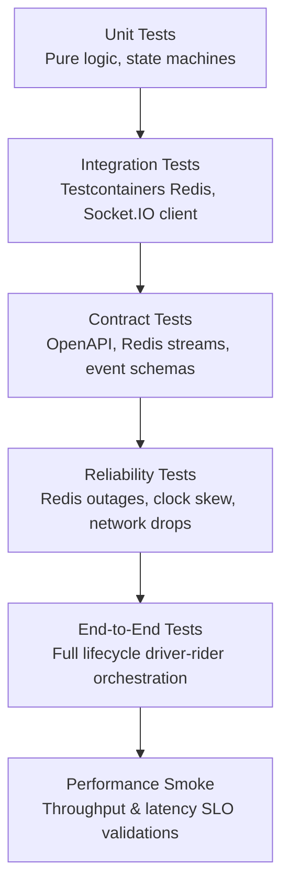

# 61 - Testing & Quality Strategy

This document defines the comprehensive testing architecture, tooling configuration, quality gates, and reliability models designed to validate the correctness, resilience, and performance of the Motus real-time dispatch and tracking platform.

---

## 1. Executive Summary & Purpose

Motus is a high-throughput, low-latency, multi-tenant real-time dispatch engine. Ensuring its correctness requires a testing strategy that balances fast development feedback with high-fidelity validation of state machines, geospatial queries, and real-time WebSocket communication under failure.

This strategy establishes:
*   A unified testing pyramid combining unit, integration, contract, end-to-end (E2E), reliability, and performance tests.
*   A shared workspace testing utility package (`@motus/testing`) to eliminate boilerplate code.
*   Explicit quality gates enforced at the package level in CI.
*   Standardized Testcontainers-based isolated testing for stateful resources like Redis.

---

## 2. Testing Architecture & Pyramid

The Motus testing hierarchy is structured to deliver rapid local execution without compromising the confidence needed for production releases:

```
                  / \
                 /   \
                / E2E \  <-- Multi-tenant Scenario Runs (~1% volume, 30s execution)
               /-------\
              /  Perf   \  <-- Load/Stress Smoke Checks (~4% volume, 20s execution)
             /-----------\
            / Reliability \ <-- Fault Injection, Network Drops (~5% volume, 20s execution)
           /-------------\
          /   Contract    \ <-- Event & API Schema Matches (~10% volume, 5s execution)
         /-----------------\
        /   Integration     \ <-- Testcontainers Redis & WebSockets (~30% volume, 10s execution)
       /---------------------\
      /         Unit          \ <-- Stateless Math, State Transitions (~50% volume, <1s execution)
     /-------------------------\
```

### Flow Lifecycle



---

## 3. Monorepo Test Architecture

Motus is organized as an npm-workspace monorepo. The test infrastructure mirrors this structure to ensure dependency isolation and build caching compatibility.

### Directory Structure

```
motus/
├── package.json                   # Root workspace config & task scripts
├── vitest.workspace.ts            # Coordinates Vitest workspaces
├── packages/
│   ├── types/
│   │   ├── vitest.config.ts       # Type testing configuration
│   │   └── src/**/*.test.ts       # Type verification tests
│   ├── core/
│   │   ├── vitest.config.ts       # Strict 95% coverage configuration
│   │   └── src/**/*.test.ts       # Unit tests for domain logic
│   ├── redis/
│   │   ├── vitest.config.ts       # Integration-heavy timeout config
│   │   └── src/__tests__/
│   │       ├── unit/              # Serializer, keys unit tests
│   │       └── integration/       # Testcontainers-based Redis tests
│   ├── socketio/
│   │   ├── vitest.config.ts       # Real-time WebSocket tests
│   │   └── src/__tests__/         # Connection registry & gateway tests
│   └── testing/
│       ├── package.json           # Shared testing utility metadata
│       ├── vitest.config.ts       # Shared configuration
│       └── src/
│           ├── builders.ts        # Test data builders (Rider, Driver, Trip)
│           ├── redis.ts           # Shared Testcontainers helper
│           ├── sockets.ts         # Socket.IO client mock helpers
│           ├── contracts.ts       # Event & API contract schemas
│           └── mutation.ts        # StrykerJS mutation test settings
```

---

## 4. Package-Level Test Plan

### `@motus/types`
*   **Focus**: Enforce semantic compatibility and compile-time soundness.
*   **Unit & Type Testing**: Verify that generic utility types, result envelopes, and commands resolve correctly under strict TS compiler options.
*   **API Compatibility**: Validate that updates do not break consumer contracts by checking compatibility using `expectTypeOf` assertions.

### `@motus/core`
*   **Focus**: Pure stateless domain execution.
*   **Matching Algorithms**: Validate coordinates filtering using Haversine calculation and geofence intersections using Raycast checks.
*   **State Machine Transitions**: Exercise driver presence states (`OFFLINE` -> `AVAILABLE` -> `BUSY` -> `STALE`) and trip status transitions.
*   **Edge Cases**: Handle boundary coordinates, empty matches, concurrent lock conflicts, and duplicate location timestamps.

### `@motus/redis`
*   **Focus**: Atomic storage execution, transaction isolation, and failover recovery.
*   **Integration Tests**: Spin up isolated Redis instances using Testcontainers.
*   **Pub/Sub & Streams**: Verify that driver events are written to streams with sequential offsets and that consumer offsets are committed atomically.
*   **Lua scripts**: Ensure atomic transactions for locks and offer acceptances evaluate correctly in isolated sandboxes.

### `@motus/socketio`
*   **Focus**: Concurrent message routing, connection tracking, and authentication hooks.
*   **Gateway Ingestion**: Test real client socket connections against mock core namespaces.
*   **Temporal & Spatial Optimizations**: Verify decimation (dropping updates under 1.0m) and temporal throttling (rate-limiting updates under 50ms) are correctly applied to location broadcasts.
*   **Room Management**: Confirm sockets are joined to and evacuated from tenant-scoped and session-scoped rooms.

### `@motus/server` (Future Composition Root)
*   **Focus**: Bootstrap, routing, and lifecycle states.
*   **Bootstrap wiring**: Verify DI container builds the Directed Acyclic Graph (DAG) and rejects circular structures.
*   **Lifecycle states**: Validate state transformations (`CREATED` -> `RUNNING` -> `STOPPED`) and graceful signal draining.
*   **HTTP Controller API**: Test endpoints validation (AJV parsing, tenant path routing, rate-limiter rejections).

---

## 5. Contract Testing

To guarantee that decoupled systems (e.g., dispatch engine, persistence adapters, and transport layers) communicate without schema drift, Motus defines four explicit contract checkpoints:

```
  Producer                     Contract Validation                     Consumer
┌──────────┐               ┌────────────────────────┐               ┌────────────┐
│ @motus/  │ ──(Event)───> │ validateEventEnvelope  │ ──(Assert)──> │ @motus/    │
│ core     │               └────────────────────────┘               │ redis      │
└──────────┘                                                        └────────────┘
┌──────────┐               ┌────────────────────────┐               ┌────────────┐
│ Driver   │ ──(Stream)──> │ validateRedisLocation  │ ──(Assert)──> │ Telemetry  │
│ Gateway  │               └────────────────────────┘               │ Repository │
└──────────┘                                                        └────────────┘
┌──────────┐               ┌────────────────────────┐               ┌────────────┐
│ Socket   │ ──(WS Frame)─>│ validateSocketIOEvent  │ ──(Assert)──> │ Rider/     │
│ Server   │               └────────────────────────┘               │ Driver Cl. │
└──────────┘                                                        └────────────┘
```

### 1. Event Schemas (Governance)
All domain events (e.g., `session.started`, `session.completed`) must include a semantic `eventVersion` (e.g., `"1.0.0"`) and are verified by `validateEventEnvelope` to guarantee compatibility:
*   Additive additions must be optional.
*   Renaming or deleting properties requires major version updates.

### 2. Redis Message Formats
Validates the structure of payloads stored in Redis hashes or published via Redis Streams (`driver.location.updated`, `telemetry.sampled`). Schema compatibility ensures that raw strings and numbers can be parsed correctly into standard objects.

### 3. Socket.IO Event Payloads
Asserts that payloads emitted to or received from clients conform to the schemas. This checks the signature of commands (`assignment:accept`, `tracking:subscribe`) and client update frames (`tracking:update`).

### 4. Public API Compatibility
Compile-time verification of the public interfaces exported by `@motus/types` and facades in `@motus/core/public`. This validates that third-party extensions do not fail due to signature changes.

---

## 6. Mutation Testing (StrykerJS)

To confirm unit test quality, Motus integrates StrykerJS mutation testing targeted at `@motus/core`. Mutation testing deliberately injects faults (e.g. changing `<` to `>`, changing logical operators, deleting array filters) to ensure the test suites "kill" the mutants:

*   **Mutation Scope**:
    *   `packages/core/src/internal/services/matching/**/*.ts` (scans filters, scoring engines, and sorting).
    *   `packages/core/src/internal/services/fanout/**/*.ts` (scans wave generation and offering bounds).
    *   `packages/core/src/internal/state/**/*.ts` (scans driver and session transition guards).
*   **StrykerJS Configuration**:
    *   **Test Runner**: Vitest workspace integration.
    *   **Execution Strategy**: Runs mutations sequentially per-file to leverage HMR cache.
    *   **Quality Gate**: Enforces a minimum mutation score of **60%** (build breaks if surviving mutants exceed 40%).

---

## 7. Integration & E2E Test Catalog

### Sequential Happy-Path E2E Scenario

```
Rider              Gateway/Server          Core Engine           Redis Store          Driver
  │                      │                      │                     │                  │
  │───Request Trip──────>│                      │                     │                  │
  │                      │───Ingest Request────>│                     │                  │
  │                      │                      │───Acquire Lock─────>│                  │
  │                      │                      │───Find Candidates──>│                  │
  │                      │                      │                     │<──Send Location──│
  │                      │                      │<──Return Candidates─│                  │
  │                      │                      │                     │                  │
  │                      │<──Offer Assigned─────│                     │                  │
  │                      │   (WS Event)         │                     │                  │
  │                      │──────────────────────────────────────────────────────────────>│
  │                      │                      │                     │───Accept Offer───│
  │                      │<───────────────────────────────────────────│                  │
  │                      │───Offer Accepted────>│                     │                  │
  │                      │                      │───Start Session────>│                  │
  │                      │                      │                     │                  │
  │<──Driver En-Route────│                      │                     │                  │
  │                      │──────────────────────────────────────────────────────────────>│
  │                      │                      │                     │───Location Update│
  │                      │                      │<──Save Telemetry────│                  │
  │<──Update Map─────────│                      │                     │                  │
  │                      │                      │                     │───Arrived/Start──│
  │                      │                      │                     │───Complete Trip──│
  │                      │<──Trip Completed─────│                     │                  │
  │                      │                      │───Save Metrics─────>│                  │
```

1.  **Scenario E2E-01: Standard Trip Orchestration**
    *   **Flow**: Rider requests trip -> Dispatch engine locks database state -> Dispatch finds closest drivers using geospatial indexes -> Core triggers assignment wave -> Driver receives offer via Socket.IO -> Driver accepts offer -> Offer locks check (atomic Lua execution) -> Trip state changes to `ACCEPTED` -> Socket.IO pushes update -> Driver starts trip -> Driver locations update periodically -> Location updates decimate and throttle -> Driver completes trip -> Telemetry is finalized and metrics computed.
    *   **Success Criteria**: Session transitions smoothly through states; data is correctly logged in Redis; clients receive matching, tracking, and completion frames.

2.  **Scenario E2E-02: Driver Disconnection & Reconnection**
    *   **Flow**: Driver active on a trip disconnects -> WebSocket connection registry drops client -> Heartbeat timer expires -> Core marks driver state as `STALE` -> Driver reconnects within 30s -> Reconnection manager matches client details -> Session recovers state -> Location streaming resumes.
    *   **Success Criteria**: Driver state does not transition to `OFFLINE` if reconnected in grace period; session data remains consistent.

3.  **Scenario E2E-03: Offer Timeout & Wave Escalation**
    *   **Flow**: Core offers trip to Driver A -> Driver A ignores offer -> Assignment timeout worker triggers -> Offer expires -> Core unlocks Driver A -> Core initiates Wave 2 with expanded radius -> Core offers trip to Driver B.
    *   **Success Criteria**: Wave transition updates event streams; Driver A state returns to `AVAILABLE`.

---

## 8. Reliability Test Matrix

To guarantee production-grade resilience, the system must survive infrastructural faults and edge cases:

| Test ID | Failure Scenario | Target System | Injection Method | Expected Behavior | Recovery Strategy |
| :--- | :--- | :--- | :--- | :--- | :--- |
| **REL-01** | Redis Instance Outage | `@motus/redis` | Terminate Redis Container | Active operations throw connection errors; queue commands buffer up to retry limits. | Auto-reconnect pool with backoff retry loops. |
| **REL-02** | Network Latency & Drops | `@motus/socketio` | Inject packet drops via proxy | WebSocket transport disconnects; events buffer. | Socket.IO client initiates exponential reconnect with jitter. |
| **REL-03** | Server Node Crash | `@motus/server` | Send SIGKILL to runner | Other active nodes pick up client socket re-routes. | Sticky sessions redirect connection; status read from Redis. |
| **REL-04** | Duplicate Events | `@motus/core` | Re-emit location updates | Operations are validated as idempotent; duplicates discarded. | Deduplicate keys checked via transaction locks. |
| **REL-05** | Clock Skew | `@motus/core` | Offset system time by 5s | Location updates verify sequence metrics instead of raw clock. | Monotonic sequence counters override system timestamp. |
| **REL-06** | Duplicate Driver Sockets | `@motus/socketio` | Connect two clients with same ID | Server disconnects original socket; updates session bindings. | Connection registry forces eviction of old connection. |
| **REL-07** | Out-of-Order Events | `@motus/core` | Reorder stream updates | Consumers discard updates with stale timestamps. | Out-of-order logs discarded via coordinate sequence checks. |
| **REL-08** | Ingress Backpressure | `@motus/server` | Ingest 50,000 requests/s | API gateway rejects requests with `429 Too Many Requests`. | Ingress rate-limiters (leaky bucket) drop overflowing requests. |
| **REL-09** | Redis Cluster Split-Brain | `@motus/redis` | Partition cluster nodes | Nodes reject writes in minority partitions, preventing split data. | Redis Sentinel/Cluster consensus elects new master node. |

---

## 9. Performance Benchmark Plan & SLOs

Motus establishes strict performance Service Level Objectives (SLOs) that must be verified using local benchmarks and performance tests:

### Service Level Objectives (SLOs)

| Metric | Target (SLO) | Measurement Method | Conditions |
| :--- | :--- | :--- | :--- |
| **Dispatch Decision Latency** | `< 250ms` (p95) | k6 run matching metrics | Under max rider/driver capacity load |
| **Location Update Latency** | `< 50ms` (p95) | Redis stream timestamp diff | 10,000 updates/second ingestion |
| **Socket Emission Latency** | `< 20ms` (p95) | Gateway log telemetry | Roundtrip connection verification |
| **Concurrent Rider Capacity** | `20,000` concurrent | Simulated load runners | System resources <= 70% CPU/Memory |
| **Concurrent Driver Capacity** | `10,000` concurrent | Simulated load runners | System resources <= 70% CPU/Memory |
| **Active Sockets per Node** | `5,000` active | WebSocket stress run | Zero memory leak warnings |

### Benchmarking Targets & Execution
*   **Tools**: `k6` for HTTP and WebSocket concurrent connection tests; `autocannon` for REST API load testing.
*   **Infrastructure**: Run in isolated containers where memory limits are enforced (e.g. 1 vCPU, 2GB memory) to measure accurate bounds.
*   **Horizontal Scaling Verification**: Verify that when nodes scale from 1 to 4 instances, concurrent socket handling scales linearly with sub-linear CPU overhead.

---

## 10. Coverage Policy & Quality Gates

The quality requirements are checked in the CI validation loop at the individual package level:

| Package | Statement Coverage | Branch Coverage | Function Coverage | Line Coverage | Build Blocking? |
| :--- | :---: | :---: | :---: | :---: | :---: |
| **`@motus/types`** | 100% | 100% | 100% | 100% | **Yes** |
| **`@motus/core`** | 95% | 95% | 95% | 95% | **Yes** |
| **`@motus/redis`** | 90% | 90% | 90% | 90% | **Yes** |
| **`@motus/socketio`** | 90% | 90% | 90% | 90% | **Yes** |
| **`@motus/server`** | 90% | 90% | 90% | 90% | **Yes** |

### Release Blocking Criteria
1.  **Any Lint Error**: Running `npm run lint` must exit with `0` warnings and errors.
2.  **TypeScript Compilation Failure**: All packages must compile under strict settings (`tsc -b`).
3.  **Test Failures**: Any test failure in any package blocks release candidate promotion.
4.  **Coverage Drops**: Any check that drops below package thresholds aborts PR merges.
5.  **Surviving Mutants**: Critical `@motus/core` mutation tests must result in a score >= 60%.

---

## 11. CI/CD Quality Gates & Pipeline Design

The CI pipeline runs stages sequentially. A failure at any stage stops the pipeline immediately:

```
  ┌───────────────────────┐
  │ Lint, Format, Type    │
  │ check Verification    │
  └───────────────────────┘
              │
              ▼
  ┌───────────────────────┐
  │  Unit Test Execution  │
  │  (Mocked database)    │
  └───────────────────────┘
              │
              ▼
  ┌───────────────────────┐
  │   Integration Tests   │
  │   (Testcontainers)    │
  └───────────────────────┘
              │
              ▼
  ┌───────────────────────┐
  │     Contract Tests    │
  │   (Schema Validation) │
  └───────────────────────┘
              │
              ▼
  ┌───────────────────────┐
  │       E2E Tests       │
  │  (Lifecycle Scenarios)│
  └───────────────────────┘
              │
              ▼
  ┌───────────────────────┐
  │   Performance Smoke   │
  │  (k6 latency checks)  │
  └───────────────────────┘
              │
              ▼
  ┌───────────────────────┐
  │   Publish Validation  │
  │  (Dry-run releases)   │
  └───────────────────────┘
```

### GitHub Actions Workflow Configuration (`.github/workflows/ci.yml`)

```yaml
name: Motus Quality pipeline

on:
  push:
    branches: [ main ]
  pull_request:
    branches: [ main ]

jobs:
  validate:
    runs-on: ubuntu-latest
    steps:
      - name: Checkout Code
        uses: actions/checkout@v4

      - name: Setup Node.js
        uses: actions/setup-node@v4
        with:
          node-version: 20
          cache: 'npm'

      - name: Install Dependencies
        run: npm ci

      - name: Stage 1 - Code Health Checks
        run: |
          npm run format:check
          npm run lint
          npm run typecheck

      - name: Stage 2 - Run Unit Tests
        run: npm run test -- --project=packages/types --project=packages/core

      - name: Stage 3 - Run Integration & Testcontainers
        run: npm run test -- --project=packages/redis --project=packages/socketio --project=packages/testing

      - name: Stage 4 - Run Stryker Mutation Testing
        run: npx stryker run packages/core/stryker.config.json
        env:
          STRYKER_DASHBOARD_API_KEY: ${{ secrets.STRYKER_API_KEY }}

      - name: Stage 5 - Performance Smoke Test
        run: |
          docker-compose -f docker-compose.test.yml up -d
          npm run test:perf-smoke
          docker-compose -f docker-compose.test.yml down

      - name: Stage 6 - Publish Validation Check
        run: npm run build
```

---

## 12. Implementation Roadmap & Phases

The testing and quality framework will be adopted across four sequential phases:

### Phase 1: Workspace Tooling Setup
*   **Objective**: Configure root Vitest configurations, establish `@motus/testing` shared library, and configure coverage scripts.
*   **Tasks**:
    1. Define `vitest.workspace.ts`.
    2. Write package `vitest.config.ts` scripts.
    3. Setup `@motus/testing` package structures and data builders.

### Phase 2: Testcontainers & Integration Harness
*   **Objective**: Transition Redis and Socket.IO tests away from external dependencies to isolated containers.
*   **Tasks**:
    1. Integrate `SharedRedisTestContext` inside `@motus/testing`.
    2. Migrate `packages/redis` integration tests to use the shared container helper.
    3. Establish socket mock helpers inside test packages.

### Phase 3: Contract & Stryker Mutation Testing
*   **Objective**: Set up type-safe schema contract guards and integrate mutation testing checks.
*   **Tasks**:
    1. Write contract validation rules for streams and events.
    2. Write type validation checks in `@motus/types`.
    3. Setup StrykerJS configurations and run execution checks against matching services.

### Phase 4: Reliability Matrix, E2E Scenarios, and CI Gates
*   **Objective**: Automate E2E scenarios, reliability fault runs, and load test scripts within the GitHub Actions CI pipeline.
*   **Tasks**:
    1. Write the E2E trip execution test files.
    2. Integrate clock skew and packet drop reliability scripts.
    3. Configure GHA steps, cache rules, and coverage thresholds.
