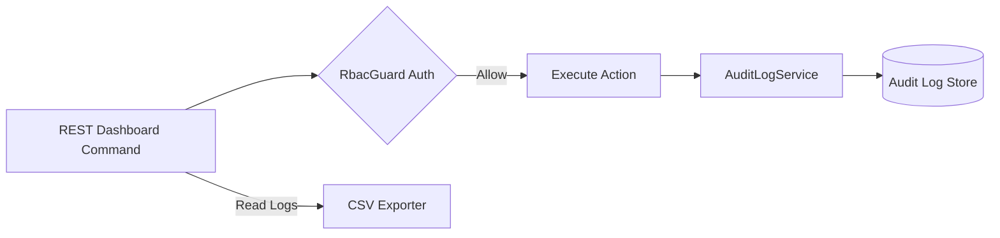

# Audit Logging Module

## 1. Overview

The Audit Logging Module records operational logs, state changes, driver actions, and configuration changes for security and compliance audits.

## 2. Business Problem Solved

Logistics platforms operate under strict compliance requirements regarding ride histories, dispatcher actions, and driver shift updates. The Audit Logging Module provides a secure, role-restricted trail of system modifications.

## 3. Features

- State transition audit logging.
- Role-Based Access Control (RBAC) validations.
- Structured log models.
- CSV data exports.

## 4. Architecture Diagram



## 5. End-to-End Business Flow

1.  User makes an administrative request (e.g. exporting session logs).
2.  `RbacGuard` verifies the user's role and tenant ID.
3.  If verified, the command executes and calls `AuditLogService`.
4.  Logs are appended to the `AuditLogService` records.
5.  Admins can query or export logs to CSV through the Dashboard HTTP server.

## 6. Core Components

- `AuditLogService`: Creates and queries audit trails.
- `RbacGuard`: Enforces permissions.
- `CSVExporter`: Translates records to CSV strings.

## 7. Public APIs

- `/api/dashboard/:tenantId/audit`: Fetch tenant logs.
- `/api/dashboard/:tenantId/audit/export`: Export logs as CSV.

## 8. Events

- `audit.log.created`: Emitted when a new audit log record is appended.

## 9. Data Models

```typescript
interface AuditRecord {
  id: string;
  tenantId: string;
  userId: string;
  role: string;
  action: string;
  targetId?: string;
  timestamp: string;
  details?: string;
}
```

## 10. Storage Design

- **Audit Trail Store**: By default, logs are stored in-memory in the `AuditLogService` buffer.
- _TTL_: Managed by process lifecycle.

## 11. Configuration

Permissions are mapped inside the `RbacGuard` configuration:

```typescript
const ROLE_PERMISSIONS = {
  admin: ["analytics.read", "logs.read", "session.read", "tenant.read"],
  analyst: ["analytics.read", "session.read"],
  operator: ["session.read"],
};
```

## 12. Integration Guide

Apply `RbacGuard` as middleware on administrative API routes. Register actions with `AuditLogService` inside your controllers.

## 13. Step-by-Step Implementation Guide

```typescript
// Authentication check in routing
const user = RbacGuard.authenticateRequest(request.headers);
if (!user || !RbacGuard.authorize(user, "logs.read", tenantId)) {
  reply.status(403).send({ error: "Unauthorized access" });
}
const csvData = await defaultAuditLog.exportCSV(tenantId);
```

## 14. Extension Guide

Implement custom logger backends in `AuditLogService` to stream logs directly to persistent storage (such as Redis Lists, PostgreSQL, Elasticsearch, or AWS CloudWatch).

## 15. Scaling Considerations

- Configure log buffer limits in `AuditLogService` to prevent unlimited memory growth.
- Offload CSV processing to background jobs for large datasets.

## 16. Troubleshooting

- **Access Forbidden**: Verify the headers contain the correct authorizations (`x-user-role`, `x-user-tenant`).

## 17. Examples

```typescript
// Append audit log manual trigger
await defaultAuditLog.logAction(
  "tenant-123",
  "admin-1",
  "SUPER_ADMIN",
  "tenant.configuration.updated",
  "matching.initialRadiusMeters",
  "Updated initial matching radius to 3000m"
);
```
