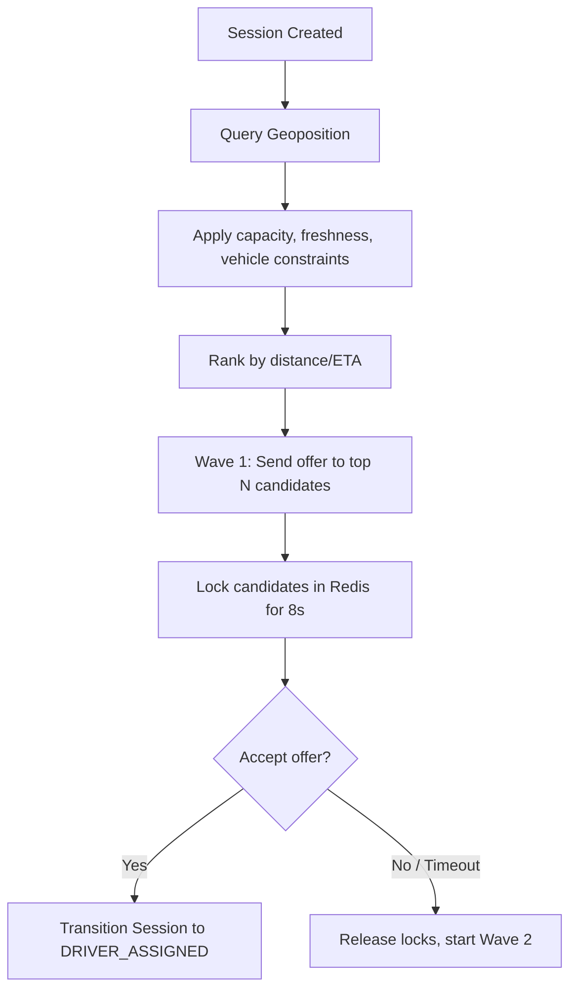

# Dispatching Module

## 1. Overview

The Dispatching Module controls the matching pipeline and assignment flows. It handles candidate discovery, radius expansion filters, ranking, progressive wave offerings, candidate reservation locks, and assignment approvals.

## 2. Business Problem Solved

Traditional systems trigger broadcast offers ("blast dispatch") causing driver competition, high network loads, and driver frustration due to failed screen-taps. The Dispatching Module solves this by sending offers sequentially in waves to ranked drivers, reservation-locking candidates to prevent double-bookings.

## 3. Features

- Radius expansion spatial search.
- Haversine and OSRM distance/ETA calculations.
- Progressive wave offerings (sequential driver notification).
- Atomic Redlock-based driver reservation locks.
- Offer acceptance and rejection state logic.

## 4. Architecture Diagram



## 5. End-to-End Business Flow

1.  Consuming application commands `Motus` to start matching for a session.
2.  `MatchingEngine` queries the spatial index for drivers within the initial radius.
3.  Filters out busy, paused, stale, or capacity-saturated drivers.
4.  Ranks the remaining candidates.
5.  `WaveDistributor` locks the first wave of drivers in Redis (default 8s TTL).
6.  An event `dispatch.wave.started` notifies the consumer to alert those drivers.
7.  If a driver accepts, the lock is converted to a trip assignment and the session transitions to `DRIVER_ASSIGNED`.
8.  If no responses occur within 8 seconds, locks are released and wave 2 begins.

## 6. Core Components

- `MatchingEngine`: Discovers and ranks candidate lists.
- `AssignmentManager`: Manages accept/reject commands.
- `RedisLockManager`: Redlock-based atomic coordinator.

## 7. Public APIs

- `DriverNamespace.acceptSessionOffer(tenantId, driverId, sessionId, waveNumber): Promise<void>`
- `DriverNamespace.rejectSessionOffer(tenantId, driverId, sessionId, waveNumber): Promise<void>`

## 8. Events

- `dispatch.wave.started`: Emitted when a new offer wave initiates.
- `session.assigned`: Emitted when a driver successfully accepts an offer.

## 9. Data Models

```typescript
interface WaveDetails {
  waveNumber: number;
  candidates: string[];
  waveStartedAt: string;
  waveExpiresAt: string;
}
```

## 10. Storage Design

- **Driver Lock**: `motus:tenant:{tenantId}:lock:driver:{driverId}`
  - _TTL_: 8 seconds (Value: `{sessionId}`)
- **Geospatial index**: `motus:tenant:{tenantId}:drivers:locations`

## 11. Configuration

```typescript
interface FanoutConfig {
  waveSize: number; // Candidates per wave. Default: 5
  waveTimeoutSeconds: number; // Lock duration. Default: 8
}
```

## 12. Integration Guide

Listen to `dispatch.wave.started` events to push offers via FCM/APNs. Drivers accept offers via the SDK's `acceptSessionOffer` method.

## 13. Step-by-Step Implementation Guide

```typescript
// Driver accepts trip
await motusClient.driver.acceptSessionOffer(
  tenantId,
  driverId,
  sessionId,
  activeWaveNumber
);
```

## 14. Extension Guide

To write a custom matching strategy (e.g. priority-score ranking), implement the custom strategy interface and register it with the `MatchingEngine`.

## 15. Scaling Considerations

- Use small wave sizes (3 to 5) to minimize Redis locking.
- Scale using Redis cluster sharding.

## 16. Troubleshooting

- **Concurrency Collision**: If two drivers accept simultaneously, only the one executing the Lua script first receives the assignment; the second receives a `ConcurrencyLockError`.

## 17. Examples

```typescript
// Initiating matching flow
const session = await motusClient.session.createSession({
  tenantId,
  pickup: { latitude: 37.7749, longitude: -122.4194 },
  destination: { latitude: 37.7891, longitude: -122.4014 },
  constraints: { requiredVehicleType: "VIP" },
});
```
