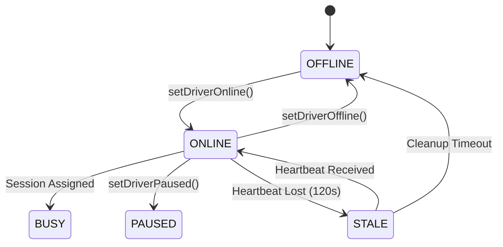

# Driver Management Module

## 1. Overview

The Driver Management Module manages driver lifecycles, vehicle capabilities, shift parameters, real-time presence states, connection heartbeat records, and automatic disconnection monitoring.

## 2. Business Problem Solved

If a driver goes offline unexpectedly (e.g. driving through a tunnel or closing the app), they remain in matching queues, leading to failed offers and delayed dispatching. This module manages heartbeat rules, detecting dropped connections and transitioning drivers to a `STALE` status to protect dispatch reliability.

## 3. Features

- Driver registrations and vehicle configurations.
- Heartbeat state machine (ONLINE, BUSY, PAUSED, STALE, OFFLINE).
- Automatic presence stale detection (heartbeat check).
- Connection recovery (resets status on reconnection).

## 4. Architecture Diagram



## 5. End-to-End Business Flow

1.  Driver profile is registered in Motus specifying load capacity.
2.  Driver transitions to `ONLINE` and streams heartbeats.
3.  Each heartbeat updates the `lastHeartbeat` timestamp in Redis.
4.  If no heartbeats are received for 120 seconds, the `DriverStaleDetector` marks the driver as `STALE`.
5.  If the driver reconnects, they return to `ONLINE` (or their previous status).
6.  If they remain offline, they are transitioned to `OFFLINE`.

## 6. Core Components

- `DriverManager`: Manages profile registration commands.
- `DriverStaleDetector`: Daemon checking heartbeat thresholds.
- `RedisPresenceRepository`: Handles state mutations in Redis.

## 7. Public APIs

- `DriverNamespace.registerDriver(command: RegisterDriverCommand): Promise<DriverResult>`
- `DriverNamespace.setDriverOnline(tenantId, driverId): Promise<void>`
- `DriverNamespace.setDriverOffline(tenantId, driverId): Promise<void>`
- `DriverNamespace.setDriverPaused(tenantId, driverId): Promise<void>`

## 8. Events

- `driver.presence.updated`: Emitted when a driver's presence status transitions.
- `driver.stale`: Emitted when a driver is marked STALE.

## 9. Data Models

```typescript
interface DriverPresenceProfile {
  driverId: string;
  status: "ONLINE" | "BUSY" | "PAUSED" | "STALE" | "OFFLINE";
  previousPresenceStatus: string;
  capacity: number;
  currentLoad: number;
  lastHeartbeat: string;
}
```

## 10. Storage Design

- **Driver Presence Key**: `motus:tenant:{tenantId}:driver:{driverId}:presence`
  - _Data Structure_: Redis Hash
  - _TTL_: 24 Hours (sliding window)

## 11. Configuration

```typescript
interface TenantDriverConfig {
  staleThresholdSeconds: number; // Default: 120s
}
```

## 12. Integration Guide

Sync driver state changes with socket connect/disconnect handlers:

- `socket.on('connect')` -> Call `setDriverOnline`
- `socket.on('disconnect')` -> Background stale detector handles disconnection.

## 13. Step-by-Step Implementation Guide

```typescript
// Onboarding driver
const newDriver = await motusClient.driver.registerDriver({
  tenantId: "tenant-123",
  capacity: 1,
  vehicleType: "SEDAN",
});
```

## 14. Extension Guide

Implement the custom capabilities validation helper to add attributes like language spoken, background checks, or payment preferences.

## 15. Scaling Considerations

- Configure Redis memory size to support peak driver concurrency.
- Batch presence checks in `DriverStaleDetector` using cursor-based scanning (`SCAN`) instead of `KEYS`.

## 16. Troubleshooting

- **False Staleness**: If active drivers are marked stale, verify the client is sending heartbeat events at least once every 10 seconds.

## 17. Examples

```typescript
// Query driver presence status
const driver = await motusClient.driver.getDriver("tenant-1", "driver-123");
console.log("Driver status:", driver.status); // e.g. ONLINE
```
