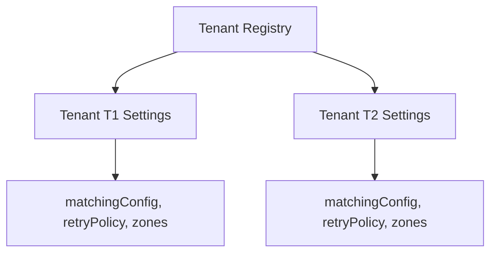

# Fleet & Tenant Management Module

## 1. Overview

The Fleet & Tenant Management Module manages multi-tenant registration, routing profiles, matching configuration overrides, and geofence boundary specifications.

## 2. Business Problem Solved

Running isolated systems for separate logistics clients (e.g. taxi networks, dispatch fleets, merchant logistics) is expensive. The Fleet Management Module enables multi-tenancy on a shared platform, separating rules, data models, configurations, and spatial indexes under distinct Tenant IDs.

## 3. Features

- Tenant registration and configuration management.
- Dynamic configuration overrides (radius, wave timeouts).
- Geofence boundary registrations.
- Logical data separation.

## 4. Architecture Diagram



## 5. End-to-End Business Flow

1.  Admin registers a new tenant with settings (e.g. initial matching radius).
2.  Settings are stored in the Redis Tenant Repository.
3.  When a driver registers, they are linked to the Tenant ID.
4.  All operations (presence, location, matching) are validated against the Tenant's configurations.
5.  If geofencing is enabled, location updates are evaluated against the Tenant's registered zones.

## 6. Core Components

- `TenantManager`: Handles registration and verification.
- `ConfigurationManager`: Coordinates dynamic configs.
- `RedisTenantRepository`: Key-value storage for tenant configurations.

## 7. Public APIs

- `TenantNamespace.registerTenant(command: RegisterTenantCommand): Promise<TenantResult>`
- `TenantNamespace.updateTenant(command: UpdateTenantCommand): Promise<TenantResult>`
- `TenantNamespace.getTenant(tenantId): Promise<TenantResult>`

## 8. Events

- `tenant.registered`: Emitted when a new tenant registers.
- `tenant.updated`: Emitted when configs are modified.

## 9. Data Models

```typescript
interface TenantProfile {
  id: string;
  name: string;
  matchingConfig: {
    strategy: "HAVERSINE" | "OSRM";
    maxCandidatesPerWave: number;
  };
  retryPolicy: {
    waveTimeoutSeconds: number;
  };
  zones: {
    name: string;
    boundary: { latitude: number; longitude: number }[];
  }[];
}
```

## 10. Storage Design

- **Tenant Record Key**: `motus:tenant:{tenantId}:profile`
  - _Data Structure_: Redis Hash
  - _TTL_: Persistent

## 11. Configuration

```typescript
interface DefaultConfiguration {
  matching: {
    initialRadiusMeters: number; // Default: 2000
    maxRadiusMeters: number; // Default: 10000
  };
}
```

## 12. Integration Guide

Create tenants at startup or via administrative configuration panels. Pass the `tenantId` in all subsequent SDK commands.

## 13. Step-by-Step Implementation Guide

```typescript
// Register a delivery client
const tenant = await motusClient.tenant.registerTenant({
  name: "Express Delivery Services",
  matchingConfig: {
    strategy: "HAVERSINE",
    maxCandidatesPerWave: 3,
  },
  retryPolicy: {
    waveTimeoutSeconds: 10,
  },
  zones: [],
});
```

## 14. Extension Guide

To integrate with an external database for configurations (e.g., PostgreSQL), implement the `IConfigurationProvider` interface and register it with the SDK during initialization.

## 15. Scaling Considerations

- Use hash tags (`{tenantId}`) on all Redis keys to ensure tenant data resides on the same cluster slot for optimized spatial queries.

## 16. Troubleshooting

- **Missing Tenant Error**: If an SDK command fails with `TenantNotFoundError`, verify that `registerTenant` was called and that the database contains the tenant ID.

## 17. Examples

```typescript
// Fetching tenant parameters
const settings = await motusClient.tenant.getTenant("tenant-1");
console.log("Max Wave Candidates:", settings.maxCapacityPerDriver);
```
