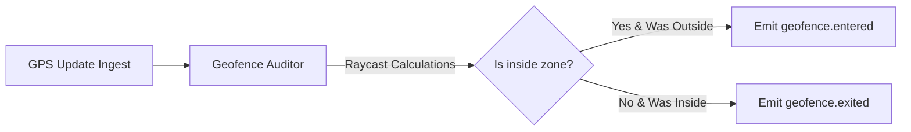

# Geofencing Module

## 1. Overview

The Geofencing Module defines spatial boundaries (polygon zones) and tracks if coordinate updates enter or exit these zones using raycasting validation.

## 2. Business Problem Solved

Mobility and dispatch systems need to track when drivers enter service areas, crossing city limits or entering high-congestion pricing zones. The Geofencing Module automates boundary checking on GPS streams without requiring external spatial database lookups.

## 3. Features

- Polygon geofence boundaries.
- Raycasting point-in-polygon math checks.
- Entry and exit state tracking.
- Hysteresis threshold filtering (reduces noise near boundaries).
- Automatic geofence event triggers.

## 4. Architecture Diagram



## 5. End-to-End Business Flow

1.  Admin registers a polygon boundary zone (e.g., Downtown Zone) under a tenant profile.
2.  Driver streams location coordinate updates.
3.  `GeofenceAuditor` is invoked on each sampled coordinate.
4.  The auditor performs a raycasting calculation against registered zones.
5.  If a driver crosses a boundary, the state is updated and the corresponding event (`driver.geofence.entered` or `driver.geofence.exited`) is emitted.

## 6. Core Components

- `GeofenceAuditor`: Executes raycasting logic.
- `TenantManager`: Stores polygon zones.

## 7. Public APIs

Tenant-wide geofences are registered within tenant configuration commands:

- `TenantNamespace.registerTenant(command: RegisterTenantCommand): Promise<TenantResult>`

## 8. Events

- `driver.geofence.entered`: Emitted when a driver coordinate enters a registered zone boundary.
- `driver.geofence.exited`: Emitted when a driver coordinate exits a boundary.

## 9. Data Models

```typescript
interface GeofenceZone {
  name: string;
  boundary: { latitude: number; longitude: number }[];
}
```

## 10. Storage Design

- **Tenant Profile Hash**: `motus:tenant:{tenantId}:profile` (contains the array of geofence zones).
- **Driver Location Cache**: `motus:tenant:{tenantId}:driver:{driverId}:location`.

## 11. Configuration

```typescript
interface GeofencingConfig {
  hysteresisMeters: number; // Buffer threshold. Default: 15m
}
```

## 12. Integration Guide

Include geofence zones when registering tenants. The core `DriverManager` hooks locations updates automatically into the `GeofenceAuditor`.

## 13. Step-by-Step Implementation Guide

```typescript
// Registering a geofenced zone inside a Tenant
const tenant = await motusClient.tenant.registerTenant({
  name: "Airport Delivery Services",
  matchingConfig: { strategy: "HAVERSINE", maxCandidatesPerWave: 5 },
  retryPolicy: { waveTimeoutSeconds: 8 },
  zones: [
    {
      name: "Airport Loading Zone",
      boundary: [
        { latitude: 37.6213, longitude: -122.379 },
        { latitude: 37.63, longitude: -122.379 },
        { latitude: 37.63, longitude: -122.36 },
        { latitude: 37.6213, longitude: -122.36 },
      ],
    },
  ],
});
```

## 14. Extension Guide

To configure dynamic geofences (e.g. circles with center coordinate and radius), update `GeofenceAuditor` with radial calculation methods.

## 15. Scaling Considerations

- Limit geofence boundaries to 50 vertices to keep raycasting checks fast.
- Evaluate geofences only on _sampled_ coordinates to reduce CPU load.

## 16. Troubleshooting

- **Boundary Fluttering**: If GPS jitter causes rapid enter/exit events near boundaries, increase the `hysteresisMeters` parameter.

## 17. Examples

```typescript
// Raycast Point in Polygon Check
import { isPointInPolygon } from "@motus/core";

const inside = isPointInPolygon(
  { latitude: 37.625, longitude: -122.37 }, // Point
  [
    // Polygon
    { latitude: 37.6213, longitude: -122.379 },
    { latitude: 37.63, longitude: -122.379 },
    { latitude: 37.63, longitude: -122.36 },
    { latitude: 37.6213, longitude: -122.36 },
  ]
);
console.log("Is inside airport:", inside); // true
```
