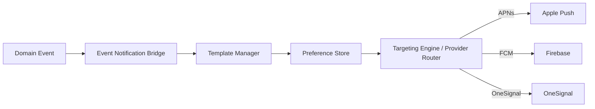

# Notifications Module

## 1. Overview

The Notifications Module translates platform domain events into push alerts. It manages template rendering, device targeting, preference stores, APNs/FCM/OneSignal delivery providers, and scheduled deliveries.

## 2. Business Problem Solved

Managing native push notifications across Apple (APNs) and Android (FCM), handling custom variables, and tracking delivery rates is complex. The Notifications Module provides a unified API interface that handles multi-provider routing and manages templates and user preferences.

## 3. Features

- Multi-provider routing (APNs, FCM, OneSignal).
- Dynamic template rendering with context injection.
- Targeting engine (device token lookup).
- User preference enforcement (opt-out filters).
- Delivery receipt tracking.

## 4. Architecture Diagram



## 5. End-to-End Business Flow

1.  Platform triggers a domain event (e.g. `dispatch.wave.started`).
2.  `EventNotificationBridge` intercepts the event.
3.  The bridge invokes `TemplateManager` to fetch and render the template.
4.  `PreferenceStore` validates that target drivers have push alerts enabled.
5.  `TargetingEngine` retrieves device tokens.
6.  The provider router routes payloads through FCM or APNs.
7.  `DeliveryTracker` updates receipt logs.

## 6. Core Components

- `NotificationService`: Central coordinator interface.
- `TemplateManager`: Renders notification titles and body strings.
- `TargetingEngine`: Tracks device tokens.
- `FcmProvider` / `ApnsProvider` / `OneSignalProvider`: Platform integrations.

## 7. Public APIs

- `NotificationService.sendNotification(userId, templateId, context): Promise<NotificationResult>`
- `NotificationService.registerDevice(userId, token, platform): Promise<void>`

## 8. Events

- `notification.sent`: Emitted on successful transmission.
- `notification.failed`: Emitted on delivery errors.

## 9. Data Models

```typescript
interface NotificationPayload {
  title: string;
  body: string;
  data?: Record<string, string>;
  sound?: string;
  badge?: number;
}
```

## 10. Storage Design

- **Preferences Hash**: `motus:tenant:{tenantId}:user:{userId}:preferences`
- **Tokens Set**: `motus:tenant:{tenantId}:user:{userId}:tokens`
- _TTL_: Persistent (explicitly managed).

## 11. Configuration

```typescript
interface NotificationServiceOptions {
  providers: INotificationProvider[];
  preferenceStore: INotificationPreferenceStore;
  deliveryTracker: IDeliveryTracker;
}
```

## 12. Integration Guide

Provide your provider credentials during initialization. Hook the service up to the event bus using the event bridge.

## 13. Step-by-Step Implementation Guide

```typescript
import { NotificationService } from "@motus/notifications";

const notificationService = new NotificationService({
  providers: [new FcmProvider({ apiKey: "fcm-key-123" })],
  preferenceStore: new InMemoryPreferenceStore(),
  deliveryTracker: new InMemoryDeliveryTracker(),
});
```

## 14. Extension Guide

Implement the `INotificationProvider` interface to support alternative push or SMS integrations (e.g. Twilio or Courier).

## 15. Scaling Considerations

- Execute notification requests asynchronously to prevent latency spikes in the core matching thread.
- Use bulk APIs for FCM/APNs when notifying multiple candidates in a wave.

## 16. Troubleshooting

- **Rejected Tokens**: If push alerts fail, verify device tokens are refreshed regularly and that certificates/credentials are valid.

## 17. Examples

```typescript
// Send notification manually
await notificationService.sendNotification("driver-123", "new_offer", {
  sessionId: "S1",
  pickupName: "Main St.",
});
```
