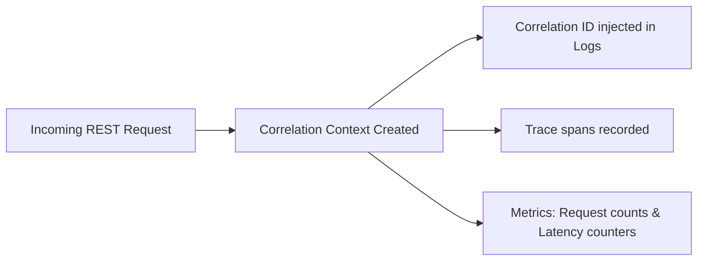

# Observability Module

## 1. Overview

The Observability Module provides logging, trace context propagation, metric collectors, and system health checks.

## 2. Business Problem Solved

Debugging microservices and real-time streams without transaction traces is difficult. The Observability Module resolves this by injecting correlation IDs across network boundaries, collecting metrics, and exposing health indicators.

## 3. Features

- OpenTelemetry-compatible Tracer contexts.
- Correlation context propagation.
- Prometheus Metrics Registry.
- Structured application logging.
- Health diagnostics registries.

## 4. Architecture Diagram



## 5. End-to-End Business Flow

1.  A request arrives at the API server (rest/socket).
2.  `CorrelationContext` extracts or generates a `correlationId`.
3.  The context is bound to the async execution scope (using AsyncLocalStorage).
4.  All log calls append this `correlationId` automatically.
5.  Traces are recorded and exported via OpenTelemetry.
6.  Metrics are aggregated in the `MetricRegistry` and exposed to Prometheus scraping engines.

## 6. Core Components

- `CorrelationContext`: Holds correlation headers across execution paths.
- `MetricRegistry`: Collects counters, gauges, and histograms.
- `HealthCheckRegistry`: Orchestrates health checks.

## 7. Public APIs

- `Logger.info(message, context): void`
- `MetricRegistry.counter(name, help): Counter`
- `HealthCheckRegistry.register(name, checkFn): void`

## 8. Events

No domain events are emitted by the observability system. It records mutations on existing processes.

## 9. Data Models

```typescript
interface HealthCheckResult {
  status: "UP" | "DOWN";
  details: Record<string, any>;
}
```

## 10. Storage Design

- No database storage is utilized for observability. Data is exported directly to OpenTelemetry backends or exposed as HTTP endpoints for scraping.

## 11. Configuration

```typescript
interface ExporterConfig {
  endpoint: string;
  protocol: "grpc" | "http";
}
```

## 12. Integration Guide

Register fastify hooks or express middlewares at startup. Bind your Redis client and database health checks to the registry.

## 13. Step-by-Step Implementation Guide

```typescript
import { defaultRegistry } from "@motus/observability";

// Creating a counter metric
const requestCounter = defaultRegistry.counter({
  name: "http_requests_total",
  help: "Total HTTP requests",
});

requestCounter.inc({ method: "GET", route: "/api/sessions" });
```

## 14. Extension Guide

Implement a custom trace exporter class to redirect traces to alternative APM platforms (e.g. Datadog or AWS X-Ray).

## 15. Scaling Considerations

- Use local metric aggregations to minimize lock contention.
- Configure sampling on trace exporters to limit bandwidth.

## 16. Troubleshooting

- **Missing Correlation IDs**: Verify `CorrelationContext.run()` is called before asynchronous operations are triggered.

## 17. Examples

```typescript
// Registering a Redis Health Check
import { defaultHealthRegistry } from "@motus/observability";

defaultHealthRegistry.register("redis", async () => {
  const status = await redisClient.ping();
  return {
    status: status === "PONG" ? "UP" : "DOWN",
    details: { ping: status },
  };
});
```
