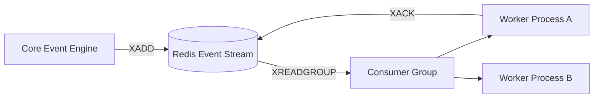

# Queue & Worker Processing Module

## 1. Overview

The Queue & Worker Processing Module handles background tasks and event consumption. It manages Redis Streams, consumer groups, worker loops, and scheduler operations.

## 2. Business Problem Solved

Running time-consuming actions (e.g. searching for drivers, verifying heartbeats, or archiving routes) synchronously block API threads. The Queue Processing Module runs these tasks asynchronously using Redis Streams and background workers.

## 3. Features

- Redis Streams integration (`XADD`, `XREADGROUP`).
- Consumer Group offsets.
- Worker loop executors.
- Heartbeat staleness checkers.
- Wave timeouts.

## 4. Architecture Diagram



## 5. End-to-End Business Flow

1.  An operation triggers an event (e.g. `driver.stale`).
2.  The engine appends the event details to the Redis Stream.
3.  Background workers query the stream for new events using a consumer group.
4.  A single worker claims the message to prevent duplicate executions.
5.  Upon successful processing, the worker submits an acknowledgment (`XACK`) to update the stream offset.

## 6. Core Components

- `RedisStreamsAdapter`: Handles low-level Redis Stream interactions.
- `RetryWorker`: Processes failed operations.
- `CleanupWorker`: Removes stale geospatial updates.

## 7. Public APIs

- `RedisStreamsAdapter.appendToStream(streamKey, payload): Promise<string>`
- `RedisStreamsAdapter.readGroup(streamKey, groupName, consumerName, options): Promise<StreamEntry[]>`

## 8. Events

- `queue.message.added`: Emitted when a new stream entry is added.
- `queue.message.processed`: Emitted upon worker acknowledgment.

## 9. Data Models

```typescript
interface StreamEntry {
  id: string; // Redis auto-generated ID (timestamp-sequence)
  fields: Record<string, string>;
}
```

## 10. Storage Design

- **Event Queue Stream Key**: `motus:tenant:{tenantId}:events:stream`
- _TTL_: Managed by stream limits or 24-hour retention.

## 11. Configuration

```typescript
interface RedisStreamsConfig {
  defaultGroupName: string; // Default: "motus_consumers"
  maxStreamLength: number; // Default: 10000 (auto-trimming)
}
```

## 12. Integration Guide

Deploy workers as separate daemons. Configure the `RedisStreamsAdapter` to target your Redis Cluster deployment.

## 13. Step-by-Step Implementation Guide

```typescript
// Initializing a worker loop
const streamAdapter = new RedisStreamsAdapter(clientManager);
setInterval(async () => {
  const entries = await streamAdapter.readGroup(
    "motus:events:stream",
    "outbox_group",
    "worker_1",
    { count: 10, blockMs: 2000 }
  );
  for (const entry of entries) {
    // Process entry
    await streamAdapter.acknowledge(
      "motus:events:stream",
      "outbox_group",
      entry.id
    );
  }
}, 5000);
```

## 14. Extension Guide

To use a different queue broker (e.g., RabbitMQ or BullMQ), implement a custom adapter for the stream operations.

## 15. Scaling Considerations

- Scale worker count to match CPU core counts.
- Use standard Redis auto-trimming (`MAXLEN ~ 10000`) to prevent memory leaks.

## 16. Troubleshooting

- **Unacknowledged Message Lag**: If messages are processed but remain in the Pending Entries List (PEL), verify workers are calling `XACK`.

## 17. Examples

```typescript
// Appending a message to a Redis Stream
const messageId = await streamAdapter.appendToStream(
  "motus:tenant:T1:session:S1:events",
  { eventType: "session.created", payload: JSON.stringify({ id: "S1" }) }
);
```
