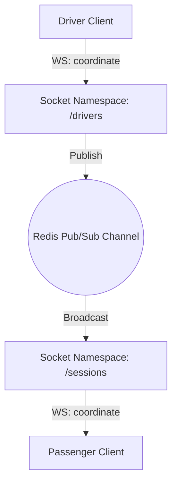

# Realtime Communication Module

## 1. Overview

The Realtime Communication Module manages WebSocket client connections, subscription rooms, live message routing, authentication handshakes, and socket heartbeats.

## 2. Business Problem Solved

Streaming locations at scale requires low-latency, bidirectional connections. Using REST polling quickly overloads backends and delays updates. The Realtime Communication Module establishes isolated persistent channels to stream locations to subscribing clients.

## 3. Features

- Bidirectional Socket.IO server transport.
- Authentication hook interceptors.
- Connection Registry tracking active socket sessions.
- Channel room subscriptions.
- Pub/Sub-backed cluster broadcasting.

## 4. Architecture Diagram



## 5. End-to-End Business Flow

1.  Client connects to the Socket.IO server gateway.
2.  `AuthenticationManager` verifies headers and token auth parameters.
3.  Upon handshake approval, the connection is saved to the `ConnectionRegistry`.
4.  If the client is a Passenger, they submit a `join_room` command for a `sessionId`.
5.  If the client is a Driver, they stream coordinates to the `/drivers` namespace.
6.  The coordinator broadcasts coordinates to the Redis Pub/Sub room, which push updates to all clients in the corresponding session room.

## 6. Core Components

- `SocketServer`: Main server listener configuring Socket.IO.
- `ConnectionRegistry`: In-memory registry of active client connections.
- `RoomManager`: Orchestrates socket room memberships.

## 7. Public APIs

- `SocketServer.attach(httpServer): void`
- `SocketServer.onConnection(socket): void`

## 8. Events

- `connection`: Fired when a client connects.
- `tracking_broadcast`: Emitted to clients containing active driver coordinates.

## 9. Data Models

```typescript
interface AuthContext {
  tenantId: string;
  userId: string;
  roles: ("driver" | "passenger" | "admin")[];
}
```

## 10. Storage Design

- **Pub/Sub Channel**: `motus:tenant:{tenantId}:channel:session:{sessionId}:tracking`
- **Registry Hash**: Transient memory records in Node process heap.

## 11. Configuration

```typescript
interface SocketIOConfig {
  port: number;
  path: string; // Default: "/socket.io"
  corsOrigin: string; // Default: "*"
}
```

## 12. Integration Guide

Attach the `SocketServer` to your existing HTTP/Fastify framework and implement authentication validation inside `IAuthenticator`.

## 13. Step-by-Step Implementation Guide

```typescript
import { SocketServer } from "@motus/socketio";
import http from "http";

const server = http.createServer();
const socketServer = new SocketServer({
  port: 8080,
  path: "/ws",
  corsOrigin: "*",
});

socketServer.attach(server);
server.listen(8080);
```

## 14. Extension Guide

Implement a custom `IAuthenticator` class to authenticate connection handshakes against third-party authentication APIs (e.g. Auth0 or Firebase).

## 15. Scaling Considerations

- Use sticky session balancing at the load balancer layer.
- Configure the Redis Adapter to sync Pub/Sub streams across multiple socket nodes.

## 16. Troubleshooting

- **Failed Handshake**: Verify authorization headers are passed in the connection request.

## 17. Examples

```javascript
// Client Connection Example (Javascript)
const socket = io("http://localhost:8080/sessions", {
  auth: { token: "user-jwt-token" },
});
socket.emit("join_room", { tenantId: "T1", sessionId: "S1" });
```
