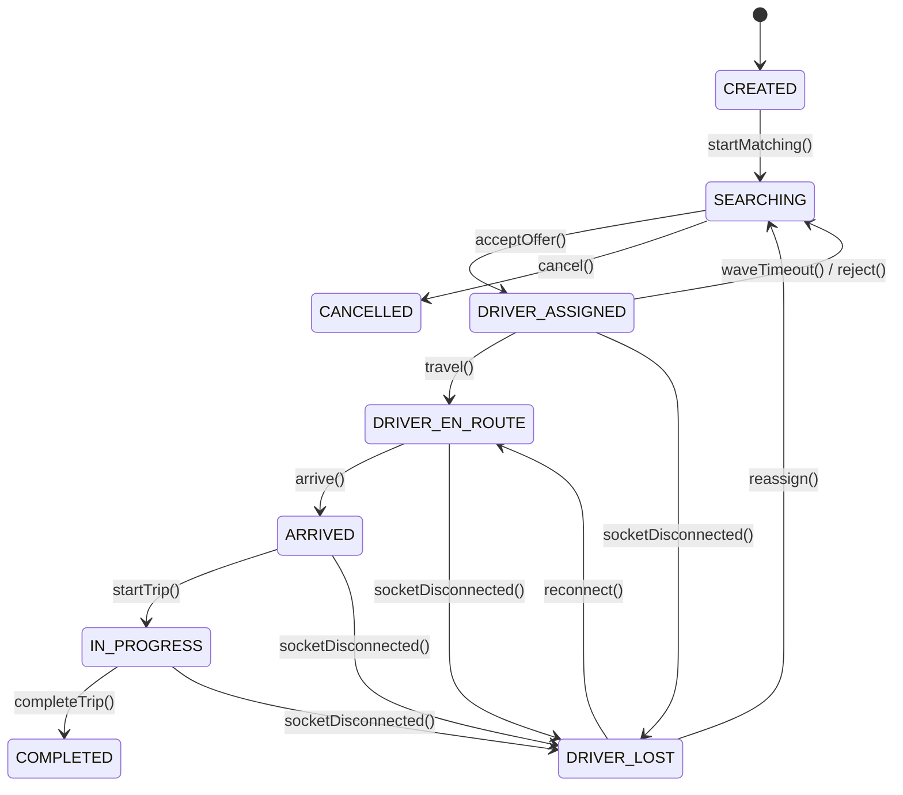

# Ride Lifecycle Module

## 1. Overview

The Ride Lifecycle Module manages the state machine transitions for active matching and tracking sessions, validating domain invariants and maintaining consistency across disconnects.

## 2. Business Problem Solved

Active ride sessions are susceptible to edge cases (e.g. driver connections dropping, passenger cancellations, or reassignments). Unstructured state handling leads to deadlocks (e.g. driver assigned to a cancelled trip). The Ride Lifecycle Module enforces a strict state machine to prevent illegal transitions.

## 3. Features

- State transition engine.
- Invariant validation (e.g., cannot start a trip without an assigned driver).
- Driver connection loss recovery (DRIVER_LOST state caching).
- Automatic trip cancellation support.

## 4. Architecture Diagram



## 5. End-to-End Business Flow

1.  Consuming application creates a session (state: `CREATED`).
2.  Platform initiates matching (state: `SEARCHING`).
3.  Driver accepts the offer (state: `DRIVER_ASSIGNED`).
4.  Driver begins transit (state: `DRIVER_EN_ROUTE`).
5.  Driver arrives at pickup (state: `ARRIVED`).
6.  Driver starts the trip (state: `IN_PROGRESS`).
7.  Driver completes the trip (state: `COMPLETED`).
8.  If the driver loses connection during any active phase, the session moves to `DRIVER_LOST`. Reconnection within 120s restores the prior active state.

## 6. Core Components

- `SessionManager`: Executes lifecycle command requests.
- `StateMachineManager`: Enforces state transitions.
- `DriverLostMonitor`: Monitored worker that handles transitions to `DRIVER_LOST`.

## 7. Public APIs

- `vectro.session.createSession(command: CreateSessionCommand): Promise<SessionResult>`
- `vectro.session.cancelSession(command: CancelSessionCommand): Promise<SessionResult>`
- `vectro.session.completeSession(command: CompleteSessionCommand): Promise<SessionResult>`
- `vectro.session.reassignSession(command: ReassignSessionCommand): Promise<SessionResult>`

## 8. Events

- `session.created`: Emitted on initialization.
- `session.state.changed`: Emitted on state machine updates.
- `session.completed`: Emitted when the trip concludes.

## 9. Data Models

```typescript
interface DispatchSession {
  id: string;
  tenantId: string;
  status:
    | "CREATED"
    | "SEARCHING"
    | "DRIVER_ASSIGNED"
    | "DRIVER_EN_ROUTE"
    | "ARRIVED"
    | "IN_PROGRESS"
    | "COMPLETED"
    | "CANCELLED"
    | "DRIVER_LOST";
  pickupPoint: LocationCoordinate;
  destinationPoint: LocationCoordinate;
  assignedDriverId?: string;
  eventTimeline: EventRecord[];
}
```

## 10. Storage Design

- **Session Profile**: `tenant:{tenantId}:session:{sessionId}`
  - _Data Structure_: Redis Hash
  - _TTL_: 24 Hours after completion or cancellation.

## 11. Configuration

```typescript
interface SessionConfig {
  sessionTtlSeconds: number; // Default: 86400 (24h)
  reconnectTimeoutSeconds: number; // Default: 120s
}
```

## 12. Integration Guide

Consuming backend applications invoke control APIs to create sessions, while driver mobile clients submit location updates that trigger transit state transitions.

## 13. Step-by-Step Implementation Guide

```typescript
// Creating session
const session = await vectro.session.createSession({
  tenantId,
  sessionId: "session-123",
  pickup: { latitude: 40.7128, longitude: -74.0060 },
  destination: { latitude: 40.7306, longitude: -73.9352 },
  requiredVehicleType: "SEDAN",
});

// Completing session
await vectro.session.completeSession({
  tenantId,
  sessionId: "session-123",
});
```

## 14. Extension Guide

Implement custom transition interceptors inside the `StateMachineManager` to trigger external database updates or billing alerts.

## 15. Scaling Considerations

- Ensure that session databases are pruned using TTLs.
- Partition session tracking rooms by `sessionId` to isolate WebSocket loads.

## 16. Troubleshooting

- **Transition Rejected**: Verify that the previous state allows the requested transition (e.g. you cannot jump from `SEARCHING` to `IN_PROGRESS`).

## 17. Examples

```typescript
// Inspect session state
const session = await vectro.query.getSession(tenantId, sessionId);
console.log("Session state:", session.status); // e.g. DRIVER_ASSIGNED
```
