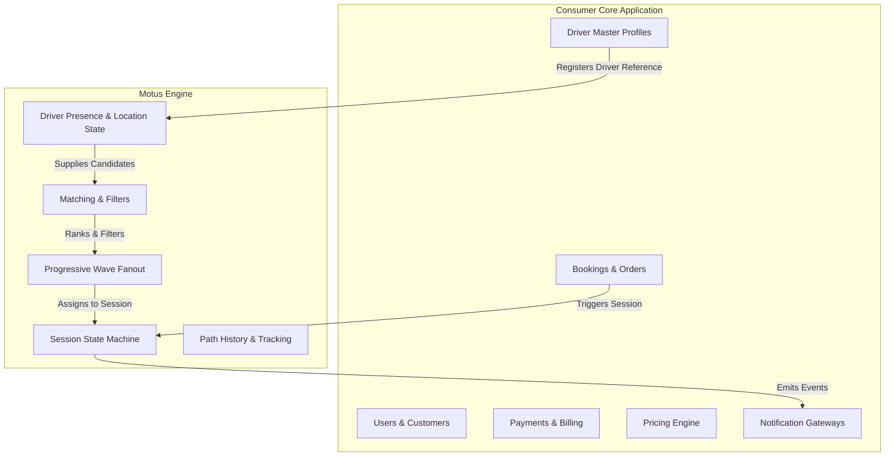
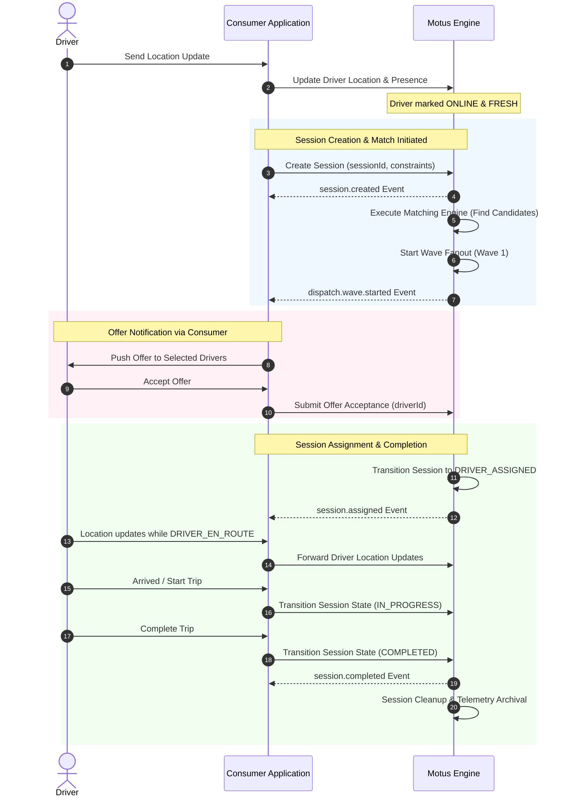

# 01. Product Overview

## Purpose
This document provides the foundational definition of **Motus**—the open-source real-time dispatch and tracking engine for modern applications. It defines the product vision, scope, architectural boundaries between Motus and consuming applications, and core service definitions.

---

## Product Vision
Motus is a multi-tenant, real-time dispatch, assignment, and tracking engine designed to power logistics, mobility, and field-service applications. It coordinates driver presence, evaluates optimal matching, manages progressive offer fanout, and captures real-time telemetry, enabling consumers to build complex booking platforms without reinventing dispatching and tracking mechanics.

### Supported Use Cases
* **Taxi / Ride Sharing:** On-demand passenger matching, wave-based driver dispatch, and route tracking.
* **Delivery / Courier:** Single or multi-drop merchant-to-customer logistics with vehicle capacity checks.
* **Ambulance / Emergency Services:** High-priority, lowest-ETA matching based on medical vehicle equipment types (e.g., Basic vs. ICU).
* **Field Service:** Dispatching technicians, inspectors, or utilities workers to jobs based on location and service zone.

### Scope: What Motus IS vs. What Motus IS NOT
To remain highly optimized, Motus maintains strict boundary separation:

| **Motus IS (In Scope)** | **Motus IS NOT (Out of Scope)** |
| :--- | :--- |
| **Driver Presence Engine:** Manages online/busy/paused/offline states. | **Booking Management:** Creating, updating, or storing bookings/orders. |
| **Matching Engine:** Filters and ranks nearby drivers based on rules. | **User Management:** Auth/identity for passengers, admins, or customers. |
| **Progressive Fanout Engine:** Dispatches offers in waves to candidates. | **Payments & Billing:** Payment processing, credit checks, or wallets. |
| **Assignment Engine:** Coordinates offer acceptance/rejection/timeouts. | **Pricing & Fare Calculation:** Surge pricing, distance-based fares, or tax. |
| **Session Lifecycle Engine:** Tracks dispatch/ride state transitions. | **Notification Delivery:** SMS, Email, Push gateway integrations. |
| **Real-Time Tracking Engine:** Distributes live coordinates of active drivers. | **Historical Analytics:** Long-term business intelligence or warehousing. |
| **Telemetry Engine:** Tracks breadcrumbs and generates session reports. | **Driver Master Data Database:** Storing driver profiles, reviews, or tax records. |

---

## Architectural Boundaries
Motus operates as an auxiliary service. Consuming applications command Motus to manage the *lifecycle of tracking and matching session entities*, while maintaining ownership of static entities and business domains.

### Domain Ownership Matrix
* **Motus Domain Entities:**
  * **Driver Presence State:** Tracks if a driver is currently ONLINE, BUSY, PAUSED, STALE, or OFFLINE.
  * **Driver Status & Live Location:** Holds the latest coordinate update and computes location freshness.
  * **Matching Logic:** Selects and orders driver candidates.
  * **Wave Fanout State:** Tracks which wave of driver dispatch is active, timers, and list of notified drivers.
  * **Session Lifecycle:** The active state of matching, en route, or in-progress trips.
  * **Telemetry breadcrumbs:** Micro-coordinate logs captured for active routes.

* **Consumer Domain Entities:**
  * **Driver Profile Data:** Driver names, vehicle plates, document verifications, ratings, and payout preferences.
  * **Order/Booking Details:** Pickup details, destination, price, payment status, package details, or customer comments.
  * **Notifications:** The mechanism used to send SMS, Push, or WebSockets directly to the passenger or driver devices. Motus notifies the consumer via events, and the consumer delivers these to client devices.

---

## Workflows

### End-to-End Dispatch Lifecycle Workflow
The following diagram showcases how a typical matching session flows between the Consumer Application, Motus, and Drivers.

---

## Edge Cases and Failure Cases
* **Mismatched Master Data:** A consumer references a `driverId` or `vehicleType` that is unrecognized by Motus configuration. 
  * *Resolution:* Motus strictly validates all constraints against registered tenant rules and immediately rejects mismatched identifiers during lifecycle commands.
* **Orphaned Sessions:** Consuming application crashes during an active ride, leaving the session open.
  * *Resolution:* Motus enforces configuration-based session timeouts and heartbeat controls, auto-terminating sessions to free up driver presence if no updates are received.
* **Duplicate Active Sessions:** A consumer tries to assign the same driver to two concurrent exclusive sessions.
  * *Resolution:* Motus checks driver presence status. If the driver is `BUSY`, they are excluded from matching pipelines, rejecting explicit duplicate assignments.

---

## Future Enhancements
* **Standardized Protocol Specifications:** Definition of plug-and-play gRPC or OpenAPI models to standardize the boundary contracts between consumer layers and Motus.
* **Driver Grouping Rules:** Support for ad-hoc grouping of drivers (e.g., fleets or sub-contractors) for tiered matching priority.
* **Inter-Tenant Agreements:** Enabling cross-tenant dispatching where a provider can fallback to search another tenant's driver pool under shared terms.
