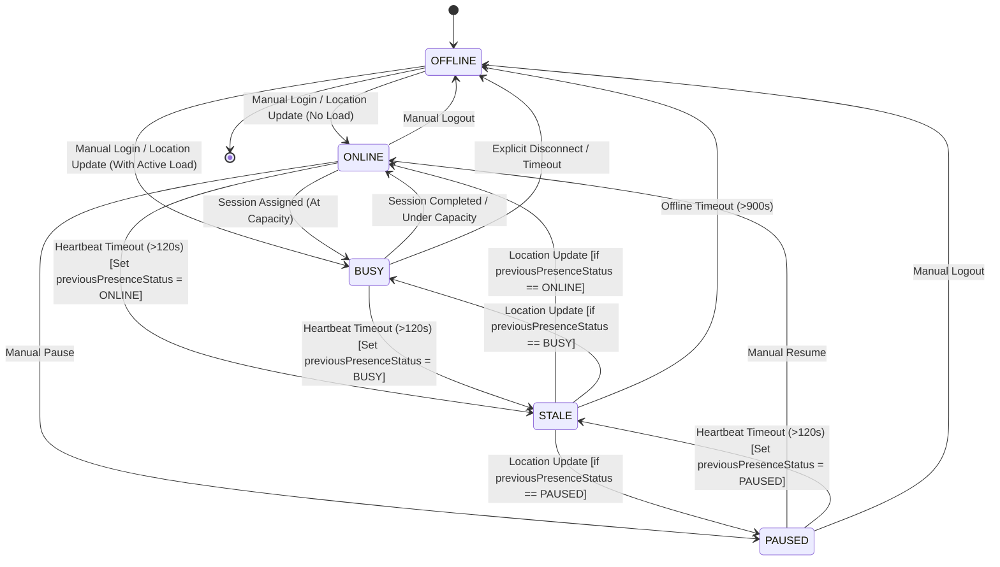
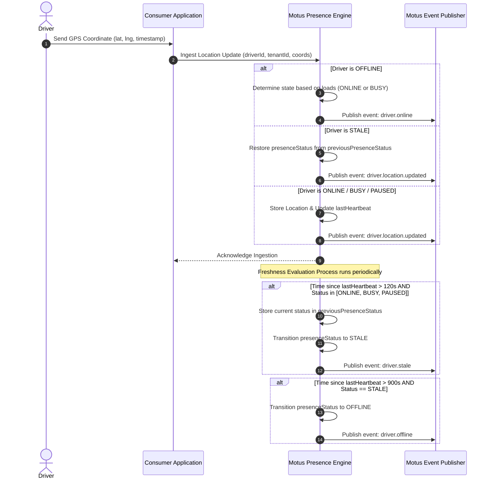

# 02. Driver Lifecycle

## Purpose
This document specifies the presence, status state machine, and location freshness evaluation for drivers within the Motus ecosystem. It details how location heartbeats are parsed, how status transitions occur, and how location freshness thresholds are evaluated.

---

## Requirements

### Driver Data Model
Every driver is represented in Motus by a transient presence profile structured as follows:

| Field | Type | Description |
| :--- | :--- | :--- |
| `driverId` | String | Unique driver identifier (managed by Consumer). |
| `tenantId` | String | Associated tenant identifier (managed by Consumer). |
| `presenceStatus` | Enum | Current presence status (`ONLINE`, `BUSY`, `PAUSED`, `STALE`, `OFFLINE`). |
| `previousPresenceStatus` | Enum | The presence status held by the driver prior to entering a `STALE` status. |
| `types` | List<String> | Supported vehicle types matching tenant definitions (e.g. `bike`, `suv`). |
| `capacity` | Integer | Maximum active loads this driver can handle concurrently. Default `1`. |
| `currentLoad` | Integer | Number of currently assigned active tasks/loads. Default `0`. |
| `serviceZones` | List<String> | List of geographic zone identifiers the driver is authorized to operate in. |
| `metadata` | Map | Flexible key-value pairs for consumer-specific constraints. |
| `lastLocation` | GeoPoint | Latest coordinates (latitude, longitude) and timestamp. |
| `lastHeartbeat`| Timestamp | Last time driver status or location was updated. |

### Driver Presence Statuses
* **ONLINE:** Driver is active, available for matching, and submitting fresh location updates.
* **BUSY:** Driver is currently assigned to a session (at capacity limit) and unavailable for new matching cycles.
* **PAUSED:** Driver is online but has temporarily opted out of receiving matches (e.g., taking a break).
* **STALE:** Driver has failed to send location updates within the configurable `freshThreshold` window. Eligible for restricted matching or warnings.
* **OFFLINE:** Driver has manually logged out, or has exceeded the configurable `offlineThreshold` window without a location update.

#### Exiting the STALE Status
When a driver in the `STALE` status submits a new location heartbeat, they exit `STALE`. Rather than resetting unconditionally to `ONLINE`, Motus evaluates their prior context using the following rules:
* **Restore BUSY:** If `previousPresenceStatus` was `BUSY` or the active load counter is at limit (`currentLoad >= capacity`), the status is restored to `BUSY`.
* **Restore PAUSED:** If `previousPresenceStatus` was `PAUSED` and no active loads are held, the status is restored to `PAUSED`.
* **Restore ONLINE:** If `previousPresenceStatus` was `ONLINE` (or if no prior state was cached) and they are below capacity, the status is restored to `ONLINE`.

### Location Freshness Config
To accommodate varying network qualities, the freshness window is configurable per tenant. The default values are:

* **Fresh:** 0 to 120 seconds since last heartbeat. Status remains/becomes `ONLINE`, `BUSY`, or `PAUSED`.
* **Stale:** 121 to 900 seconds (15 mins) since last heartbeat. Automatically transitions presence status to `STALE` and caches current status to `previousPresenceStatus`.
* **Offline:** 901+ seconds since last heartbeat. Automatically transitions presence status to `OFFLINE`.

```
[Heartbeat] ----------------> (120s) ----------------> (900s) ----------------> Time (seconds)
           |      FRESH      |       STALE       |            OFFLINE           |
           | (ONLINE/BUSY/..) |      (STALE)      |           (OFFLINE)          |
```

---

## Workflows

### Driver Presence State Machine
This diagram represents the permitted state transitions for a driver in Motus.



### Location Update & Freshness Check Workflow
The sequence below shows how location reports flow from the client application through the consumer wrapper into the Motus tracking engine.



---

## Edge Cases and Failure Cases
* **Out-of-Order Location Packets:** GPS updates can arrive out of chronological order due to mobile network latency.
  * *Resolution:* Motus checks the payload's timestamp. If the incoming packet timestamp is older than `lastHeartbeat`, the location coordinates are archived in telemetry but do *not* overwrite the current realtime location or reset the presence timer.
* **Driver Lost Signal in Tunnel (During Active Ride):** A driver in status `BUSY` stops sending location updates.
  * *Resolution:* The driver presence status transitions to `STALE` (previousPresenceStatus set to `BUSY`) and eventually `OFFLINE`. However, the driver's session linkage remains preserved. See [13-failure-scenarios.md](file:///c:/Mohit/Projects/motus/13-failure-scenarios.md) for session-specific `DRIVER_LOST` handling.
* **Rapid Presence Status Flapping:** Intermittent connectivity causes a driver to toggle states repeatedly.
  * *Resolution:* Motus enforces a brief debouncing window (e.g., 5 seconds) before firing `driver.offline` events to reduce noise on consumer downstream subscribers.

---

## Future Enhancements
* **Battery-Optimized Dynamic Heartbeats:** Adjusting required heartbeat frequencies based on vehicle velocity (e.g., report every 5 seconds when moving fast, every 30 seconds when stationary).
* **Predictive Offline Transitions:** Using machine learning or historical route behavior to predict offline transitions (e.g., entering known zero-coverage zones).
