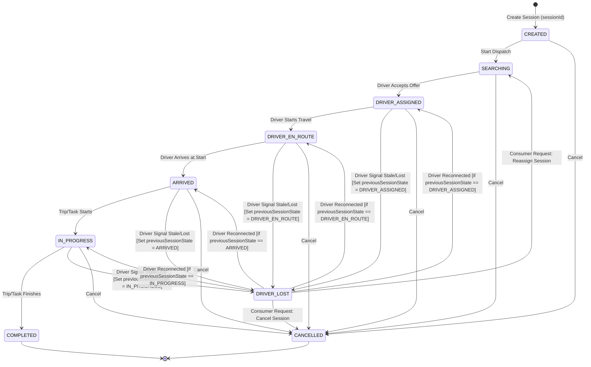
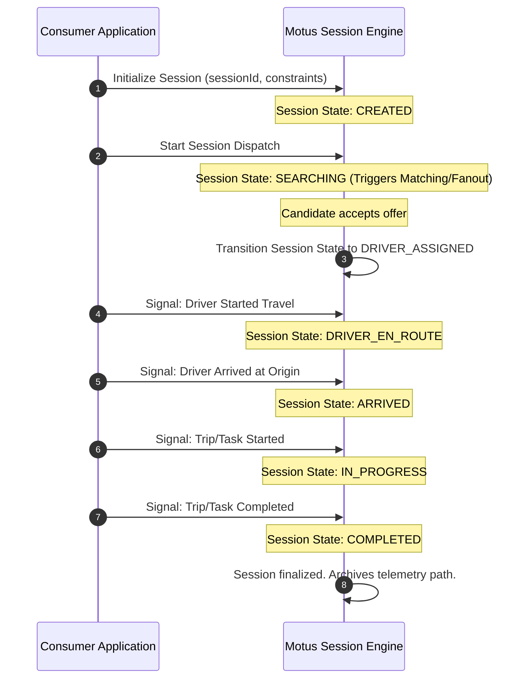

# 03. Session Lifecycle

## Purpose
This document specifies the lifecycle, ownership boundaries, and state transitions of a Motus session. A session is the logical entity representing a single tracking and dispatch workflow, mapped to a unique external entity (e.g. an order, booking, trip, or task).

---

## Requirements

### Session Ownership & Identifiers
* **Session ID Ownership:** Motus *never* generates booking or order IDs. The consuming application must generate and supply a unique `sessionId` (along with `tenantId`) when initializing a session in Motus.
* **State Containment:** The session tracks state variables including:
  * Assigned driver (`driverId`)
  * Current session state
  * `previousSessionState` (Stores the session state prior to entering `DRIVER_LOST`)
  * Active dispatch wave tracker
  * Active retry count
  * Geofence matching constraints

### Session States
A session moves through the following lifecycle states:

1. **CREATED:** The session is registered with its matching criteria. No matching has started yet.
2. **SEARCHING:** The matching engine is actively executing. Offers are being fanout to driver candidates.
3. **DRIVER_ASSIGNED:** A driver has accepted the offer, and the slot is locked.
4. **DRIVER_EN_ROUTE:** The driver is traveling toward the pickup/start location.
5. **ARRIVED:** The driver has arrived at the pickup/start location.
6. **IN_PROGRESS:** The active job/journey has commenced. Telemetry tracking is active.
7. **DRIVER_LOST:** The assigned driver has gone offline or lost signal. The session holds its state, waiting for the driver to reconnect or the consumer to reassign/cancel.
8. **COMPLETED:** The journey/job has successfully ended (Terminal State).
9. **CANCELLED:** The session has been canceled by the customer, driver, or system (Terminal State).

#### Recovery from DRIVER_LOST State
When a session enters the `DRIVER_LOST` state due to driver heartbeat loss, the engine preserves the current session state in `previousSessionState`. 
* **Driver Reconnection Recovery:** If the assigned driver reconnects (submits a location update while the session is `DRIVER_LOST`), the session state automatically restores to the value stored in `previousSessionState` (`DRIVER_ASSIGNED`, `DRIVER_EN_ROUTE`, `ARRIVED`, or `IN_PROGRESS`).
* **Reassignment Recovery:** If the consumer application issues a `reassign` command, the session is reset to the `SEARCHING` state, discarding `previousSessionState` and clearing the driver linkage.
* **Cancellation Recovery:** If the consumer issues a `cancel` command, the session transitions to `CANCELLED`.

---

## State Diagram
The following diagram shows all valid state transitions:

---

## State Transition Matrix

The table below defines which transitions are valid (✔) and invalid (✖):

| From / To | CREATED | SEARCHING | DRIVER_ASSIGNED | DRIVER_EN_ROUTE | ARRIVED | IN_PROGRESS | DRIVER_LOST | COMPLETED | CANCELLED |
| :--- | :---: | :---: | :---: | :---: | :---: | :---: | :---: | :---: | :---: |
| **CREATED** | ✖ | ✔ | ✖ | ✖ | ✖ | ✖ | ✖ | ✖ | ✔ |
| **SEARCHING** | ✖ | ✖ | ✔ | ✖ | ✖ | ✖ | ✖ | ✖ | ✔ |
| **DRIVER_ASSIGNED**| ✖ | ✖ | ✖ | ✔ | ✖ | ✖ | ✔ | ✖ | ✔ |
| **DRIVER_EN_ROUTE**| ✖ | ✖ | ✖ | ✖ | ✔ | ✖ | ✔ | ✖ | ✔ |
| **ARRIVED** | ✖ | ✖ | ✖ | ✖ | ✖ | ✔ | ✔ | ✖ | ✔ |
| **IN_PROGRESS** | ✖ | ✖ | ✖ | ✖ | ✖ | ✖ | ✔ | ✔ | ✔ |
| **DRIVER_LOST** | ✖ | ✔ | ✔ | ✔ | ✔ | ✔ | ✖ | ✖ | ✔ |
| **COMPLETED** | ✖ | ✖ | ✖ | ✖ | ✖ | ✖ | ✖ | ✖ | ✖ |
| **CANCELLED** | ✖ | ✖ | ✖ | ✖ | ✖ | ✖ | ✖ | ✖ | ✖ |

*Note: Terminal states (`COMPLETED`, `CANCELLED`) cannot transition to any other state.*

---

## Workflows

### Session Lifecycle Transitions Workflow
This sequence diagram illustrates a normal execution path driven by consumer commands.

---

## Edge Cases and Failure Cases
* **Invalid State Transitions:** A client application sends a command to transition directly from `SEARCHING` to `IN_PROGRESS` (skipping assignment).
  * *Resolution:* Motus rejects the request with an explicit invalid-transition rule error. The session state remains unchanged.
* **Driver Lost During Ride (`IN_PROGRESS`):** A driver loses telemetry connectivity while transporting cargo.
  * *Resolution:* The session automatically transitions to `DRIVER_LOST` (setting `previousSessionState` to `IN_PROGRESS`). Telemetry sampling stops, and the system fires a `session.driver_lost` event. The consumer application must handle this by choosing to cancel, wait, or assign another driver.
* **Double Cancellation:** A cancel command is received after a session has already reached the `COMPLETED` state.
  * *Resolution:* Motus checks the terminal status. If the session state is already `COMPLETED`, the cancel request is rejected as an invalid transition, ensuring historical completion data is not overwritten.

---

## Future Enhancements
* **Multi-Segment Sessions:** Supporting sessions with sequential waypoints (e.g. multiple pickups and dropoffs), enabling transitions like `ARRIVED_WAYPOINT_1` ➔ `IN_PROGRESS_SEGMENT_1` ➔ `ARRIVED_WAYPOINT_2` without terminating the parent session.
* **Optimistic Auto-Recovery:** Automatic retry logic to place the session back into `SEARCHING` if the assigned driver transitions to `OFFLINE` while in `DRIVER_ASSIGNED` or `DRIVER_EN_ROUTE`.
