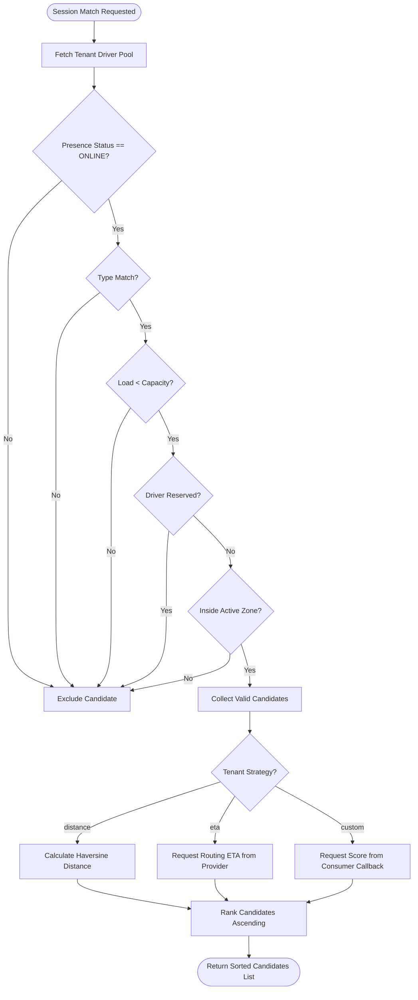
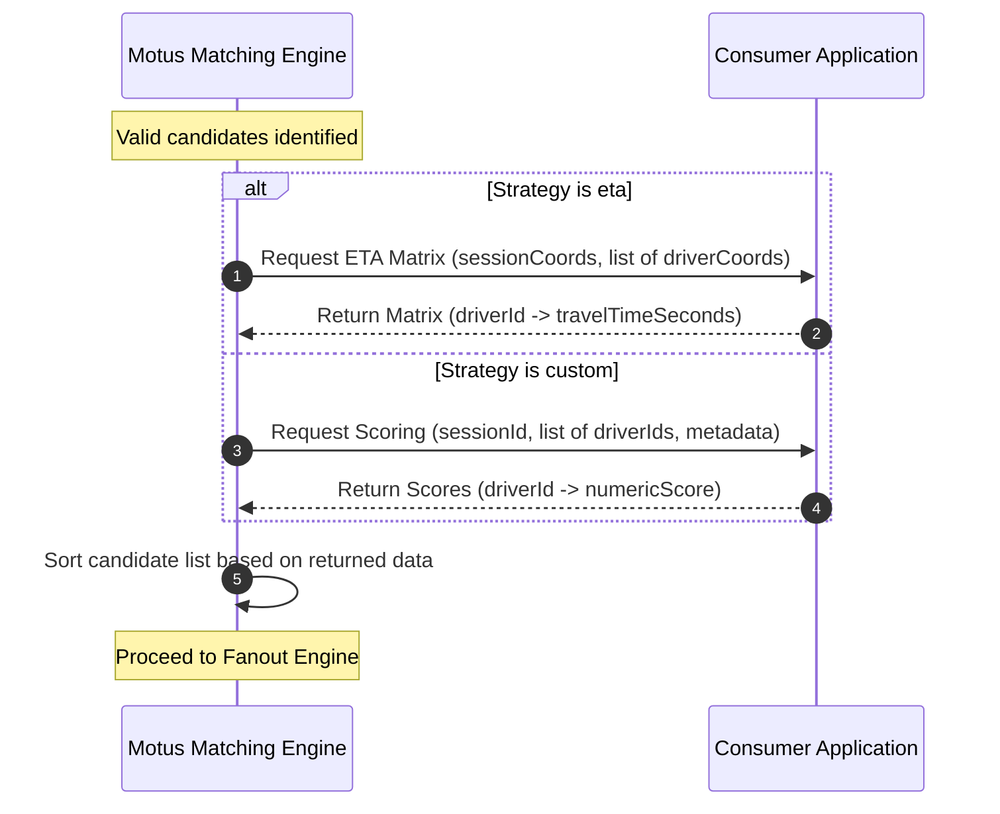

# 04. Matching Engine

## Purpose
This document specifies the matching engine for Motus. It details candidate selection, the pipeline of filters applied to the driver pool, and the ranking strategies (distance, ETA, and custom scoring) used to match a session with eligible drivers.

---

## Requirements

### Supported Matching Strategies
The matching engine ranks eligible driver candidates using one of three strategies, configured per tenant:

| Strategy | Description | Key Characteristics |
| :--- | :--- | :--- |
| **`distance`** | *Default Strategy.* Ranks candidates by straight-line (Haversine) distance from the session's starting coordinates. | Fast, computed entirely in-memory by Motus without external dependencies. |
| **`eta`** | Ranks candidates by drive-time ETA to the session's starting coordinates. | Requires the consumer to configure an external routing/mapping provider interface. |
| **`custom`** | Ranks candidates using scores provided dynamically by the consumer application. | Allows consumer business logic (e.g. driver rating, tenure, preference) to determine match priority. |

### The Candidate Filter Pipeline
Before scoring and ranking occurs, Motus filters the global pool of drivers for a given tenant. A candidate must pass all of the following pipeline stages to be scored:

1. **Presence Status Check:** Driver presence status must be `ONLINE`. Drivers in `BUSY`, `PAUSED`, `STALE`, or `OFFLINE` are excluded.
2. **Vehicle Type Validation:** The driver's registered vehicle types list must intersect with the vehicle types requested by the session (e.g. session requires `delivery-truck`, driver has `delivery-bike` ➔ **Filtered Out**).
3. **Capacity Check:** The driver's `currentLoad` must be strictly less than their `capacity` (`currentLoad < capacity`).
4. **Reservation Check:** The driver must not have an active offer reservation for another session (i.e. they are not currently locked in another wave's 8-second window).
5. **Geofence/Zone Match:** The driver's location must reside within the pickup/session service zone and satisfy active tenant geofence rules.

---

## Workflows

### Candidate Filter & Scoring Pipeline Workflow
The flowchart below illustrates how candidates are processed from the initial pool to the final sorted offer list.

### External ETA / Custom Scoring Sequence
When using `eta` or `custom` strategies, Motus delegates evaluation to external consumer interfaces.

---

## Edge Cases and Failure Cases
* **No Candidates Pass the Filter Pipeline:** 
  * *Resolution:* The matching engine returns an empty candidate list. The session remains in the `SEARCHING` session state. The retry policy is triggered to expand the radius or search criteria. If retry limits are exhausted, the event `dispatch.no_driver_found` is emitted.
* **External ETA Service Outage:** The third-party mapping provider is unreachable or returns an error.
  * *Resolution:* Motus falls back automatically to the `distance` strategy (Haversine calculation) for that specific wave to ensure system availability, and publishes a warning event.
* **Slow Custom Scoring Callback:** The consumer's custom scoring service takes longer than the matching timeout threshold.
  * *Resolution:* Motus enforces a strict timeout on custom scoring callbacks (e.g. 500ms). If exceeded, Motus drops back to using straight-line `distance` to maintain dispatch latency guarantees.
* **Stale Location for Closest Driver:** The top candidate based on distance has not sent an update in 115 seconds (still marked `ONLINE` but close to `STALE`).
  * *Resolution:* Tenant configuration defines a "Location Age Penalty". Candidates with location age greater than a threshold (e.g., 60 seconds) have their distance score artificially penalized to favor drivers with fresher coordinates.

---

## Future Enhancements
* **Road Network Distance Routing (Native):** Integrations with open-source road network routers (e.g., OSRM, Valhalla) to calculate actual driving distance rather than straight-line distance, without relying on costly commercial APIs.
* **Predictive Matching Scores:** Incorporating history of driver acceptance rates for specific pickup zones as a multiplier in candidate scoring.
