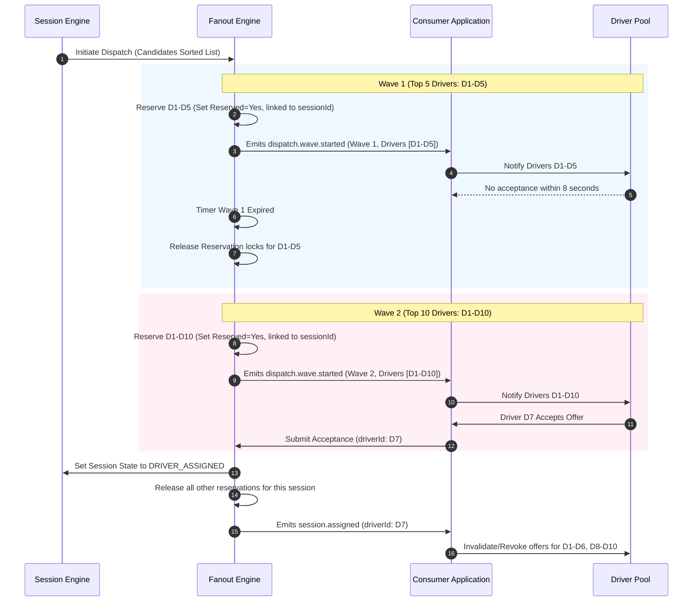
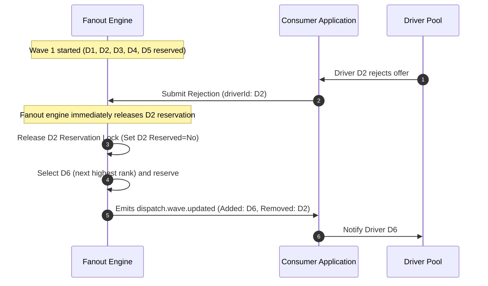

# 05. Fanout Engine

## Purpose
This document specifies the progressive fanout engine. It outlines the progressive wave dispatch system, managing offer timeouts, driver responses (acceptance/rejection), wave transitions, candidate reservation locks, and race condition handling.

---

## Requirements

### Configurable Dispatch Waves
Motus prevents network congestion and driver notification fatigue by dispatching session offers in incremental waves. The system scales the search radius and candidate count progressively.

The default configuration is:
* **Wave 1:** Notifies the top **5** ranked driver candidates.
* **Wave 2:** Notifies the top **10** candidates (adds next 5).
* **Wave 3:** Notifies the top **20** candidates (adds next 10).
* **Wave Timeout (`timeoutPerWave`):** **8 seconds** per wave before escalating.

These parameters are fully configurable at the tenant level.

---

## Candidate Reservation & Offer Lock

To prevent duplicate bookings and eliminate double-assignment ambiguity during overlapping dispatch waves, Motus implements a strict candidate locking mechanism.

```
       [Driver Available] (Presence Status: ONLINE, Reserved: No)
               │
               ▼  Wave 1 Starts (Select Candidate)
       [Offer Reserved] (Presence Status: ONLINE, Reserved: Yes, linked to sessionId)
         /           \
        /             \  Timeout (8s) or Rejection
       /               \
 Driver Accepts      [Offer Released] (Reserved: No)
      │                        │
      ▼                        ▼
 [Presence: BUSY]       Back to Available Pool
```

### 1. Candidate Reservation
* **Exclusivity:** When a driver is selected as a candidate in an active dispatch wave and notified of an offer, Motus places an **Offer Reservation** lock on that driver presence profile.
* **Lock Association:** The reservation is tagged with the unique `sessionId`.
* **Single-Offer Constraint:** A driver with an active reservation is **ineligible** for selection in any other concurrent session's matching waves. They cannot receive multiple offers simultaneously.

### 2. Offer Lock Lifecycle
* **Lock Reservation state:** The reservation begins the moment the `dispatch.wave.started` event is emitted. The driver remains `ONLINE` in presence status but carries the reservation lock.
* **Timeout Behavior:** A reservation lock is valid for the duration of the wave timeout (`timeoutPerWave`, default 8 seconds). 
* **Expiration and Release Behavior:** 
  * If the wave timer expires without acceptance, the reservation lock for that candidate is **released** immediately, making them available for matching by other sessions. 
  * If a driver rejects the offer, the reservation lock is **released** immediately.
  * If the driver accepts, the lock is promoted to an assignment: the driver's presence status transitions to `BUSY` (if capacity limit is reached) and the reservation lock is cleared.

### 3. Acceptance Race Conditions
* **Simultaneous Acceptance Handling:** If a driver attempts to accept an offer after their reservation has expired (e.g. at 9 seconds) and they have been reserved by a second session, the transaction evaluates locks:
  * The second session holds the reservation lock.
  * The first session's acceptance attempt is rejected by Motus with a `ReservationExpired` code.
* **Multiple Sessions Competing for Same Driver:** If Session A and Session B both rank Driver D1 highly, whichever session executes its matching wave first locks D1. The second session's matching engine sees the reservation flag and skips D1, choosing the next best candidate.

---

## Workflows

### Wave Progression Sequence Diagram
This diagram shows wave progression when Wave 1 times out, and a driver in Wave 2 accepts.



### Driver Rejection Sequence Diagram
If a driver rejects an offer, the fanout engine responds immediately.



---

## Edge Cases and Failure Cases

### 1. Late Acceptance (Acceptance after Wave Timeout)
* **Problem:** Driver D1 receives an offer in Wave 1. The 8-second wave timer expires, and Wave 2 begins. D1 tries to accept at 9 seconds.
* **Resolution:** 
  * If D1 has not been reserved by any other session in the interim, the late acceptance succeeds.
  * If D1 has already been reserved by another session, the acceptance fails, and the driver client is notified that the offer is no longer valid.

### 2. Driver Disconnects While Holding Reservation Lock
* **Problem:** Driver D3 is reserved, but their phone goes offline before the wave timeout.
* **Resolution:** 
  * If the wave timeout expires (8s), the lock is released automatically.
  * If D3's presence status transitions to `OFFLINE` due to a separate heartbeat sweep before the timeout, the presence engine informs the fanout engine, which immediately releases the reservation lock and notifies a replacement candidate.

---

## Future Enhancements
* **Dynamic Wave Sizing (Load-Aware):** Automatically reducing wave sizes in high-demand/low-supply conditions to avoid multiple drivers rushing to accept the same booking.
* **Predictive Wave Timing:** Shortening the wave timeout if candidate historical response profiles suggest they are highly likely to ignore or reject.
