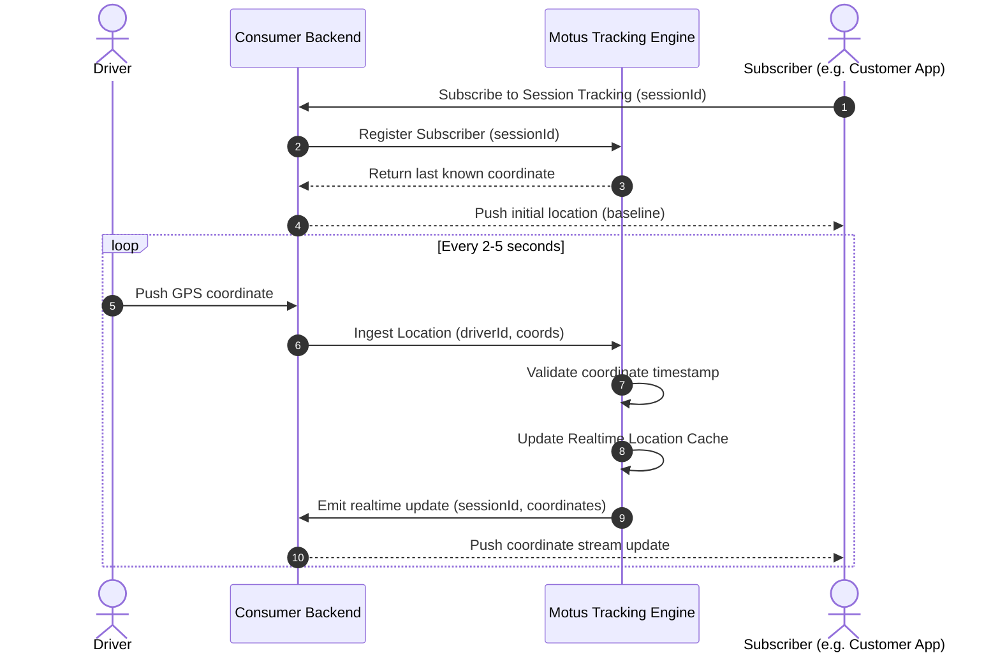
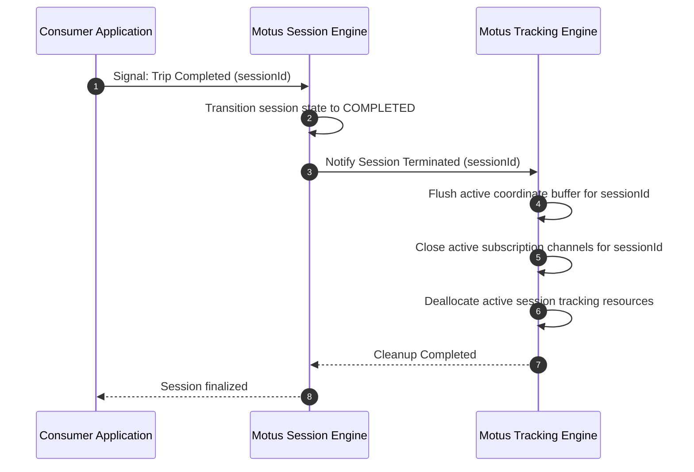

# 06. Tracking Engine

## Purpose
This document specifies the tracking engine. It outlines how realtime location updates from drivers are processed, how consumers subscribe to coordinate streams for active sessions, and how tracking lifecycles are cleaned up upon session termination.

---

## Requirements

### Realtime Ingestion
* The tracking engine acts as a conduit for incoming coordinate updates. Drivers update their location periodically, sending coordinates (`lat`, `lng`), heading, speed, and timestamp.
* The system evaluates each update to determine if it is the most recent coordinate before forwarding it.

### Consumer Tracking Subscriptions
* Consuming applications subscribe to tracking updates for active sessions (e.g. for customer-facing maps or dispatch monitoring dashboards).
* Tracking subscriptions are scoped by `sessionId` or `driverId`.
* Realtime delivery mechanisms are abstract; Motus provides the ingestion and streaming logic, while the network protocol (e.g., streaming gateways) is managed by the application layer.

### Reconnections
* The tracking engine must support client reconnections without losing the current session tracking context. Upon reconnection, the subscriber receives the last cached location packet as a baseline.

### Tracking Cleanup
* Tracking resources (active buffers, routing channels, active subscribers list) must be deallocated when a session reaches a terminal session state (`COMPLETED` or `CANCELLED`) to prevent resource leaks.

---

## Workflows

### Realtime Tracking Flow
The sequence diagram below displays how location updates are ingested from the driver client and pushed to subscribers listening to the session tracking stream.

### Session Termination & Tracking Cleanup
This diagram shows how resources are freed when a tracking session completes.

---

## Edge Cases and Failure Cases

### 1. Driver Signal Drop During Live Tracking
* **Problem:** A driver enters an area with no cellular coverage. No location updates are sent for 120 seconds.
* **Resolution:** 
  * The tracking engine detects the missing heartbeats.
  * When the duration exceeds the configured threshold, the session transitions to `DRIVER_LOST`.
  * Subscribers are notified that the stream is suspended, displaying the last known position with a "stale location" indicator.

### 2. Client Subscriber Disconnects & Reconnects
* **Problem:** A customer tracking a delivery on their phone locks their screen, causing their subscription to disconnect. They unlock the screen 3 minutes later.
* **Resolution:** 
  * Upon reconnecting, the consumer application issues a subscription request.
  * The tracking engine fetches the last known valid coordinate from the session cache and returns it immediately.
  * The subscriber's screen updates to the driver's current position without waiting for the next location update packet.

### 3. Out-of-Order or Drift Coordinates
* **Problem:** A driver's GPS module errors, sending a coordinate that is 5 kilometers away from their actual location, followed by a correct coordinate.
* **Resolution:** 
  * The tracking engine implements a tenant-configured velocity filter. 
  * If the speed required to reach the new coordinate from the last cached coordinate exceeds physical limits (e.g., > 150 km/h for a bike), the coordinate is flagged as noise and filtered out of the realtime tracking stream.

---

## Future Enhancements
* **Dynamic Sampling Frequency:** Instructing the driver's client device to reduce update frequencies when stationary and increase updates when driving on highways or nearing a pickup point.
* **Geofenced Tracking Visibility:** Restricting coordinate streaming to the customer until the driver actually reaches the `DRIVER_EN_ROUTE` session state, preventing access to the driver's location before they accept the job.
