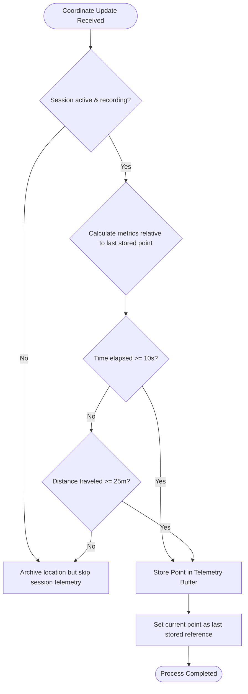
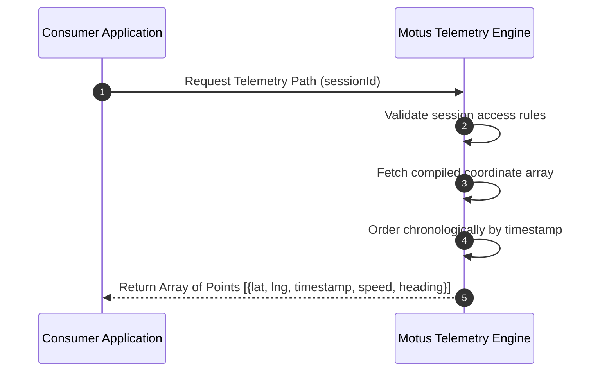

# 07. Telemetry

## Purpose
This document specifies the telemetry collection engine. It defines how historical path coordinates are sampled, filtered, and aggregated to create route history, enabling session replays and audit reports.

---

## Requirements

### Telemetry Sampling Rules
To prevent storage footprint bloat while maintaining route fidelity, Motus filters raw location streams. A coordinate is saved to the session's telemetry history *only* when one of the following thresholds is met:

1. **Distance-Based Threshold (`sampleDistance`):** The driver has moved more than **25 meters** (straight-line distance) from the last stored telemetry coordinate.
2. **Time-Based Threshold (`sampleTime`):** More than **10 seconds** have elapsed since the last stored telemetry coordinate was recorded.

*Note: Both parameters are configurable at the tenant level.*

```
Raw Location Updates:  o-----o---o-------o---------o----o----o
Stored Telemetry:      X-----------------X--------------X----X
Trigger:             [Start]            [Time]        [Dist] [Dist]
```

### Telemetry vs. Tracking Scope Separation
* **Realtime Tracking Storage:** The tracking engine caches only the single latest "raw" coordinate update in a transient cache to feed live client maps. This raw coordinate is not evaluated against distance/time thresholds.
* **Historical Telemetry Storage:** The telemetry engine evaluates the raw coordinate stream against sampling rules and saves matching points in a chronological path history collection for audits, metrics calculations, and playbacks.

### Telemetry Lifecycle
* **Active Recording:** Telemetry collection begins when a session transitions to `DRIVER_EN_ROUTE` and ends when the session transitions to a terminal session state (`COMPLETED` or `CANCELLED`).
* **Storage Preservation:** During the session, telemetry points are stored in a session telemetry buffer. Upon completion, they are frozen and compiled into the session report.
* **Purge Window:** Tenants can define a data retention policy (e.g., 30 days) after which detailed telemetry coordinate arrays are purged, leaving only aggregated trip statistics (e.g. total distance, duration).

### Replay & Playback Capabilities
Motus stores coordinate streams in chronological order with metadata (timestamp, speed, heading). This structure allows consuming systems to request the complete coordinate path to reconstruct or animate the driver's route on a map.

---

## Workflows

### Telemetry Ingestion Decision Workflow
The following diagram details the decision logic applied to every incoming coordinate update during an active session.



### Telemetry Path Retrieval Workflow
Consuming applications can request the path history for visualization or audits.



---

## Edge Cases and Failure Cases

### 1. The Stationary Driver (Traffic Jams / Waiting at Pickup)
* **Problem:** If a driver is stuck in gridlock, distance remains 0 meters. However, the 10-second timer will continuously trigger, writing identical coordinates every 10 seconds, wasting storage.
* **Resolution:** 
  * Motus enforces a "Stationary Filter". 
  * If the distance traveled since the last stored coordinate is below a threshold (e.g., < 2 meters) and the speed is 0, the time-based sampling trigger is suspended after the first stationary point is written. 
  * The timer trigger resumes once the driver moves more than 2 meters.

### 2. GPS Jitter (False Movement)
* **Problem:** A driver is parked, but GPS signal bouncing causes the coordinates to jump randomly by 30 meters, triggering false distance-based samples.
* **Resolution:** 
  * Motus filters coordinates that do not pass horizontal accuracy checks.
  * The system also uses a speed consistency filter: if the distance jumped implies a velocity that exceeds the average speed of the last few points, it is flagged as jitter and ignored.

### 3. Session Reached Terminal Session State with Zero Telemetry
* **Problem:** A session is created and canceled immediately, or completed without the driver ever successfully sending coordinates.
* **Resolution:** 
  * The telemetry engine registers a fallback entry consisting of the pickup coordinates provided by the session request.
  * The system flags the session report's telemetry status as `EMPTY` or `NO_DATA`.

---

## Future Enhancements
* **Compressed Telemetry Transmission:** Supporting compressed path formats (like Google Polyline Algorithm) to reduce payload size when returning long routes to clients.
* **Map Matching Integration Framework:** Providing hook boundaries so external map-matching systems can snap raw GPS telemetry coordinates to actual road networks before compiling final reports.
