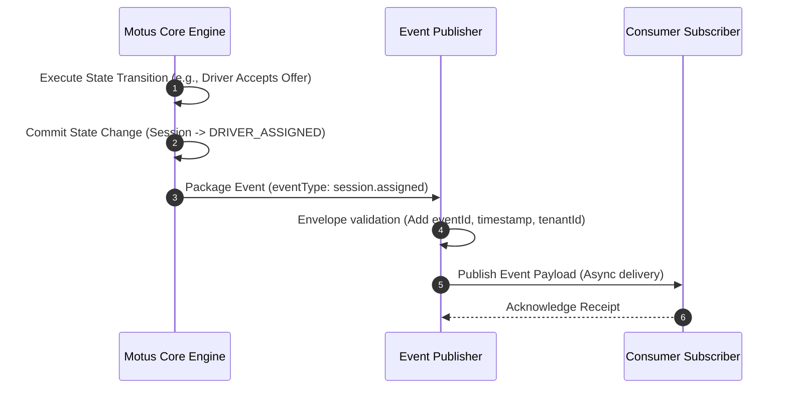

# 08. Event System

## Purpose
This document specifies the event system for Motus. It defines the event taxonomy, payload schemas, and triggering conditions for all asynchronous events emitted by Motus, enabling consuming applications to react to presence, dispatch, and tracking state changes.

---

## Requirements

### Event Envelope Structure
All events emitted by Motus share a standard envelope, ensuring consistency for consumer ingestion layers. All keys in the payload `data` object use camelCase naming.

| Envelope Field | Type | Description |
| :--- | :--- | :--- |
| `eventId` | String | Unique UUID for the event. |
| `eventType` | String | Dot-separated event namespace (e.g. `session.created`). |
| `tenantId` | String | The tenant namespace this event belongs to. |
| `timestamp` | Timestamp | ISO 8601 UTC timestamp when the event occurred. |
| `schemaVersion`| String | Version of the event payload schema (e.g., `1.0`). |
| `data` | Object | Event-specific payload with camelCase properties. |

---

## Event Catalog & Schema Payloads

### 1. Session Events

#### `session.created`
* **Trigger:** A new session is initialized by the consumer application.
* **Payload (`data`):**
  ```json
  {
    "sessionId": "session-123",
    "sessionState": "CREATED",
    "vehicleTypes": ["taxi", "suv"],
    "origin": { "lat": 12.9716, "lng": 77.5946 },
    "metadata": { "paymentType": "cash" }
  }
  ```

#### `session.searching`
* **Trigger:** The session enters the dispatch pipeline and begins matching candidates.
* **Payload (`data`):**
  ```json
  {
    "sessionId": "session-123",
    "sessionState": "SEARCHING",
    "startedAt": "2026-06-11T12:00:05Z"
  }
  ```

#### `session.assigned`
* **Trigger:** A driver accepts the offer and is assigned to the session.
* **Payload (`data`):**
  ```json
  {
    "sessionId": "session-123",
    "sessionState": "DRIVER_ASSIGNED",
    "driverId": "driver-999",
    "vehicleType": "suv",
    "assignedAt": "2026-06-11T12:00:15Z"
  }
  ```

#### `session.completed`
* **Trigger:** The trip/job reaches its successful completion.
* **Payload (`data`):**
  ```json
  {
    "sessionId": "session-123",
    "sessionState": "COMPLETED",
    "driverId": "driver-999",
    "completedAt": "2026-06-11T12:30:00Z",
    "metrics": {
      "totalDurationSeconds": 1785,
      "totalDistanceMeters": 12450
    }
  }
  ```

#### `session.cancelled`
* **Trigger:** The session is explicitly terminated before completion.
* **Payload (`data`):**
  ```json
  {
    "sessionId": "session-123",
    "sessionState": "CANCELLED",
    "cancelledBy": "consumer-admin",
    "reason": "customer_no_show",
    "cancelledAt": "2026-06-11T12:05:00Z"
  }
  ```

#### `session.driver_lost`
* **Trigger:** The assigned driver misses consecutive heartbeats and is marked lost.
* **Payload (`data`):**
  ```json
  {
    "sessionId": "session-123",
    "sessionState": "DRIVER_LOST",
    "driverId": "driver-999",
    "lastKnownLocation": { "lat": 12.9780, "lng": 77.5990 },
    "secondsSinceLastHeartbeat": 135
  }
  ```

---

### 2. Driver Presence Events

#### `driver.online`
* **Trigger:** A driver submits a location heartbeat while in `OFFLINE` status.
* **Payload (`data`):**
  ```json
  {
    "driverId": "driver-999",
    "presenceStatus": "ONLINE",
    "vehicleTypes": ["suv"],
    "initialLocation": { "lat": 12.9716, "lng": 77.5946 }
  }
  ```

#### `driver.stale`
* **Trigger:** A driver misses heartbeats exceeding the fresh threshold (120s) and transitions to `STALE`.
* **Payload (`data`):**
  ```json
  {
    "driverId": "driver-999",
    "presenceStatus": "STALE",
    "previousPresenceStatus": "BUSY",
    "lastHeartbeat": "2026-06-11T12:00:00Z"
  }
  ```

#### `driver.offline`
* **Trigger:** A driver explicitly logs out, or their presence exceeds the offline threshold (900s).
* **Payload (`data`):**
  ```json
  {
    "driverId": "driver-999",
    "presenceStatus": "OFFLINE",
    "reason": "heartbeat_timeout"
  }
  ```

#### `driver.location.updated`
* **Trigger:** Ingested location update passes chronological sequencing checks.
* **Payload (`data`):**
  ```json
  {
    "driverId": "driver-999",
    "location": { "lat": 12.9720, "lng": 77.5950 },
    "heading": 180,
    "speed": 12.5,
    "recordedAt": "2026-06-11T12:01:00Z"
  }
  ```

#### `driver.geofence.entered`
* **Trigger:** Driver's updated coordinates cross the boundary into a geofenced service zone.
* **Payload (`data`):**
  ```json
  {
    "driverId": "driver-999",
    "zoneId": "downtown-zone",
    "location": { "lat": 12.9780, "lng": 77.5990 },
    "enteredAt": "2026-06-11T12:05:00Z"
  }
  ```

#### `driver.geofence.exited`
* **Trigger:** Driver's updated coordinates cross the boundary out of a geofenced service zone.
* **Payload (`data`):**
  ```json
  {
    "driverId": "driver-999",
    "zoneId": "downtown-zone",
    "location": { "lat": 12.9800, "lng": 77.6010 },
    "exitedAt": "2026-06-11T12:08:00Z"
  }
  ```

---

### 3. Dispatch & Wave Events

#### `dispatch.wave.started`
* **Trigger:** A new progressive dispatch wave is executed.
* **Payload (`data`):**
  ```json
  {
    "sessionId": "session-123",
    "waveNumber": 1,
    "candidateCount": 5,
    "driverIds": ["driver-1", "driver-2", "driver-3", "driver-4", "driver-5"],
    "timeoutSeconds": 8
  }
  ```

#### `dispatch.wave.updated`
* **Trigger:** A candidate in an active wave rejects an offer, and a replacement candidate is reserved.
* **Payload (`data`):**
  ```json
  {
    "sessionId": "session-123",
    "waveNumber": 1,
    "addedDriverIds": ["driver-6"],
    "removedDriverIds": ["driver-2"]
  }
  ```

#### `dispatch.wave.completed`
* **Trigger:** A dispatch wave completes because its timer expired or candidates rejected the offer.
* **Payload (`data`):**
  ```json
  {
    "sessionId": "session-123",
    "waveNumber": 1,
    "reason": "expired",
    "durationSeconds": 8.0
  }
  ```

#### `dispatch.no_driver_found`
* **Trigger:** All matching waves and retries have completed, and no driver accepted the offer.
* **Payload (`data`):**
  ```json
  {
    "sessionId": "session-123",
    "totalWavesRun": 3,
    "totalCandidatesNotified": 35,
    "finalSearchRadiusMeters": 5625
  }
  ```

---

## Workflows

### Event Generation Pipeline
This workflow shows how a state change in the Motus core triggers event generation and publishes it to the consumer application's subscription channel.



---

## Edge Cases and Failure Cases

### 1. Out-of-Order Event Processing
* **Problem:** A consumer's system processes `session.completed` before `session.assigned` due to queue delivery variations.
* **Resolution:** 
  * Every event contains a chronological `timestamp`.
  * The consumer application's state handler must compare event timestamps or keep track of state sequence order to prevent updating their records to an obsolete state.

### 2. Payload Schema Changes
* **Problem:** A minor version update to Motus adds a field to the payload, breaking consumer parsers.
* **Resolution:** 
  * Event schemas are versioned via the `schemaVersion` envelope field.
  * Structural breaking changes necessitate an increment in `schemaVersion` (e.g., `1.0` ➔ `2.0`). Motus will support multi-version concurrent publishing based on tenant configurations to ease migrations.

---

## Future Enhancements
* **CloudEvents Specification Compliance:** Aligning the standard envelope fields with the CNCF CloudEvents format to facilitate seamless integration with serverless function routers.
* **Webhook Target Routing:** Allowing tenants to register web endpoints where Motus will deliver event notifications directly via HTTP POST requests, complete with security signing headers.
