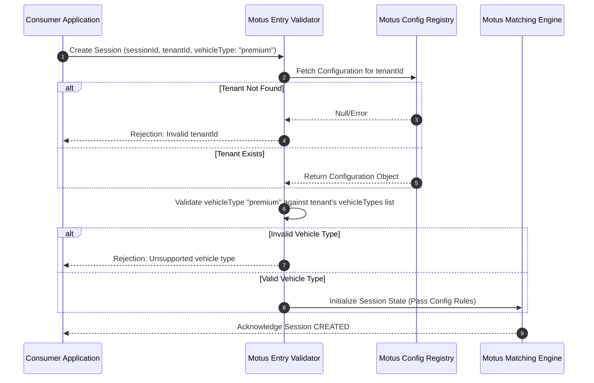

# 09. Multi-Tenancy

## Purpose
This document specifies the multi-tenant architecture for Motus. It details the isolation model, tenant registration schema, and the configuration scopes that control how vehicle validation, matching strategies, dispatch waves, retry rules, and geofencing limits are isolated and enforced per tenant.

---

## Requirements

### Tenant Isolation Model
* **Logical Isolation:** Every driver presence, session lifecycle, telemetry coordinate, and event is tagged with a unique `tenantId`.
* **Zero Cross-Talk:** Motus restricts coordinate matching, queries, and fanout calculations to the active `tenantId`. A driver online under `tenant-A` is completely invisible to sessions created under `tenant-B`.
* **Configurable Defaults:** When a tenant is registered, they must define their operational configuration rules.

### Tenant Configuration Structure
Tenants configure their operational parameters within the following namespaces:

| Config Scope | Customizable Parameters |
| :--- | :--- |
| **`vehicleTypes`** | List of valid vehicle identifier tags (e.g., `["bike", "taxi", "delivery-van"]`). |
| **`matchingRules`** | * Strategy selector: `["distance", "eta", "custom"]`.   * Candidate search limit (e.g. max 50 candidates).   * Location age penalty threshold. |
| **`fanoutRules`** | * Wave sizes array (e.g., `[5, 10, 20]`).   * Wave timeout (e.g., 8s). |
| **`retryRules`** | * Max retry count (e.g., 3).   * Search radius multiplier (e.g., 1.5).   * Initial search radius (e.g., 2000m). |
| **`telemetryRules`** | * Sample distance threshold (e.g., 25m).   * Sample time threshold (e.g., 10s).   * Telemetry retention policy duration (e.g., 30 days). |
| **`geofencingRules`** | * Service zone boundaries (polygon or circles).   * Strict geofencing flag (whether to filter drivers outside active service zones). |

---

## Workflows

### Tenant Configuration Request Lifecycle
The sequence below illustrates how a session creation request evaluates and applies tenant-specific configuration rules.

---

## Edge Cases and Failure Cases

### 1. Cross-Tenant ID Leakage
* **Problem:** A driver app compromised on the client-side attempts to send updates using another tenant's `driverId` or a different `tenantId` header.
* **Resolution:** 
  * Motus enforces tenant boundaries at the boundary verification layer. 
  * The context token verified by the consumer application must match the `tenantId` of the target resource. 
  * Any request attempting to access or modify a driver presence or session with a mismatched `tenantId` returns a permission denied error.

### 2. Changing Tenant Rules Mid-Session
* **Problem:** An administrator updates the wave timeout config from 8 seconds to 12 seconds while a session is actively progressing through dispatch waves.
* **Resolution:** 
  * To ensure consistency, a session snapshots its tenant's configuration at the moment the session state transitions to `SEARCHING`. 
  * Subsequent wave transitions utilize the snapshotted config. 
  * Any modifications to the tenant configuration apply only to sessions created *after* the configuration update was saved.

### 3. Service Zone Boundary Overlaps
* **Problem:** Two separate tenants define identical overlapping geofence coordinates in the same city.
* **Resolution:** 
  * Because the matching engine partitions driver lists by `tenantId` first, overlapping geofences do not cause conflicts. 
  * Driver presence profiles are evaluated strictly within the context of their own tenant partition.

---

## Future Enhancements
* **Hierarchical Tenant Nesting:** Introducing "Parent-Child" tenant relationships. This allows a global enterprise tenant to define base rules (e.g. global telemetry rules) while local franchisee tenants override specific operational values.
* **Dynamic Config Scheduling:** Enabling tenants to schedule config changes (e.g. increase wave timeouts or initial search radius during predicted peak hours).
