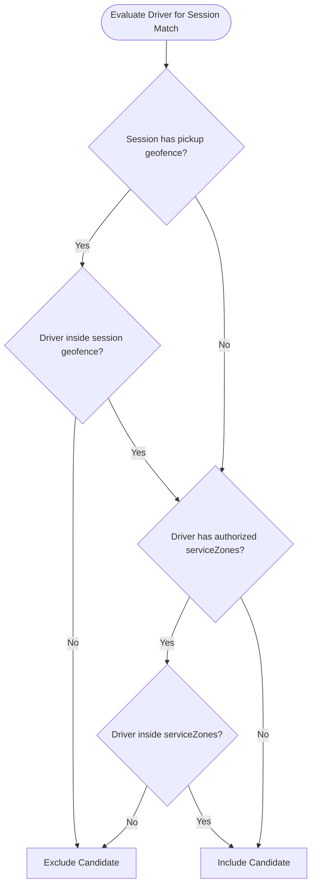
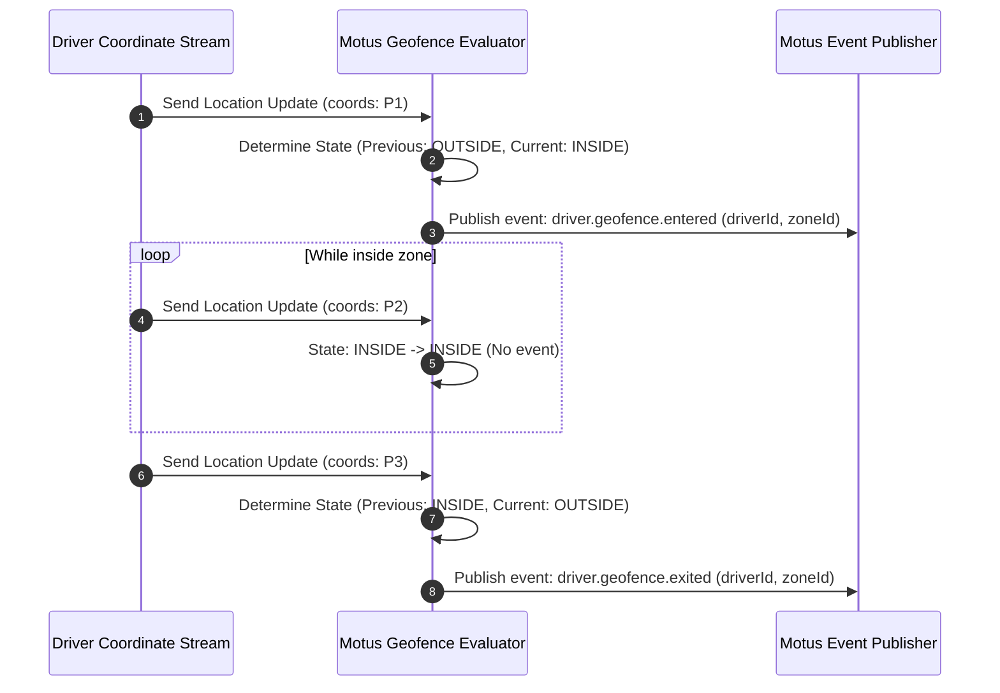

# 10. Geofencing

## Purpose
This document specifies the geofencing engine for Motus. This optional, tenant-configurable capability restricts matching and telemetry updates to defined geographic boundaries, facilitating service zone isolation, localized dispatching, and region validation.

---

## Requirements

### Spatial Zone Representation
Geofences in Motus are defined using two mathematical geometries:
1. **Circular Geofence:** Configured via a center coordinate (`lat`, `lng`) and a radius in meters.
2. **Polygonal Geofence:** Configured via an ordered list of vertices (minimum 3 coordinates) forming a closed linear ring (polygon).

```
Circular:                     Polygonal:
     _ - _                          *--------*
   /   *   \                       /          \
  (  Radius )                     /            \
   \       /                     *--------------*
     - _ -
```

### Zone Matching & Filtering Rules
When geofencing is enabled, the system enforces spatial boundaries across three operations:

* **Presence Isolation:** Drivers can list a set of authorized `serviceZones` in their presence profiles. The matching engine filters candidates by ensuring the driver's current coordinates intersect with one of their authorized service zones.
* **Session Route Constraints:** A session can define a pickup or dropoff geofence. Drivers are excluded from matching if their current location is outside the pickup geofence.
* **Active Boundary Ingress/Egress Monitoring:** The telemetry engine monitors if a driver crosses into (ingress) or out of (egress) a geofenced zone during an active session, emitting state notifications accordingly.

---

## Workflows

### Geofence Filter Pipeline Workflow
This diagram details how the geofence engine validates driver coordinates against session and driver boundaries during candidate selection.



### Ingress / Egress Boundary Cross Event Workflow
The sequence below displays how coordinates are monitored for geofence crossings, triggering event emissions.



---

## Edge Cases and Failure Cases

### 1. Border Jitter (The Ping-Pong Problem)
* **Problem:** A driver is parked near the edge of a geofence. Tiny variations in GPS signals cause coordinates to slide in and out of the boundary, triggering a flood of ingress/egress events.
* **Resolution:** 
  * Motus implements a "Spatial Hysteresis Buffer". 
  * To trigger an egress event, the driver must move beyond the geofence boundary by a configurable distance margin (e.g., 15 meters) OR remain outside the boundary for at least 3 consecutive updates before the transition event is published.

### 2. Self-Intersecting Polygons
* **Problem:** A tenant registers a complex service zone polygon where boundary lines cross, creating mathematical calculation ambiguities.
* **Resolution:** 
  * The geofence validator checks the polygon coordinates upon registry. 
  * If the vertices self-intersect or the ring is not closed, the registration is rejected, preventing invalid spatial calculations.

### 3. Cross-Boundary Telemetry Drops
* **Problem:** A tenant sets a geofence rule to strictly reject telemetry coordinates recorded outside the geofence. The driver takes a detour through a neighboring zone, leaving a gap in the trip track.
* **Resolution:** 
  * The telemetry engine registers coordinates regardless of geofence boundaries to ensure route integrity. 
  * However, it flags out-of-boundary points in the session report's telemetry array, allowing the consumer to apply business rules later.

---

## Future Enhancements
* **Temporal Geofencing:** Restricting geofence enforcement to specific hours (e.g., congestion zones active only between 7:00 AM and 7:00 PM).
* **Dynamic Geofence Scaling:** Rescaling geofence radii dynamically based on driver density or time of day.
