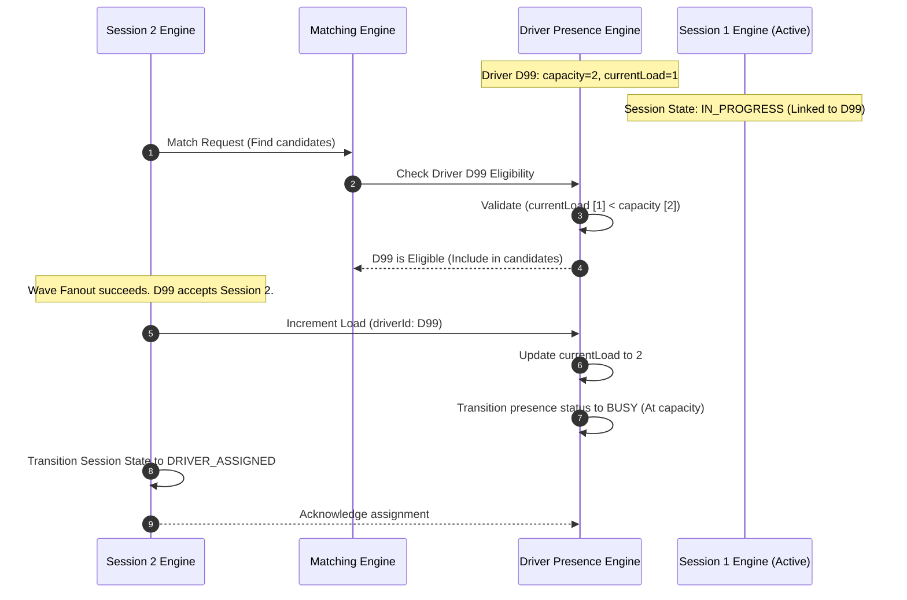

# 11. Capacity Management

## Purpose
This document specifies the driver capacity management engine for Motus. It details the rules governing driver load limits, validation logic during session matching and assignment, and the architectural roadmap for complex route-aware assignments.

---

## Requirements

### Driver Capacity and Load Attributes
Motus supports concurrent assignment limits, allowing drivers to execute multiple jobs simultaneously (e.g. multiple parcel deliveries in a single vehicle).

* **`capacity`:** The maximum number of concurrent sessions a driver can be assigned to. Default value is `1`. This is configurable per driver.
* **`currentLoad`:** The counter representing the driver's active assignments. An assignment is counted toward `currentLoad` when the session is in any of the following session states:
  * `DRIVER_ASSIGNED`
  * `DRIVER_EN_ROUTE`
  * `ARRIVED`
  * `IN_PROGRESS`
  * `DRIVER_LOST`
* **Validation Rule:** A driver is eligible for matching and assignment *only* if:
  $$\text{currentLoad} < \text{capacity}$$
  *Note: They must also pass the Candidate Reservation check (they cannot have an active reservation lock).*
* **Release Rule:** The `currentLoad` counter is decremented by exactly `1` when an assigned session transitions to a terminal session state (`COMPLETED` or `CANCELLED`).

*Route-aware capacity management (evaluating if a new pickup is along the path of an existing active journey) is out of scope for V1.*

---

## Workflows

### Multi-Capacity Assignment Workflow
This diagram illustrates how a courier driver with `capacity = 2` is assigned to a second session while already executing an active session (`currentLoad = 1`).



---

## Edge Cases and Failure Cases

### 1. Dynamic Decrease of Capacity Under Active Load
* **Problem:** A driver is executing 2 active sessions (`currentLoad = 2`, `capacity = 2`). The consumer application updates the driver's capacity to `1`.
* **Resolution:** 
  * Motus updates the driver profile's `capacity` to `1` immediately.
  * Active assignments are *never* terminated or reassigned by Motus. The driver continues executing both trips.
  * However, because `currentLoad (2) >= capacity (1)`, the driver is excluded from matching pipelines.
  * When one trip completes (`currentLoad` drops to 1), the driver remains excluded since `currentLoad (1) >= capacity (1)`.
  * The driver becomes eligible for matching again only when `currentLoad` drops to `0`.

### 2. Race Conditions on Capacity Allocation
* **Problem:** Two separate session matching pipelines run concurrently and select Driver D1 (who has `capacity = 1`, `currentLoad = 0`). Both sessions attempt to assign Driver D1 at the same time.
* **Resolution:** 
  * Motus uses optimistic concurrency controls on the driver presence resource.
  * The session that commits the assignment first increments `currentLoad` to 1.
  * The second session's attempt to increment the load fails because `currentLoad (1) >= capacity (1)`.
  * The second session reverts its assignment state and resumes the dispatch fanout process.

---

## Future Roadmap: Route-Aware Assignment (V2/V3)

To support advanced pooling, ride-sharing, and logistics consolidation, the capacity engine will evolve from flat count-based limits to route-aware algorithms.

```
Route-Aware Assignment Scenario (Overlapping Paths):

  Pickup A        Pickup B            Dropoff A        Dropoff B
     *---------------*--------------------*----------------*
     |====== Driver Route Segment 1 ======|
                     |========= Driver Route Segment 2 ============|
```

### Planned Features
* **Dynamic ETD/ETA Windows:** Rather than checking flat capacity, the matching engine calculates if adding a new waypoint to the driver's itinerary violates time-window constraints (e.g. pickup/delivery SLA) for existing active sessions.
* **Itinerary Sequencer:** A module that recalculates the optimal visiting order of waypoints when a new session is proposed. For example, if a driver is carrying Session A (Pickup A ➔ Dropoff A) and receives Session B (Pickup B ➔ Dropoff B), the sequencer evaluates options:
  * Option 1: Pickup A ➔ Pickup B ➔ Dropoff A ➔ Dropoff B
  * Option 2: Pickup A ➔ Pickup B ➔ Dropoff B ➔ Dropoff A
* **Geometric Path Intersection Filtering:** Pre-filtering candidates by calculating the angle of deviation. If a candidate's current route is heading North, and the proposed session moves South, they are automatically excluded, regardless of current load count.
