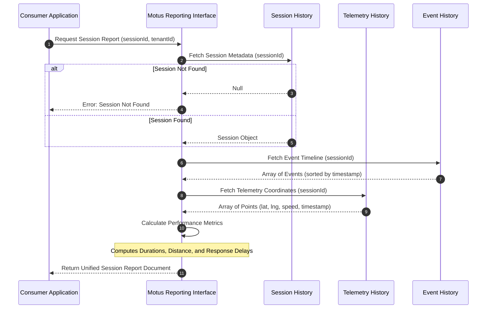

# 12. Reporting

## Purpose
This document specifies the reporting and query interfaces for Motus. It details the payload schemas and compilation rules for session query interfaces, allowing consumer applications to audit matching processes, telemetry paths, and session event timelines.

---

## Requirements

### Query Interfaces
Motus exposes three query boundaries that consumer applications can request at any time (during an active session or after session completion):

1. **`getSession(sessionId)`:** Fetches the current session state, configuration, and presence status parameters of the session.
2. **`getSessionEvents(sessionId)`:** Retrieves a chronological timeline of all session state transitions and dispatch events emitted during the session lifecycle.
3. **`getSessionReport(sessionId)`:** Compiles the session data, event timeline, telemetry coordinates path, and computed performance metrics into a single document.

---

## Report Data Schema

The compiled report returned by `getSessionReport(sessionId)` contains four key sections:

### 1. Session Details (`session`)
* Basic session parameters: session state, tenant, driver link, vehicle type requirements, constraints, and timestamps.

### 2. Event Log (`events`)
* Ordered list of events occurred during the session, including timestamps and transitional metadata.

### 3. Telemetry Path (`telemetry`)
* Chronological coordinate array containing latitude, longitude, timestamp, speed, and heading values of the driver during the session.

### 4. Computed Metrics (`metrics`)
* **`totalSearchingSeconds`:** Duration from session creation to driver assignment.
* **`totalEnRouteSeconds`:** Duration from assignment to arrival.
* **`totalInProgressSeconds`:** Duration from trip start to trip completion.
* **`totalDistanceMeters`:** Sum of spatial distances between sequential telemetry points.
* **`responseTimes`:** Milliseconds taken by driver to accept the offer once dispatched.
* **`numberWaveDispatches`:** Number of waves executed before assignment.

---

## Workflows

### Session Report Compilation Workflow
The sequence diagram below displays how the reporting engine compiles data from internal state buffers and historical archives to fulfill a `getSessionReport` request.

---

## Edge Cases and Failure Cases

### 1. Requesting Report for an Active Session (`SEARCHING` or `IN_PROGRESS`)
* **Problem:** A consumer requests a report while the trip is still ongoing. The telemetry and event datasets are incomplete.
* **Resolution:** 
  * Motus allows reports to be generated for active sessions.
  * The report status is marked as `INCOMPLETE`.
  * Metrics like `totalDistanceMeters` are calculated up to the latest cached coordinate, and durations for active states are computed relative to the current UTC system time.

### 2. Telemetry Gaps in Completed Sessions
* **Problem:** A driver is assigned, but their device loses network connectivity, completing the trip offline. The telemetry history contains only the start and end coordinates.
* **Resolution:** 
  * The reporting engine compiles the report, but flags the telemetry section with a quality warning: `"telemetryQuality": "low_data_points"`.
  * The computed `totalDistanceMeters` is calculated using a straight-line calculation between the available points, indicating that the value is estimated rather than measured.

---

## Future Enhancements
* **Scheduled Tenant Exports:** Allowing tenants to register queries that automatically compile daily/weekly session reports and push them to external target endpoints in CSV or JSON formats.
* **SLA Breach Highlighting:** Automatically flagging sessions in report metrics that violated tenant SLA agreements (e.g. search duration exceeding 5 minutes, or driver ETA deviation > 30%).
