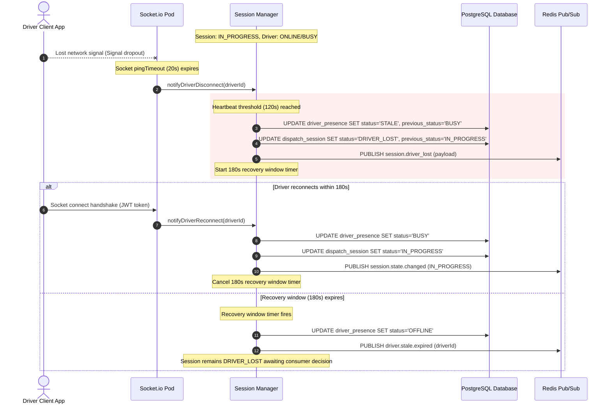
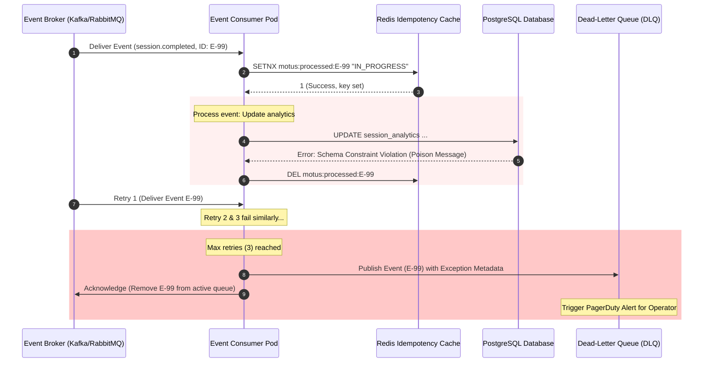
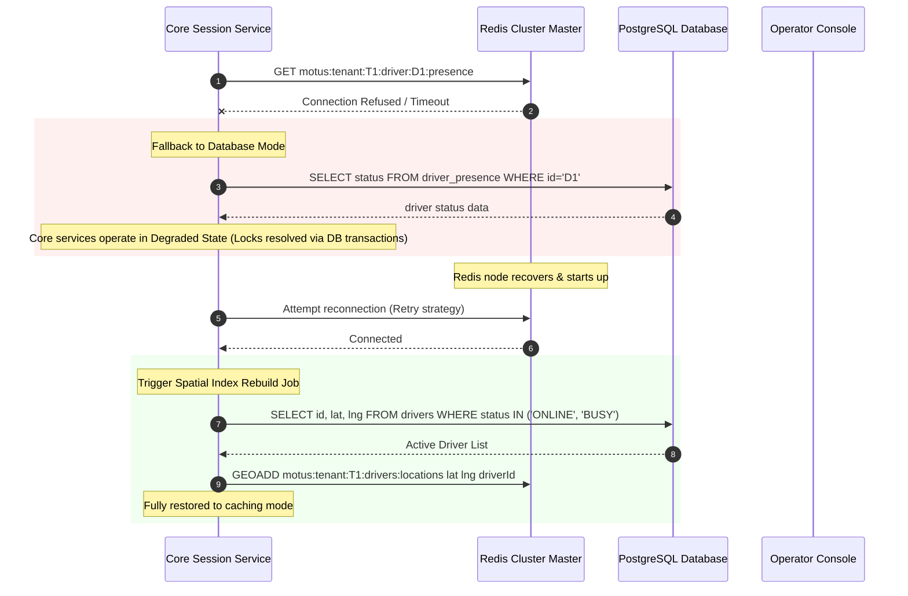
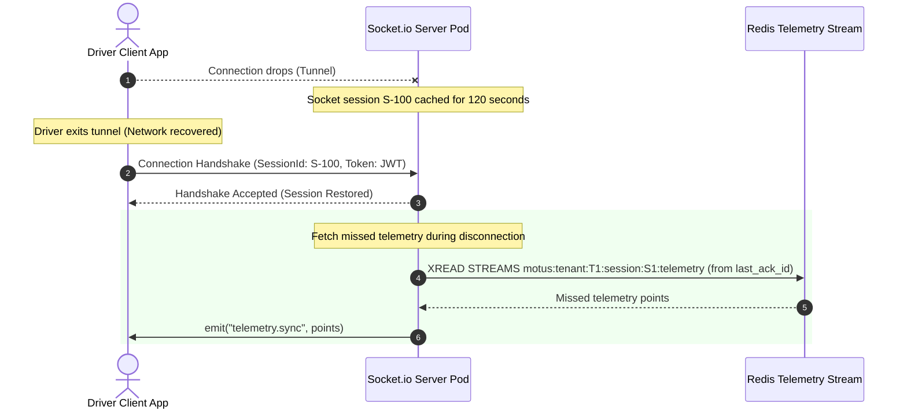

# 13. Failure Scenarios & Recovery Design

This document specifies the technical design, failure mitigation strategies, and recovery procedures for the Motus real-time dispatch, tracking, and presence engine. It establishes how the platform guarantees consistency, reliability, and strict tenant isolation during partial or total outages.

---

## 1. Introduction

### Purpose of Failure Handling
As a real-time dispatching and tracking system, Motus operates in an inherently unreliable environment characterized by mobile network drops, hardware outages, and third-party API instability. This design document establishes the failure containment boundaries, transactional recovery logic, and operational runbooks required to maintain system integrity.

### Reliability Goals
*   **Prevent Double Assignment:** Under no hardware or network failure state should two driver candidates be assigned to the same dispatch session.
*   **Enforce Tenant Isolation:** A failure, resource depletion, or rate-limit trigger in one tenant's partition must not affect the performance or availability of other tenants.
*   **Self-Healing Runtime:** The system must automatically recover from transient failures (database failovers, redis partitions, socket drops) without human operator intervention.

### Consistency vs. Availability Tradeoffs
Applying the CAP theorem to the Motus architecture:
*   **Dispatch Session State (CP-focused):** Dispatch session state transitions (e.g. `acceptOffer`, `cancelSession`, `completeTrip`) require strict linearizability. If a network partition occurs, the system favors consistency over availability, rejecting ambiguous mutations rather than risking double assignments or out-of-order state transitions.
*   **Driver Presence & Location (AP-focused):** Real-time GPS location updates and presence statuses tolerate eventual consistency. During a network partition, the system continues to accept local updates and broadcast coordinates to active tracking rooms, reconciling the presence statuses asynchronously.

### Design Principles
1.  **Idempotency-First:** Every API endpoint, message consumer, and state transition command must accept a client-provided uniqueness key to ensure safety under message retries.
2.  **Graceful Degradation:** When secondary integrations (such as maps or push notifications) experience outages, the core engine must degrade to offline defaults (e.g., straight-line distance fallback, SMS fallback) instead of halting matching workflows.
3.  **Fail-Fast and Validate Early:** Input validation and tenancy entitlement checks must run at the gateway layer before acquiring distributed locks or initiating database transactions.
4.  **Bulkhead and Throttling Isolation:** Isolate compute, memory, socket connections, and database resource pools per tenant to prevent cascaded failures.

---

## 2. Failure Classification

The Motus architecture isolates and handles failures across seven primary classifications:

```
+-----------------------------------------------------------------------------------+
|                                 API GATEWAY / INGRESS                             |
|    +-----------------------------+                     +---------------------+    |
|    |      Client Failures        |                     |    Rider Failures   |    |
|    +-----------------------------+                     +---------------------+    |
+------------------------------------------+----------------------------------------+
                                           |
                                           v
+-----------------------------------------------------------------------------------+
|                              CORE DISTRIBUTED SERVICES                            |
|    +-----------------------------+                     +---------------------+    |
|    |      Driver Failures        |                     |   Service Failures  |    |
|    +-----------------------------+                     +---------------------+    |
+------------------------------------------+----------------------------------------+
                                           |
                                           v
+-----------------------------------------------------------------------------------+
|                             INFRASTRUCTURE & PLUGINS                              |
|    +-----------------------------+                     +---------------------+    |
|    |    Network / Partitions     |                     |    Infrastructure   |    |
|    +-----------------------------+                     +---------------------+    |
|                                  |                                                |
|                                  +---------------------+                          |
|                                                        |                          |
|                                                        v                          |
|                                              +-------------------+                |
|                                              | External Outages  |                |
|                                              +-------------------+                |
+-----------------------------------------------------------------------------------+
```

### 2.1 Client Failures
*   **Description:** Misconfigured API consumers submitting malformed requests, invalid credentials, or rapid burst traffic.
*   **Handling:** Rate limiting at the ingress layer (Token Bucket per Tenant), strict OpenAPI schema validation, and early authentication verification.

### 2.2 Driver Failures
*   **Description:** Physical courier device anomalies, including app crashes, battery drainage, manual GPS disablement, or network coverage gaps.
*   **Handling:** Decoupled heartbeat tracking, local coordinate queue caching, and automated stale presence promotion.

### 2.3 Rider Failures
*   **Description:** Consumer apps losing connection, experiencing websocket handshake failures, or failing to acknowledge dispatch status events.
*   **Handling:** Persistent state storage in Redis for session queries, offline mobile push notifications, and HTTP polling fallbacks.

### 2.4 Service Failures
*   **Description:** Internal crash of service pods (e.g., Session Manager, Matching Engine, Fanout Engine) due to OOM errors or unhandled exceptions.
*   **Handling:** Stateless service pods managed by Kubernetes with readiness/liveness probes, using Redis streams for inter-service task queuing to resume operations after restarts.

### 2.5 Infrastructure Failures
*   **Description:** Redis master nodes crashing, PostgreSQL master database failovers, or message queue brokers running out of disk space.
*   **Handling:** Redlock cluster consensus, PostgreSQL streaming replication with Patroni/PgBouncer, and local memory queues with backpressure controls.

### 2.6 Network Failures
*   **Description:** Partition between the Kubernetes pods and the Redis/PostgreSQL cluster, or cross-availability-zone latency spikes.
*   **Handling:** Circuit breakers on database connections, aggressive TCP keep-alives, and automatic transport downgrades.

### 2.7 External Dependency Failures
*   **Description:** Outages in mapping services (Google Maps/Mapbox), push notification providers (FCM/APNS), or SMS gateways (Twilio).
*   **Handling:** Resiliency patterns (Circuit Breaker, Bulkhead, Fallback engines) decoupling core matching from external network calls.

---

## 3. Driver Availability Failures

### Canonical Failure-Recovery Sequence
The platform handles driver network anomalies and hardware crashes using a unified state degradation sequence:

```
+---------------+           Heartbeat Loss           +---------------+
|    ONLINE     | ---------------------------------> |     STALE     |
+---------------+              (>120s)               +---------------+
        ^                                                    |
        |               Heartbeat Reconnection               |
        +----------------------------------------------------+
        |
        |              Cleanup Window Expiry (>180s)
        v
+---------------+
|    OFFLINE    |
+---------------+
```

1.  **Active Heartbeat:** Drivers broadcast location pings every 10 seconds.
2.  **STALE Status Transition:** If no heartbeat is received within `staleThresholdSeconds` (default: 120s), the presence status transitions to `STALE` and the `driver.stale` event is emitted.
3.  **Session DRIVER_LOST Transition:** If the driver has an active assigned session, the Session Engine transitions that session to `DRIVER_LOST` (caching the current state in `previousSessionState`).
4.  **180s Reconnect/Recovery Window:** A timer is registered.
    *   *If Reconnected:* Driver presence is restored to its previous state (e.g. `BUSY`). The session transitions back to `previousSessionState`.
    *   *If Window Expires:* Driver status is set to `OFFLINE`. The driver is removed from the active locations spatial geoset.
5.  **Consumer Selection / Safety Timeout:** The consumer application has up to 30 minutes (safety timeout) to call `reassign` or `cancel`. If they take no action, Motus cancels the session automatically with `consumer_heartbeat_timeout`.

### Scenario Handlings

#### 3.1 Driver Disconnects During Availability
*   **Impact:** Driver remains in the spatial search index but cannot receive offers.
*   **Mitigation:** The heartbeat sweeper identifies the expired heartbeat after 120 seconds, transitions the driver status to `STALE`, and calls `GEODEL motus:tenant:{tenantId}:drivers:locations {driverId}` to prevent the matching engine from evaluating this driver.

#### 3.2 Driver Disconnects During Assignment (Active Wave Offer)
*   **Impact:** The system waits for an acceptance that will never arrive.
*   **Mitigation:** The wave expires after the 8-second window. The driver's wave lock is automatically released by Redis TTL. The driver is marked `STALE` if the heartbeat threshold is crossed.

#### 3.3 Driver Disconnects During Active Trip
*   **Impact:** Live telemetry drops, leaving the rider and operator without real-time tracking updates.
*   **Mitigation:** The session state transitions to `DRIVER_LOST`. Telemetry sampling and matching are paused.

#### 3.4 Driver App Crashes & Device Power Loss
*   **Impact:** Abrupt socket closure.
*   **Mitigation:** The Socket.IO server detects TCP FIN or ping timeout, invokes `handleDriverDisconnect`, and transitions the driver presence immediately to `STALE`.

#### 3.5 GPS Disabled
*   **Impact:** Sockets remain connected, but coordinates are missing or reported as stale.
*   **Mitigation:** Location updates lacking coordinates or with `accuracy > 100m` are rejected. If no valid coordinates are sent for 120 seconds, the driver status is downgraded to `STALE` even if the socket remains active.

---

### Sequence Diagram: Driver Disconnect During Active Fulfillment



---

## 4. Dispatch Failures

### 4.1 No Driver Found & Candidate Exhaustion
When all waves of a matching cycle complete and no driver accepts the offer:
*   **Escalation Logic:** If the configuration permits, Motus expands the search scope.
*   **Radius Expansion Formula:**
    $$\text{Radius}_{n} = \text{InitialRadius} \times (\text{radiusMultiplier})^{n-1}$$
    Where $n$ is the retry cycle index, up to `maxRetries` (default: 3).
*   **Final Action:** If `maxRetries` is reached and no candidate accepted, the session transitions to `CREATED` (or remains in `SEARCHING` based on tenant config) and emits `dispatch.no_driver_found`.

### 4.2 Assignment Timeout
*   **Failure:** Driver receives an assignment notification but fails to accept or reject within the wave window (default 8 seconds).
*   **Mitigation:** The distributed reservation lock `motus:tenant:{tenantId}:lock:driver:{driverId}` has a TTL of 8 seconds. Once expired, the driver is disqualified for that session in the current wave, and the wave controller proceeds to the next candidate subset.

### 4.3 Driver Rejection Chains
*   **Failure:** A sequence of driver candidates actively reject the offer, causing dispatch delay.
*   **Mitigation:** Active rejections immediately trigger the next wave transition, bypassing the remaining timer for the current wave to accelerate the dispatch pipeline.

### 4.4 Simultaneous Demand Spikes
*   **Failure:** Surge of matching requests exhausts system resources or results in high Lock contention.
*   **Mitigation:** Core matching pipelines utilize Redis Lua scripts to fetch and lock driver profiles atomically. The matching engine batches queries to prevent database lock escalation.

### 4.5 Assignment Service Restart During Active Waves
*   **Failure:** The server pod coordinating active waves crashes mid-search.
*   **Mitigation:** The status of active waves is persisted in the Redis database (`motus:tenant:{tenantId}:session:{sessionId}`). Upon pod restart, the newly spawned pod queries active sessions in the `SEARCHING` state, parses the `waveExpiresAt` timestamp, and resumes matching execution loops.

---

## 5. Double-Assignment Prevention

To prevent two drivers from accepting the same dispatch session, Motus implements a strict concurrency control model using Redis Redlock consensus and atomic database transactions.

### Distributed Locking Strategy

#### Key Schema and Lease Metrics
*   **Driver Wave Reservation Lock:** 
    *   *Key:* `motus:tenant:{tenantId}:lock:driver:{driverId}`
    *   *TTL:* 8,000 ms
    *   *Behavior:* Fail fast (no retry) to allow rapid wave distribution.
*   **Session Mutation Lock:** 
    *   *Key:* `motus:tenant:{tenantId}:lock:session:{sessionId}`
    *   *TTL:* 5,000 ms
    *   *Behavior:* Retry 3 times with 100ms backoff and random jitter.
*   **Driver Lost Reassignment Lock:** 
    *   *Key:* `motus:tenant:{tenantId}:lock:lost:{sessionId}`
    *   *TTL:* 10,000 ms
    *   *Behavior:* Retry 5 times with 200ms backoff.

#### Atomic Lua Acceptance Script
To guarantee that a driver cannot accept an expired or reassigned offer, the acceptance API uses the following Redis Lua script to validate the state and driver lock atomically:

```lua
-- KEYS: [1] Session Hash Key, [2] Driver Lock Key
-- ARGS: [1] Expected Session State, [2] Target Driver ID, [3] Accepted State Value
local session_state = redis.call("hget", KEYS[1], "state")
local driver_lock = redis.call("get", KEYS[2])

if session_state ~= ARGS[1] then
    return {err = "STATE_MISMATCH", details = session_state}
end

if driver_lock ~= ARGS[2] then
    return {err = "LOCK_EXPIRED", details = driver_lock}
end

-- Update Session and release lock atomically
redis.call("hset", KEYS[1], "state", ARGS[3], "assignedDriverId", ARGS[2])
redis.call("del", KEYS[2])
return "SUCCESS"
```

### Idempotency Protection
*   **Idempotency Keys:** Every mutation request must include an `idempotency_key` header (UUIDv4).
*   **Storage:** Keys are written to Redis via `SET motus:idempotency:{key} {response_payload} NX EX 86400`.
*   **Execution Rule:** If the key exists, the cached response is returned immediately. If a transaction is in progress, subsequent requests block and wait for the initial transaction to complete.

---

### Sequence Diagram: Assignment Race Condition Prevention

```mermaid
sequenceDiagram
    autonumber
    actor D1 as Driver 1 Client
    actor D2 as Driver 2 Client
    participant API as API Gateway / Ingress
    participant Lk as Redis Lock Manager
    participant DB as PostgreSQL Database

    Note over API: Session: SEARCHING, Wave includes D1 & D2
    D1->>API: POST /sessions/S1/accept (Idempotency: Key-D1)
    D2->>API: POST /sessions/S1/accept (Idempotency: Key-D2)
    
    rect rgb(240, 248, 255)
        Note over API: Process Driver 1 Request First
        API->>Lk: Acquire Session Lock motus:tenant:T1:lock:session:S1
        Lk-->>API: Lock Acquired (Success)
        API->>Lk: Read Driver Lock motus:tenant:T1:lock:driver:D1
        Lk-->>API: Driver Lock Matches Session S1
        API->>DB: BEGIN; UPDATE session SET status='DRIVER_ASSIGNED', driver_id='D1' WHERE status='SEARCHING'; COMMIT;
        API->>Lk: Release locks & cache Idempotency Key-D1 response
        API-->>D1: 200 OK (Session Assigned)
    end

    rect rgb(255, 240, 240)
        Note over API: Process Driver 2 Request Second
        API->>Lk: Acquire Session Lock motus:tenant:T1:lock:session:S1
        Lk-->>API: Lock Acquired (Success)
        API->>Lk: Read Driver Lock motus:tenant:T1:lock:driver:D2
        Lk-->>API: Driver Lock NOT Found (Expired/Cleaned up)
        API->>Lk: Release Session Lock S1
        API-->>D2: 409 Conflict (Offer Expired or Session Already Assigned)
    end
```

---

## 6. Trip Lifecycle Failures

### 6.1 Driver Accepts but Never Starts Trip
*   **Problem:** Driver accepts the offer (transitioning session to `DRIVER_ASSIGNED`) but does not move, or remains stationary.
*   **Mitigation:** The **Dispatch Watchdog** runs every 60 seconds. If a session remains in `DRIVER_ASSIGNED` for more than `arrivalGracePeriod` (default: 10 minutes) and the driver’s distance from the pickup point does not decrease, the watchdog transitions the session to `DRIVER_LOST` and alerts the consumer.

### 6.2 Driver Starts Wrong Trip
*   **Problem:** In high-density zones, a driver might pick up the wrong passenger, attempting to initiate fulfillment on a different session.
*   **Mitigation:** The API requires a verification handshake. The passenger's client must provide a one-time PIN (OTP) or the driver's device must cross a pickup geofence radius (<50 meters) before the `IN_PROGRESS` transition is authorized.

### 6.3 Driver Ends Trip Accidentally
*   **Problem:** Driver completes the trip on their client application while far away from the intended destination.
*   **Mitigation:** If a driver calls `completeTrip` while their coordinate is more than 200 meters from the destination polygon, the API rejects the transition unless an explicit manual override reason is provided by the client.

### 6.4 Duplicate Trip Completion Events
*   **Problem:** Network retries cause multiple `completeTrip` commands to hit the session engine.
*   **Mitigation:** The session state machine enforces that `completeTrip` is only valid when the current state is `IN_PROGRESS`. If the state is already `COMPLETED`, the API gateway recognizes the duplicate request and returns a cached `200 OK` response.

### 6.5 Out-of-Order State Transitions
*   **Problem:** Delayed message delivery attempts to move a session from `CREATED` directly to `IN_PROGRESS`.
*   **Mitigation:** State transition validations strictly enforce the sequence:
    $$\text{CREATED} \rightarrow \text{SEARCHING} \rightarrow \text{DRIVER\_ASSIGNED} \rightarrow \text{DRIVER\_EN\_ROUTE} \rightarrow \text{ARRIVED} \rightarrow \text{IN\_PROGRESS} \rightarrow \text{COMPLETED}$$
    Any transition violating this pipeline is rejected with an `INVALID_STATE_TRANSITION` error.

---

## 7. Location Tracking Failures

### 7.1 Offline Coordinate Buffering
*   **Problem:** Driver moves through tunnel or network dead-zones, resulting in dropped updates.
*   **Mitigation:** The driver SDK maintains an internal SQLite database. When offline, updates are queued locally. Once connection is restored, the buffered coordinates are sent in bulk.

### 7.2 Out-of-Order / Delayed Updates
*   **Problem:** Network re-routing causes older coordinates to arrive after newer ones.
*   **Mitigation:** The tracking manager maintains `lastProcessedTimestamp` for each session. When a coordinate batch arrives, the system filters out any point where:
    $$\text{PointTimestamp} \le \text{lastProcessedTimestamp}$$

### 7.3 GPS Drift and Hysteresis
*   **Problem:** GPS inaccuracy causes coordinates to jump erratically, triggering false geofence entries/exits.
*   **Mitigation:** The `GeofenceAuditor` uses a Kalman filter to smooth raw coordinates and applies a **hysteresis window** (minimum of 3 consecutive updates inside the boundary, or distance threshold $>15\text{m}$) before confirming geofence state transitions.

### 7.4 Invalid Coordinates
*   **Problem:** Device reporting coordinates that are geographically impossible or corrupt.
*   **Mitigation:** Coordinates are validated against schema boundaries:
    *   Latitude must be in range $[-90.0, 90.0]$.
    *   Longitude must be in range $[-180.0, 180.0]$.
    *   Speed must be in range $[0.0, 100.0]\text{ m/s}$.
    *   Points violating these constraints are discarded and logged as telemetry errors.

---

## 8. Network Partition Scenarios

```
                       +-----------------------------+
                       |    API Gateway / Load Bal.  |
                       +-----------------------------+
                          /                       \
                         / (Partition A)           \ (Partition B)
                        v                           v
             +--------------------+       +--------------------+
             | WebSocket Pod 1    |       | WebSocket Pod 2    |
             +--------------------+       +--------------------+
                        |                           |
                        x <--- Lost Redis Sync ---> x
                        |       (@socket.io/        |
                        v       redis-adapter)      v
             +--------------------+       +--------------------+
             | Redis Master 1     |       | Redis Master 2     |
             +--------------------+       +--------------------+
```

### 8.1 Driver Offline
*   **Impact:** Presence drops.
*   **Mitigation:** The Socket.IO connection manager detects socket loss and invokes the 120s stale countdown.

### 8.2 Rider Offline
*   **Impact:** Customer loses live updates on screen.
*   **Mitigation:** System falls back to SMS updates for major state changes (e.g., driver arrival).

### 8.3 Regional Service Outage (Data Center Partition)
*   **Impact:** Part of the cluster becomes isolated.
*   **Mitigation:** Ingress controllers routes traffic away from degraded availability zones. Active sessions in the failed zone are reconciled from persistent database snapshots when regional connections recover.

### 8.4 Redis Partition (Split-Brain)
*   **Impact:** Multiple master nodes accept opposing writes.
*   **Mitigation:** Configure Redis Cluster with `min-replicas-to-write 1` and `min-replicas-max-lag 10`. If a master node loses its replica, it stops accepting writes, ensuring consistency over availability.

### 8.5 Socket.IO Cluster Partition
*   **Impact:** WebSockets lose synchronization via `@socket.io/redis-adapter`.
*   **Mitigation:** Sockets fall back to local instance broadcasting. Liveness probes fail the node to redirect new clients to healthy pods.

### 8.6 Cross-Service Communication Failures
*   **Impact:** Core services cannot communicate with each other.
*   **Mitigation:** Internal APIs utilize HTTP client circuit breakers. Async inter-service communication is routed via a resilient rabbitMQ/Kafka broker with persistent message logs.

---

## 9. Messaging & Event Failures

### Resilient Event Outbox Pattern
To prevent lost events during database outages, Motus uses the Transactional Outbox pattern. Domain mutations and event records are written to the database within the same transaction:

```
[Service Logic] 
      |
      v
[BEGIN TRANSACTION]
  |--> Write to dispatch_session
  |--> Write to event_outbox_table
[COMMIT]
      |
      +---> Outbox Daemon ---> Publish to Kafka/RabbitMQ ---> Ack ---> Mark Published
```

### 9.1 Duplicate Events (At-Least-Once Delivery)
*   **Problem:** Event broker publishes the same event multiple times.
*   **Mitigation:** Consumers enforce idempotency by recording processed event IDs in a Redis cache with a 24-hour sliding window:
    ```
    IF EXISTS motus:processed_event:{eventId} THEN AckEvent() ELSE ProcessEvent(); SETEX motus:processed_event:{eventId} 86400 "true"
    ```

### 9.2 Delayed Events / Out-of-Order Event Replay
*   **Problem:** Replaying logs processes old events, overriding fresh state.
*   **Mitigation:** Event payloads contain a schema version and timestamp. Consumers discard messages if the timestamp is older than the currently persisted record.

### 9.3 Poison Messages and Dead-Letter Queue (DLQ)
*   **Problem:** Corrupted payloads crash consumers, halting execution.
*   **Mitigation:** When processing fails, the event is retried 3 times with exponential backoff. If it continues to fail, the message is routed to the Dead-Letter Queue (`motus:tenant:{tenantId}:dlq`), and an alert is triggered.

---

### Sequence Diagram: Event Replay / DLQ Recovery



---

## 10. Redis Failure Handling

### 10.1 Cache Unavailability
*   **Impact:** Distributed locking, presence lookups, and Socket.IO adapter fail.
*   **Mitigation:** When Redis is offline, the gateway routes read traffic directly to PostgreSQL replicas. Writes are validated using database transactions rather than Redis-based locks (degraded mode with higher latency).

### 10.2 Pub/Sub Channel Interruptions
*   **Impact:** Live tracking updates do not propagate across socket nodes.
*   **Mitigation:** Upon Pub/Sub disconnect, Socket.IO pods transition to direct polling of the telemetry database table. Sockets automatically re-subscribe when Redis reconnection is established.

### 10.3 Reconnection Strategy
The Redis client uses an exponential backoff strategy with random jitter to prevent thundering herd problems during cluster recovery:

```typescript
function retryStrategy(options: { attempt: number, error: Error }) {
  if (options.attempt > 10) {
    return new Error("Redis connection retry limit reached");
  }
  const delay = Math.min(options.attempt * 500, 5000);
  const jitter = Math.random() * 200;
  return delay + jitter; // exponential delay with jitter
}
```

### 10.4 Active Location Index Rebuilt
*   **Impact:** Lost `Geo Set` spatial data during Redis node crashes.
*   **Mitigation:** Upon reconnection, a background job fetches all drivers marked `ONLINE` or `BUSY` from the database and rebuilds the `motus:tenant:{tenantId}:drivers:locations` spatial index.

---

### Sequence Diagram: Redis Outage and Recovery



---

## 11. Socket.IO Failure Handling

### 11.1 Reconnect Flow & Session Recovery
*   **Mechanism:** Socket.IO clients are configured with `reconnectionAttempts: Infinity` and `reconnectionDelayMax: 10000`.
*   **State Buffering:** Sockets utilize `connectionStateRecovery` option. The Socket.IO server buffers missed tracking packets in Redis Streams (`motus:tenant:{tenantId}:session:{sessionId}:telemetry`) for up to 120 seconds.
*   **Handshake Recovery:** Upon reconnection, the client submits the previous socket ID. The server validates the session token and transmits all missed updates from the buffer.

### 11.2 Presence Restoration
*   **Mechanism:** If the driver re-establishes socket connection within 180 seconds, the server cancels the stale recovery window. The presence status is restored to the cached `previousPresenceStatus` (e.g. `BUSY`).

---

### Sequence Diagram: Socket.IO Reconnection & State Restoration



---

## 12. Database Failure Scenarios

### 12.1 Write Failures
*   **Handling:** Database writes use optimistic lock checks. If a write fails due to connection pool depletion, the application retries the query up to 3 times with exponential backoff.

### 12.2 Read Failures
*   **Handling:** Critical execution paths fall back to Redis caching. Non-critical reads (e.g. historical reports) fail gracefully, returning `503 Service Unavailable` with a `Retry-After` header.

### 12.3 Transaction Rollbacks & Partial Commits
*   **Handling:** All operations affecting state updates (e.g., driver assignment) run inside SQL transactions. If any step fails, the transaction is rolled back completely. No partial commits are allowed across bounded contexts.

### 12.4 Read Replica Lag
*   **Handling:** Read queries for matching and dispatch must read from the PostgreSQL master node. Read replicas are reserved for telemetry historical analytics and report generations to prevent stale matching evaluations.

---

## 13. External Integration Failures

```
+-----------------------------------------------------------------------------------+
|                                 CORE SERVICES                                     |
|                                       |                                           |
+---------------------------------------+-------------------------------------------+
                                        |
       +--------------------------------+--------------------------------+
       | (Bulkhead Pool A)              | (Bulkhead Pool B)              | (Bulkhead Pool C)
       v                                v                                v
+----------------------+       +----------------------+       +----------------------+
| Circuit Breaker 1    |       | Circuit Breaker 2    |       | Circuit Breaker 3    |
| [Maps API - Google]  |       | [SMS - Twilio]       |       | [Payments - Stripe]  |
+----------------------+       +----------------------+       +----------------------+
       |                                |                                |
       v                                v                                v
+----------------------+       +----------------------+       +----------------------+
| Fallback: OSM        |       | Fallback: Push Only  |       | Fallback: Async      |
+----------------------+       +----------------------+       +----------------------+
```

### 13.1 Circuit Breaker Patterns
Every external HTTP integration utilizes circuit breaker state machines (e.g. Opossum):
*   **Closed State:** Requests flow normally. If the failure rate exceeds 50% over a 10-second sliding window, the breaker trips to **Open**.
*   **Open State:** Requests fail fast immediately, executing the fallback logic without hitting the external provider. After a 30-second delay, the breaker transitions to **Half-Open**.
*   **Half-Open State:** A limited number of trial requests are sent. If they succeed, the breaker returns to **Closed**. If any fail, it returns to **Open**.

### 13.2 Bulkhead Isolation
To prevent slow external APIs from exhausting core thread/connection pools, each external integration operates in an isolated worker thread pool (bulkhead). If the Maps API pool queue becomes full, subsequent map calculations are rejected immediately, leaving the rest of the application unaffected.

### 13.3 Dependency Degradation Strategies

#### 13.3.1 Maps Provider Outage
*   **Fallback:** If Google Maps API fails, Motus switches routes to OpenStreetMap/Mapbox. If both are unreachable, the engine degrades to **straight-line distance (haversine formula)** with a configured routing factor (e.g. $1.3 \times \text{distance}$) to calculate ETAs.

#### 13.3.2 Notification / Push Provider Outage
*   **Fallback:** If Firebase Cloud Messaging (FCM) fails, the engine falls back to SMS notification delivery via Twilio.

#### 13.3.3 Authentication Provider Outage
*   **Fallback:** Web gateways use locally cached public keys to verify JWT signatures, allowing existing sessions to execute actions even if the main identity provider is unreachable.

#### 13.3.4 Payment Provider Outage
*   **Fallback:** Trip completion is processed immediately. Payment capture requests are queued in the outbox table and retried asynchronously when the payment gateway restores service.

---

## 14. Multi-Tenant Failure Isolation

### 14.1 Tenant-Level Resource Containment
To prevent "noisy neighbor" impacts:
*   **Connection Pools:** Database connection pools are partitioned per tenant. High traffic on Tenant A cannot exhaust database connections for Tenant B.
*   **Queue Partitioning:** Event queue topics are split by tenant (e.g., `motus:tenant:T1:events`).

### 14.2 Tenancy Routing Keys
Redis keys use hashtags to isolate memory allocation on cluster slots:
```
motus:tenant:{tenantId}:driver:{driverId}:presence
```
This partition strategy guarantees that spatial indices and driver metadata are distributed and grouped per tenant, ensuring fast query execution and isolation.

### 14.3 Rate-Limit Protection
*   **Algorithmic Guard:** Token Bucket algorithm implemented at the API Gateway.
*   **Configuration:** Custom rate limits defined per tenant (e.g. Tenant A: 100 req/sec, Tenant B: 500 req/sec). Requests exceeding the limits receive `429 Too Many Requests`.

---

## 15. Recovery Workflows

### Operator Runbooks

#### Runbook 15.1: Forced Session Repair
Used when a session is stuck in a non-terminal state (e.g., `ARRIVED`) due to client crash and must be manually corrected.
1.  Verify the actual physical state of the trip.
2.  Acquire the Session Mutation Lock.
3.  Execute the state repair command:
    ```bash
    curl -X POST https://api.motus.io/v1/tenants/{tenantId}/sessions/{sessionId}/force-transition \
      -H "Authorization: Bearer <token>" \
      -H "Content-Type: application/json" \
      -d '{"targetState": "CANCELLED", "reason": "operator_manual_repair"}'
    ```
4.  Verify the session state updates to `CANCELLED` and the driver profile status is released.

#### Runbook 15.2: Manual Reassignment Procedure
Used when a driver is lost, and the consumer application fails to automatically trigger reassignment.
1.  Execute the manual reassignment trigger API:
    ```bash
    curl -X POST https://api.motus.io/v1/tenants/{tenantId}/sessions/{sessionId}/reassign \
      -H "Authorization: Bearer <token>"
    ```
2.  This command breaks the driver-session linkage, updates the session to `SEARCHING`, and initializes matching waves.

#### Runbook 15.3: Redis Index Rebuild and Reconciliation
Used after a Redis cluster recovery to restore corrupted or missing geo spatial tracking indexes.
1.  Trigger the rebuild admin script:
    ```bash
    npm run admin:reconcile-spatial-index -- --tenantId={tenantId}
    ```
2.  The script reads PostgreSQL to fetch all drivers currently marked `ONLINE` or `BUSY`, and executes bulk `GEOADD` operations to rebuild the spatial indexes in Redis.

#### Runbook 15.4: Dispatch Queue Replay
Used to re-process failed events parked in the Dead Letter Queue (DLQ).
1.  Inspect the DLQ messages:
    ```bash
    npm run admin:dlq-inspect -- --tenantId={tenantId}
    ```
2.  Resolve the root database or code bug that caused processing failures.
3.  Replay the messages back to the primary event channel:
    ```bash
    npm run admin:dlq-replay -- --tenantId={tenantId} --limit=100
    ```

---

## 16. Observability During Failures

### 16.1 Critical Metrics
*   `motus_presence_heartbeat_miss_total`: Number of missed heartbeat occurrences.
*   `motus_session_driver_lost_total`: Number of sessions transitioning to `DRIVER_LOST`.
*   `motus_redis_lock_collisions_total`: Number of failed locking attempts.
*   `motus_circuit_breaker_state`: Gauge of circuit breaker status (0 = Closed, 1 = Half-Open, 2 = Open).
*   `motus_dlq_message_count`: Total number of poison messages stored in DLQ.

### 16.2 Structured Logging Scheme
Every log record must include correlation keys to trace requests across the microservice cluster:
```json
{
  "timestamp": "2026-06-16T11:15:48.000Z",
  "level": "ERROR",
  "tenant_id": "tenant-101",
  "correlation_id": "corr-abc-12345",
  "session_id": "session-9876",
  "driver_id": "driver-55",
  "message": "Distributed lock acquisition failed for session mutation",
  "exception": "LockAcquisitionException: Lock timed out after 5000ms"
}
```

### 16.3 Metric Alerts
*   **Alert - High Stale Rates:** `rate(motus_presence_heartbeat_miss_total[5m]) > 20%` -> Trigger PagerDuty (Severity: Warning).
*   **Alert - DLQ Backlog:** `motus_dlq_message_count > 10` -> Trigger PagerDuty (Severity: Critical).
*   **Alert - Circuit Breaker Open:** `motus_circuit_breaker_state == 2` -> Trigger Slack notification.

---

## 17. Reliability Targets

The table below defines the availability SLAs, Recovery Point Objectives (RPO), and Recovery Time Objectives (RTO) for major Motus components:

| Component Class | Availability Objective (SLA) | Recovery Point Objective (RPO) | Recovery Time Objective (RTO) | Graceful Degradation Mode |
| :--- | :--- | :--- | :--- | :--- |
| **Dispatch & State Engine** | 99.99% | 0 (No transaction loss) | < 5 Seconds | Reject new dispatches; process active sessions via DB replicas |
| **Real-Time Tracking & Telemetry** | 99.9% | < 30 Seconds | < 15 Seconds | Fall back to straight-line distance; buffer coordinates locally on device |
| **Notifications & WS Broker** | 99.9% | N/A (Event-driven) | < 10 Seconds | Fall back to SMS alerts |
| **Reporting & Analytics** | 99.5% | < 5 Minutes | < 2 Hours | Buffer report requests; queue execution until database recovery completes |

---

## 18. Failure Scenario Matrix

| Failure Scenario | Impact | Detection Mechanism | Mitigation | Recovery Process | User-Visible Behavior |
| :--- | :--- | :--- | :--- | :--- | :--- |
| **Driver loses internet connectivity during trip** | Tracking drops; telemetry path stops updating. | Missing heartbeat for >120s. | Session enters `DRIVER_LOST` state. | If reconnected in 180s, resume trip. Otherwise, mark driver `OFFLINE` and wait for consumer action. | The map pin freezes on the passenger app. A notification states "Driver connection lost. Retrying...". |
| **Two drivers attempt to accept same offer wave** | Race condition; risk of double assignment. | Distributed lock collision in Redis. | Redlock blocks second transaction. | Reject second API call. Release first driver lock. | One driver sees "Session Assigned"; the other receives "Offer Expired". |
| **Redis cluster experiences partition** | Locks, presence updates, and socket room sync fail. | High Redis timeout exceptions; Sentinel alerts. | Fallback to PostgreSQL database for locks and presence status. | Auto-reconcile geospatial indexes upon Redis recovery. | Reduced performance and slightly longer dispatch times. |
| **PostgreSQL primary database crash** | Session mutations and state writes fail. | Health check probes fail; DB connection timeouts. | Active/Passive replication failover (Patroni / PgBouncer promotion). | Replica node promoted to Master. Replay pending events from outbox log. | The application freezes for 5-10 seconds, then resumes normal operations. |
| **Maps API (Google Maps) outage** | Distance and ETA calculations fail. | Circuit breaker trips; HTTP 5xx returns from Maps client. | Fallback to Mapbox or haversine straight-line distance calculations. | Reset circuit breaker to closed once Maps provider restores normal service. | Routing path changes from snapped roads to straight lines. |
| **WebSocket pod crashes mid-trip** | Active telemetry connections drop for clients on that pod. | Kubernetes readiness probe fail; Socket disconnect. | Load balancer routes socket clients to healthy pods. | Client reconnects with JWT token. Stream recovery delivers missed coordinates. | Minor lag in map update (1-3 seconds) before path catches up. |
| **FCM push notification service offline** | Drivers cannot receive wave notification alerts. | FCM client returns 5xx; high alert delivery times. | Fallback notifications sent via Twilio SMS. | Revert notification channels back to primary push when FCM restores. | Driver receives SMS with link instead of native push notification banner. |
| **Payment gateway (Stripe) down** | Payment capture fails upon trip completion. | API call failure; webhook delivery timeouts. | Queue payment transactions in event outbox table. | Asynchronous scheduler retries payment when Stripe recovers. | The trip completes successfully on screen. Receipt is emailed later. |
| **Driver disables GPS manually** | Coordinates missing from incoming updates. | GPS accuracy parameter > 100m or coordinates empty. | Discard invalid updates. Downgrade presence to `STALE` if empty for >120s. | Re-enable normal matching once valid coordinates are received. | Driver app shows warning: "Please enable high-accuracy GPS". |
| **Out-of-order coordinate delivery** | Telemetry route draws incorrect backtracking paths. | Incoming timestamp $\le$ latest telemetry timestamp. | Discard stale coordinates. | No recovery needed; the stale data is ignored. | The vehicle path remains smooth, avoiding erratic jumps. |
| **Assignment Service crash during wave** | Active dispatch wave hangs. | Kubernetes health check failure. | Pod restarts. Resumes matching from Redis session state. | Re-fetch active waves from Redis and continue search loops. | Minor delay (5-10s) in finding driver. |
| **Event Broker (Kafka) partition** | Event delivery to consumer application stops. | Queue client connection failures. | Write events to PostgreSQL `event_outbox` table. | Outbox daemon polls database and publishes events when Kafka recovers. | Event notifications (e.g. "Driver Arrived") are delayed but not lost. |
| **Rider loses internet connectivity** | Cannot track driver location. | Socket disconnects on rider app. | Buffer telemetry updates on WebSocket pods. | Client reconnects and syncs state. | App displays "Offline. Reconnecting..." banner. |
| **API rate limit exceeded by consumer** | Requests blocked at gateway. | API Gateway logs return 429. | Token Bucket throttles tenant. | Automatic recovery once traffic volume drops below threshold. | Consumer receives HTTP 429 error message. |
| **Driver starts trip far from pickup** | Driver picks up wrong passenger. | Geofence validation checks pickup radius (>50m). | Block `IN_PROGRESS` transition; request OTP verification. | OTP validation completes, or driver drives to pickup geofence. | Driver app shows: "Too far from pickup. Verify PIN with passenger." |
