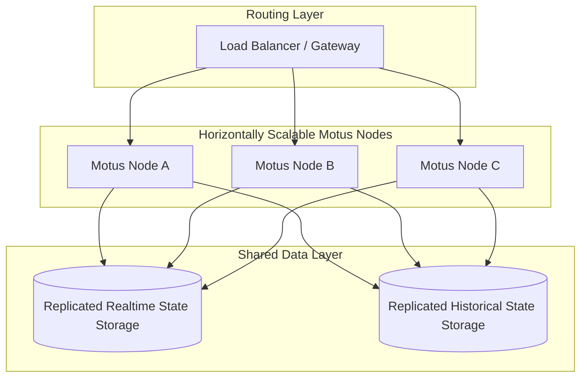

# 14. Non-Functional Requirements

## Purpose
This document specifies the non-functional requirements (NFRs) for Motus. It defines the target latency bounds, concurrency rules, availability requirements, horizontal scaling concepts, fault recovery strategies, and multi-region routing patterns.

---

## Requirements

### 1. Performance & Latency Bounds
To support real-time operations, Motus must operate within strict timing constraints:

| Operation | Metric | Target Boundary |
| :--- | :--- | :--- |
| **Location Ingestion** | write-acknowledgment latency | $\le 50\text{ ms}$ (99th percentile) |
| **Candidate Filtering** | calculation time per 10k drivers | $\le 100\text{ ms}$ (99th percentile) |
| **Realtime Dispatch Fanout** | time to notify consumer after accept | $\le 150\text{ ms}$ (99th percentile) |
| **Telemetry Ingestion** | processing & write delay | $\le 80\text{ ms}$ (95th percentile) |

### 2. Concurrency & Collision Safety
* **Optimistic Locking:** All state transitions (e.g., driver acceptance, presence changes) must check state version tags to prevent double-allocation errors when multiple updates arrive simultaneously.
* **Non-Blocking Matching:** Matching calculations must run as independent read-only pipelines, preventing concurrent state updates from delaying location update streams.

### 3. Fault Tolerance & Recovery Protocols

#### High-Speed State Recovery
* *Requirement:* If the volatile memory holding real-time driver locations fails, Motus must remain operational.
* *Recovery Protocol:* The system must reconstruct driver presence status within 15 seconds by:
  1. Triggering an immediate status check sweep.
  2. Awaiting incoming location heartbeats to rebuild the active driver registry.
  3. Re-evaluating active sessions using snapshot states replicated in historical or transactional persistent storage.

#### Client Connection / Gateway Failures
* *Requirement:* Network drops between client applications and the consumer gateway must not compromise session states.
* *Recovery Protocol:* 
  * Every command sent to Motus must include an idempotency key.
  * Reconnections must query current session reports to resume tracking without recreating entities.
  * If connection drops exceed configured limits, transition sessions gracefully to `DRIVER_LOST`.

---

## Architectural Scaling Concept

### Horizontal Scaling
Motus uses a "shared-nothing" application layer. Coordination of state is managed through a separated, replicated data storage layer, allowing nodes to spin up or down dynamically based on CPU/Memory load.

### Multi-Region Considerations
To respect local data sovereignty laws and reduce latency, Motus uses a Tenant Region Pinning model.

* **Data Pinning:** A tenant's configuration defines their primary geographic region (e.g. `US-East`, `EU-Central`). All sessions and telemetry are stored within data stores local to that region.
* **Isolated Processing Clusters:** Motus instances run in regional clusters. Load balancers route incoming requests and location streams to the regional cluster matching the resource's `tenantId`.
* **No Cross-Region Replication:** Real-time driver presence data is never replicated across geographic boundaries to protect user privacy and avoid sync overhead.

---

## Edge Cases and Failure Cases

### 1. Regional Network Splits (Split-Brain)
* **Problem:** A network split divides a cluster, causing Node A and Node B to lose contact. Both nodes attempt to manage the same session's dispatch wave.
* **Resolution:** 
  * The shared volatile data layer must enforce a partition-tolerant consensus protocol.
  * If a node is partitioned from the majority of the replica set, it ceases write operations and rejects client commands, preventing conflicting state updates.

### 2. Cascading Failovers on Location Ingest Nodes
* **Problem:** A sudden surge in active drivers overwhelms ingestion nodes, causing memory exhaustion.
* **Resolution:** 
  * Motus enforces strict Rate-Limiting per tenant, matching configured SLAs.
  * If ingestion buffers are saturated, nodes return an overloaded response (backpressure), signaling client applications to reduce coordinates frequency until load stabilizes.

---

## Future Enhancements
* **Edge Routing Nodes:** Deploying lightweight presence and telemetry ingestion endpoints at edge locations to reduce coordinate submission latency.
* **Automated Geographic Partitioning:** Dynamically partitioning telemetry data based on active spatial groupings (e.g. grouping drivers by city-level geohashes dynamically) to optimize query performance during localized peak demand.
