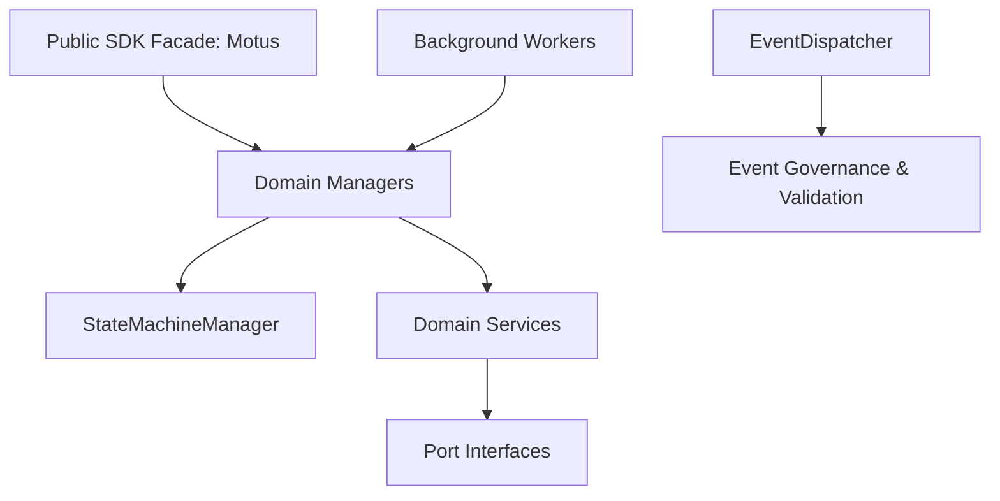

# `@motus/core`

The core real-time dispatch and tracking engine for the **Motus** platform. This package contains all domain models, business logic, state machines, matching/fanout logic, and background processing systems.

Following strict clean architecture principles, this package contains **zero** infrastructure dependencies (no Redis, Socket.IO, databases, or Express). All infrastructure is abstracted via port contracts and injected at runtime.

---

## Features

- **State Machine Management**: Core session lifecycle (`CREATED` $\to$ `SEARCHING` $\to$ `DRIVER_ASSIGNED` $\to$ `IN_PROGRESS` $\to$ `COMPLETED`).
- **Matching Engine**: Intelligent matching using spatial index boundaries, haversine calculations, raycast geofencing, and score/ETA evaluations.
- **Wave Distribution (Fanout)**: Orchestrates offer waves to multiple candidate drivers with automatic timeouts and lock-based reservation guarantees.
- **Presence & Lost Detection**: Keeps track of driver heartbeats and flags stale drivers or triggers `session.driver_lost` when drivers go offline mid-journey.
- **Telemetry Processing**: Decodes location coordinates, records route trajectories, and compresses tracks using Google Polyline.
- **Type-Safe Event Dispatcher**: Emits domain events using wildcard-based subscription routing (e.g. `session.*`, `driver.location.*`) with semantic version governance.
- **Hierarchical Configuration**: Supports platform defaults, tenant overrides, validation schemas, and real-time updates.

---

## Package Architecture & Dependency Rules

`@motus/core` enforces a unidirectional dependency rule:
- **Public Facades** (`src/public/**`) may depend on internal components.
- **Internal Modules** (`src/internal/**`) must **never** depend on public facades.
- **Managers** must avoid circular dependencies.



### Locking Order to Prevent Deadlocks
When acquiring resources, the following order must be strictly maintained:
1. **Session Lock**
2. **Driver Lock**
3. **Candidate Reservation Lock**

---

## Port Contracts & Dependency Injection

To use `@motus/core`, you must inject implementation providers matching the standard ports in [ports.ts](file:///c:/Mohit/Projects/motus/packages/core/src/internal/interfaces/ports.ts):

| Port | Description |
| :--- | :--- |
| `ITenantRepository` | Direct access to tenant-scoped settings. |
| `IDriverRepository` | Reads and writes real-time driver state and location telemetry. |
| `ISessionRepository` | Reads and writes dispatch session states. |
| `IIdGenerator` | Generates unique IDs (e.g. UUID, KSUID). |
| `IClock` | Absolute time provider (essential for deterministic tests). |
| `ILogger` | Custom telemetry/logging bridge. |
| `IEtaProvider` | Calculates driving distance & time to session start coordinates. |
| `IGeofenceProvider` | Resolves boundaries for driver geofence presence check. |
| `IMatchingProvider` | Scores candidate drivers for a session. |
| `ILockProvider` | Key-based mutex resource locking (e.g., Redis Lock). |
| `IEventDispatcher` | Dispatches domain events system-wide. |

---

## Configuration Subsystem

Configuration supports global default fallback with tenant overrides:

```typescript
import { ConfigurationManager } from '@motus/core';

const configManager = new ConfigurationManager({
  // global config override
  matching: { searchRadiusMeters: 5000 }
});

// Register a tenant-specific override
configManager.setTenantConfig('tenant-abc', {
  matching: { searchRadiusMeters: 2000 }
});

// Resolve tenant config
const tenantConfig = configManager.resolve('tenant-abc');
console.log(tenantConfig.matching.searchRadiusMeters); // 2000
```

---

## Event Governance & Type-Safe Dispatcher

All internal events are validated and routed through `EventDispatcher` which supports wildcards:

```typescript
import { EventDispatcher } from '@motus/core';

const dispatcher = new EventDispatcher();

// Subscribe to all session events
dispatcher.subscribe('session.*', (event) => {
  console.log(`Session event triggered: ${event.eventName}`, event.payload);
});

// Subscribe to specific driver online event
dispatcher.subscribe('driver.online', (event) => {
  console.log(`Driver ${event.payload.driverId} went online.`);
});

// Dispatch an event
await dispatcher.dispatch({
  eventName: 'session.created',
  eventVersion: '1.0.0',
  timestamp: new Date().toISOString(),
  payload: { sessionId: 'sess-123', tenantId: 'tenant-abc' }
});
```

---

## Background Workers

Background workers handle time-critical domain updates:
- **`FanoutTimeoutWorker`**: Detects expired offer waves and advances to the next wave or fails matching.
- **`RetryWorker`**: Manages retry attempts for failed transactions based on retry policies.
- **`DriverStaleDetector`**: Transition driver statuses to `STALE` if heartbeat updates are missed.
- **`DriverLostMonitor`**: Triggers a `session.driver_lost` event if a driver is assigned to a session but loses presence status.
- **`CleanupWorker`**: Prunes expired database entities or logs.

---

## Quick Start Example

Here is how to boot the Motus engine in an application:

```typescript
import { Motus } from '@motus/core';
import { 
  MockTenantRepository, 
  MockDriverRepository, 
  MockSessionRepository, 
  MockClock, 
  MockIdGenerator, 
  MockLogger 
} from './mocks';

// 1. Initialize your repositories and port adapters
const tenantRepo = new MockTenantRepository();
const driverRepo = new MockDriverRepository();
const sessionRepo = new MockSessionRepository();
const clock = new MockClock();
const idGenerator = new MockIdGenerator();
const logger = new MockLogger();

// 2. Initialize Managers
const tenantMgr = new TenantManager(tenantRepo, idGenerator);
const driverMgr = new DriverManager(driverRepo, idGenerator, clock);
const sessionMgr = new SessionManager(
  sessionRepo, 
  driverRepo, 
  tenantRepo, 
  idGenerator, 
  clock
);

// 3. Initialize Motus SDK Facade
const motus = new Motus(tenantMgr, driverMgr, sessionMgr, clock);

// 4. Create and start a dispatch session
const session = await motus.session.create({
  tenantId: 'tenant-1',
  pickupLocation: { latitude: 37.7749, longitude: -122.4194 },
  dropoffLocation: { latitude: 37.7891, longitude: -122.4014 },
  requirements: {}
});

console.log(`Session created in state: ${session.status}`);
```

---

## Testing & Quality

Run tests using Vitest:

```bash
npm test
```

Generate coverage reports (minimum 95% statements/lines, 85% branches, 95% functions):

```bash
npx vitest run --coverage
```
